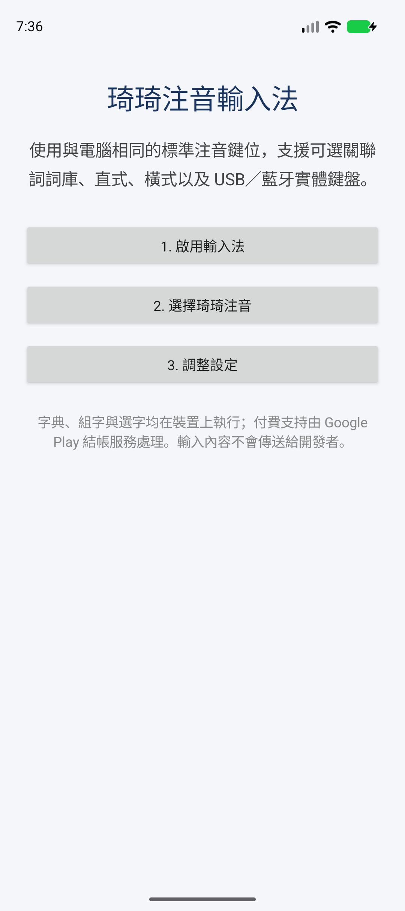
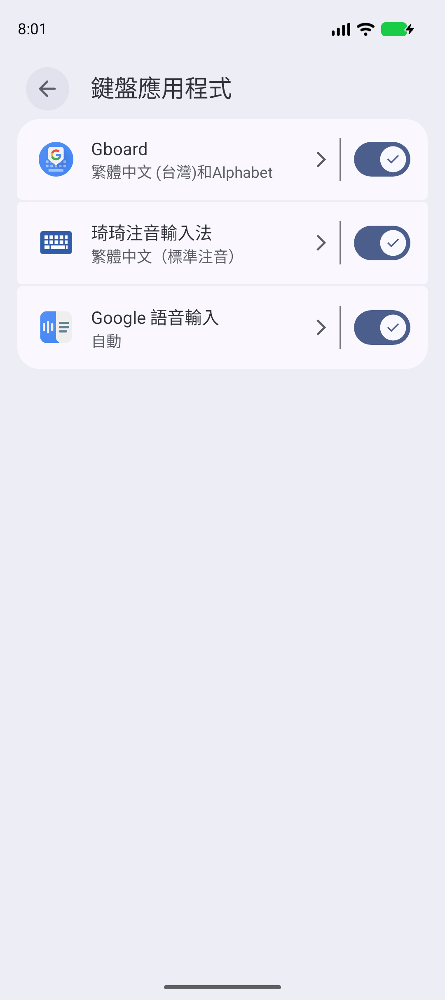
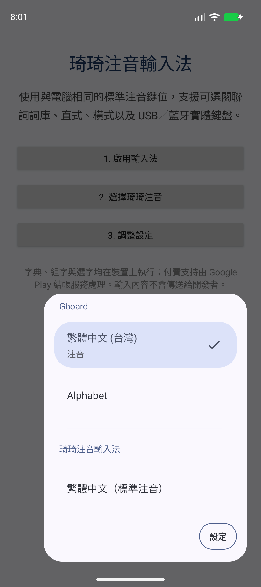
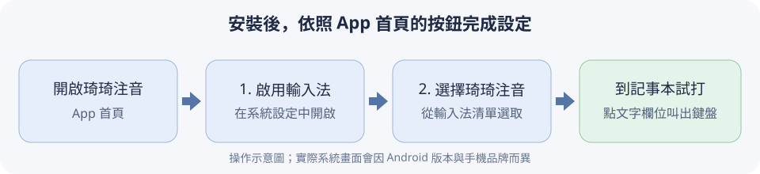
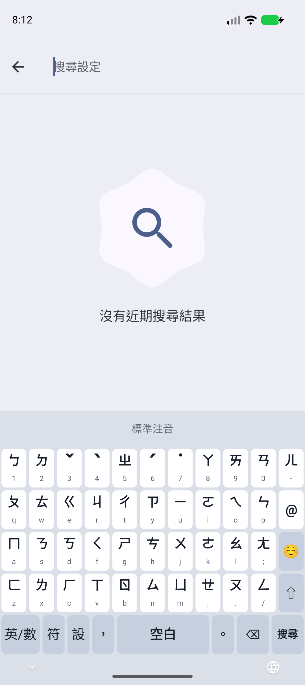
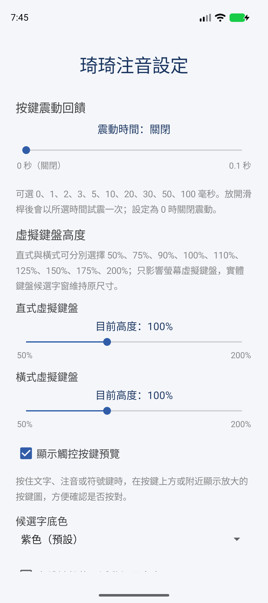
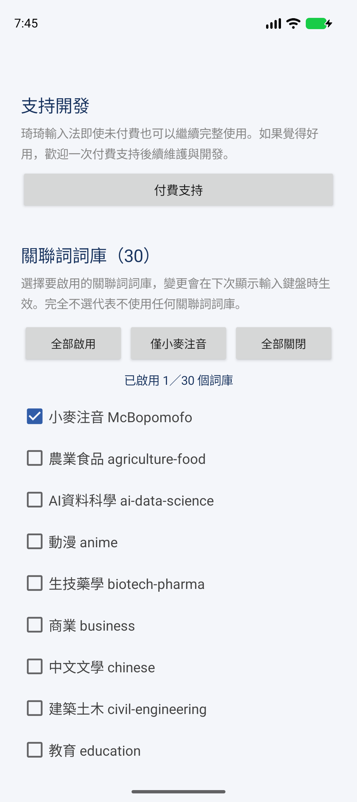

# Android 手機、平板安裝與使用指南

琦琦注音適用於 **Android 8 以上**的手機和平板，可用螢幕鍵盤，也可接 USB／藍牙實體鍵盤。安裝 App 後，還要在 Android 設定中啟用輸入法，再選它作為目前的鍵盤。**打字功能免費，不需要付費支持。**

## 1. 取得並安裝 App

目前 Android 版透過 **Google Play 封閉測試**提供安裝。請在 Android 裝置上依序完成：

1. [加入琦琦注音的 Google 測試群組](https://groups.google.com/g/chichi77keykey/about)。依群組頁面的指示登入並加入。
2. [加入 Google Play 封閉測試](https://play.google.com/apps/testing/tw.chichi77.keykey.android)。在測試頁面確認加入。
3. [開啟琦琦注音的 Google Play 商店頁面](https://play.google.com/store/apps/details?id=tw.chichi77.keykey.android)，確認名稱是 **琦琦注音**，點 **安裝**。

**三個步驟都要使用同一個 Google 帳號。**加入後請**至少保留測試資格 14 天，不要中途退出**。如果商店顯示「無法使用」或沒有安裝按鈕，先確認群組與封閉測試都已加入，再檢查目前 Play 商店登入的帳號是否相同。

GitHub Actions 的 **debug APK 是開發測試產物**，不是一般使用者的安裝包。

## 2. 啟用並選擇琦琦注音

1. 安裝後，打開手機上的 **琦琦注音** App。
2. 點 **1. 啟用輸入法**。在打開的 Android 設定中找到 **琦琦注音輸入法**，將它開啟。
3. 系統可能顯示第三方輸入法的安全提示；確認顯示的是你要啟用的輸入法，再依自己的判斷繼續。琦琦注音的字典、組字與選字在裝置上執行，App 未宣告網路權限。
4. 返回琦琦注音 App，點 **2. 選擇琦琦注音**，在輸入法清單中選 **琦琦注音輸入法**。
5. 開啟記事本或其他可輸入文字的 App，點文字欄位，確認琦琦注音鍵盤出現。

*Pixel 9a 實拍：先按 1 啟用，再按 2 選擇；完成後可按 3 調整設定。*

*Pixel 9a 實拍（繁體中文／台灣）：第 2 步在「鍵盤應用程式」打開琦琦注音輸入法的開關。*

*Pixel 9a 實拍：第 4 步在選擇清單點琦琦注音輸入法。*

*圖 1：操作順序示意圖，不是 Android 系統截圖；各品牌手機的設定頁名稱、警示文字和按鈕位置可能不同。優先從琦琦注音 App 的兩個按鈕進入對應設定。*

## 3. 用螢幕鍵盤打字

先在記事本的空白處試打：

1. 預設的**好打注音**可連續輸入每個字的注音與聲調，不必逐字選定；沒有聲調的一聲字
   以 **空白**結束音節。鍵盤會依整句前後文調整文字。
2. 候選列可修正目前最後一個音節；兩端的 **▲／▼**、左右滑動與候選開啟時的空白可換頁。
   按 **Enter** 確定整段文字，再按一次才執行換行或 App 的送出動作。
3. 若偏好逐字選字，從 **琦琦注音 App → 3. 調整設定 → 注音模式**選擇「傳統注音」。

*Pixel 9a 實拍（繁體中文／台灣）：在 Android 系統設定的搜尋欄叫出琦琦注音鍵盤，底部可看見注音鍵、模式、符號、設定、空白與搜尋鍵。這是一般系統輸入欄位。*

### 常用按鍵

| 按鍵 | 用途 |
| --- | --- |
| **英／數**、**數／ㄅ**、**ㄅ／英** | 點左下角模式鍵，依序切換注音、英文、數字符號；文字提示會隨模式改變。 |
| **符**、**☺** | 開啟符號或表情符號列表；點候選區中的項目即可輸入。 |
| **設** | 開啟琦琦注音設定。也可從 App 首頁點 **3. 調整設定**。 |
| **空白** | 正在顯示候選字時換到下一頁；一般輸入時輸入空白。 |
| **⌫** | 刪除；尚在輸入注音時，會先逐步刪除聲調和注音符號。 |
| **↵** | 確認、換行或執行「搜尋」「傳送」等動作，依目前 App 的欄位而定。 |

有些欄位會自動切換版面：電子郵件、網址或密碼欄位通常先顯示英文；電話與數字欄位通常先顯示數字。在一般文字欄位試打，最容易確認注音功能。

## 4. 使用 USB／藍牙實體鍵盤

先照 Android 裝置的方式連接實體鍵盤，並確認目前輸入法仍是琦琦注音。進入可輸入文字的 App 後，直接在實體鍵盤打注音；**Android 版可在其他 App 的文字欄位使用實體鍵盤**。

| 實體鍵盤按鍵 | 用途 |
| --- | --- |
| **1–9** | 選取畫面上對應號碼的候選字。 |
| **Page Up／Page Down** | 翻候選字頁。 |
| **Shift + 1–9** | 選取關聯詞候選。 |
| **Ctrl + Space** | 切換注音／英文。 |
| **Shift + Space** | 切換半形／全形。 |
| **Ctrl + 0** 或 **Ctrl + 1** | 開啟符號候選。 |

預設在螢幕底部顯示固定候選列，也可直接點它選字。如果想讓候選字靠近文字游標，打開 **琦琦注音 App → 3. 調整設定 → 實體鍵盤使用浮動候選字窗**，再選垂直或水平排列。這項設定只影響實體鍵盤；若目標 App 不支援浮動窗，會改用底部候選列。

## 5. 調整設定與關聯詞

打開 **琦琦注音 App → 3. 調整設定**，可以切換好打注音／傳統注音，並調整按鍵震動、
直式與橫式的螢幕鍵盤高度、按鍵預覽、候選字底色，以及實體鍵盤的浮動候選字窗。
注音模式預設為好打注音；不確定怎麼選時，先保留預設值。

*Pixel 9a 實拍：設定頁上方可調整震動和鍵盤高度。*

關聯詞是**選好一個字後**提供的接續詞建議。初次安裝預設只開啟「小麥注音」詞庫；若想增加特定領域的建議，在 **關聯詞詞庫**勾選對應分類即可，也可選 **僅小麥注音**或 **全部關閉**。分類詞庫可能有錯字或不合適的詞，輸入重要內容時請自行確認。詞庫變更在下次顯示鍵盤時生效。

*Pixel 9a 實拍：往下滑可找到關聯詞詞庫；保留預設也可以正常打字。*

## 遇到問題時

| 情況 | 先檢查 |
| --- | --- |
| Google Play 找不到 App 或無法安裝 | 依序加入上方的 Google 測試群組及封閉測試，再確認 Play 商店使用同一個 Google 帳號。 |
| 安裝後找不到鍵盤 | 先開啟琦琦注音 App，依序完成「1. 啟用輸入法」及「2. 選擇琦琦注音」。 |
| 打字時仍出現原本鍵盤 | 回琦琦注音 App 點「2. 選擇琦琦注音」，再點文字欄位；部分 Android 裝置也能從鍵盤切換按鈕改選。 |
| 看不到注音鍵 | 先在記事本的一般文字欄位測試；密碼、電子郵件、電話等欄位可能顯示其他版面。 |
| 詞庫勾選後沒有變化 | 離開文字欄位，再點入讓鍵盤重新顯示；關聯詞要在選好一個字後才會出現。 |
| 實體鍵盤沒有候選字窗 | 確認已選琦琦注音，並先試預設的底部候選列；浮動窗若無法顯示，App 會退回底部候選列。 |

仍無法使用時，請記下 Android 版本、手機或平板型號、正在輸入的 App、使用螢幕鍵盤或實體鍵盤，以及卡住的步驟。

Google Play 測試加入方式可參考 [Google 的封閉測試說明](https://support.google.com/googleplay/android-developer/answer/9845334?hl=zh-Hant)；程式架構、建置與進階快捷鍵另見 [Android IME 技術文件](Source/Loaders/Android-IME/README.md)。
