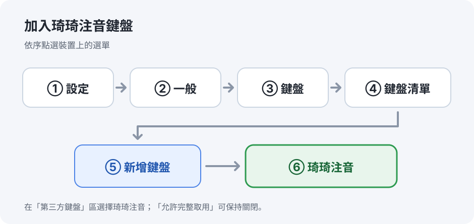
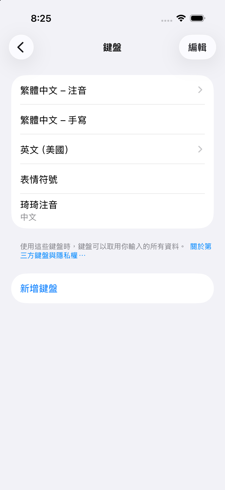
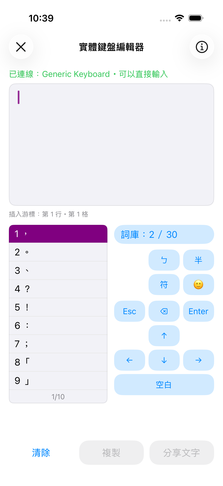
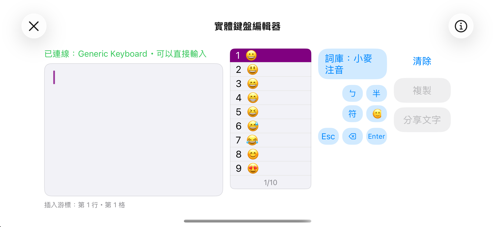

# iPhone、iPad 安裝與使用指南

琦琦注音可在 **iOS 17／iPadOS 17 以上**的 iPhone、iPad 使用。安裝 App 後，還要在裝置的「設定」中把它加入鍵盤清單，打字時再切換到琦琦注音。**基本輸入功能免費，也不需要開啟「允許完整取用」。**

## 1. 從 App Store 安裝

在 iPhone 或 iPad 上開啟 [《琦琦注音》的 App Store 頁面](https://apps.apple.com/tw/app/%E7%90%A6%E7%90%A6%E6%B3%A8%E9%9F%B3/id6807832939)，確認 App 名稱是「琦琦注音」，點 **取得**並完成安裝。安裝後先打開一次「琦琦注音」App；首頁也會顯示加入鍵盤的步驟。

App 內有可選擇的「支持開發」一次性購買，**不購買也能完整使用輸入功能**。台灣商店目前的金額是 **NT$90**；購買時請確認 Apple 帳號的商店地區為台灣，並以付款畫面顯示的金額為準。只更改 iPhone 的語言或地區，不一定會更改 App Store 帳號的商店地區。GitHub 上的 iOS 模擬器測試包不能安裝到 iPhone 或 iPad。

## 2. 加入琦琦注音鍵盤

1. 打開 iPhone／iPad 的 **設定 → 一般 → 鍵盤 → 鍵盤**。
2. 點 **新增鍵盤**（某些版本顯示「加入新的鍵盤」）。
3. 向下找到 **第三方鍵盤**，點 **琦琦注音**。回到鍵盤清單，確認它已列在其中。
4. 如果看到 **允許完整取用**，保持關閉即可；琦琦注音不需要這項權限來打字或選字。

*圖 1：設定路徑示意圖；實際按鈕名稱可能因 iOS／iPadOS 版本略有不同。App 首頁的「開啟『設定』」按鈕會帶你到系統設定；若沒有直接到鍵盤清單，依照上面的路徑繼續點選。*

*iPhone 17 Pro（iOS 26.5）實拍：加入完成後，鍵盤清單會出現「琦琦注音」。清單中的「英文（美國）」是另一種鍵盤配置，與 App Store 帳號的商店地區無關；這張畫面不包含購買價格。*

## 3. 切換鍵盤並試打

1. 開啟 **備忘錄**，新增一則空白筆記，點一下文字區讓螢幕鍵盤出現。
2. **按住地球圖示 🌐 或表情符號鍵**，從清單選 **琦琦注音**。之後也可以點地球圖示，在已加入的鍵盤間切換。
3. 預設的**好打注音**可直接連續輸入每個字的注音與聲調，不必先選定前一個字；鍵盤會
   依整句前後文調整文字。
4. 候選列可修正目前最後一個音節，左右箭頭可翻頁；按 **Enter** 確定整段文字，再按一次
   才執行換行或 App 的送出動作。
5. 若偏好原本逐字選字的方式，按鍵盤上的 **設 → 注音模式 → 傳統注音**。

### 鍵盤上常用的按鍵

| 按鍵 | 用途 |
| --- | --- |
| 候選字列的字 | 點一下就選字；左右箭頭可看前一頁、下一頁。 |
| **英／數**（或 **數／ㄅ**、**ㄅ／英**） | 切換注音、英文與數字輸入模式；按鍵文字會隨目前模式改變。 |
| **符**、**☺** | 開啟符號或表情符號列表。 |
| **設** | 切換好打／傳統注音、選擇關聯詞詞庫、調整候選字底色等鍵盤設定。 |
| **空白**、**⌫**、**↵** | 空白／翻候選頁、刪除、確認或換行；實際動作會依正在組字或所用 App 的欄位而變。 |

App 首頁的**「輸入法設定」**可調整注音模式、關聯詞詞庫、候選字底色與按鍵音，
也可管理自訂詞及重設好打注音學習紀錄；鍵盤下次開啟時會套用。在正在使用的
琦琦注音鍵盤點「設」也可調整鍵盤設定。鍵盤內修改的值存在鍵盤自己的資料區，
因此不會顯示回 App；若之後在 App 再次修改同一選項，鍵盤會套用 App 的新值。

## 4. 使用 USB／藍牙實體鍵盤

iOS 不會讓第三方螢幕鍵盤接收其他 App 裡的實體鍵盤按鍵。若你接上 USB 或藍牙鍵盤，想用琦琦注音選字，請在**琦琦注音 App 內**點 **開啟實體鍵盤編輯器**：

1. 先依 iPhone／iPad 的一般方式連接實體鍵盤，再打開琦琦注音 App 的編輯器。
2. 確認畫面顯示已連線，直接在編輯區打注音；用 **1–9** 選候選字，**Space／Page Up／Page Down** 可翻頁。
3. 完成後點 **複製**，再到備忘錄、LINE 等 App 貼上；也可以點 **分享文字**，使用 iOS 分享功能。

*圖 2：實體鍵盤編輯器畫面；圖中的連線狀態、候選字和按鈕狀態會依你的操作改變。編輯器只能在琦琦注音 App 開啟時使用。*

*iPhone 17 Pro（iOS 26.5）實拍：橫向編輯器的候選列、模式與複製／分享按鈕。截圖時停在表情符號模式，實際候選內容會依所選模式改變。*

## 遇到問題時

| 情況 | 先檢查 |
| --- | --- |
| App Store 顯示無法安裝 | 確認裝置是 iPhone／iPad，系統已更新到 iOS／iPadOS 17 以上；商店可用性也可能依 Apple ID 地區而異。 |
| 「新增鍵盤」清單找不到琦琦注音 | 先打開一次琦琦注音 App，再回「設定 → 一般 → 鍵盤 → 鍵盤」查看；必要時關閉並重新開啟「設定」。 |
| 已加入，但打字時仍是原本鍵盤 | 點進可輸入文字的欄位，按住地球圖示或表情符號鍵，明確選「琦琦注音」。 |
| 在密碼、電話等欄位變回系統鍵盤 | iOS 可能限制第三方鍵盤用於這些欄位；先在備忘錄的一般文字區測試。 |
| 接了實體鍵盤，在其他 App 無法用琦琦注音 | 到琦琦注音 App 的「實體鍵盤編輯器」輸入，完成後複製或分享文字。 |
| App 內編輯器與螢幕鍵盤的詞庫勾選不同 | 兩處的詞庫設定分別保存，請在要使用的那一處調整。 |

仍無法使用時，請記下裝置型號、iOS／iPadOS 版本、是否已在系統鍵盤清單看到「琦琦注音」，以及在備忘錄切換後的畫面。

系統操作參考：[Apple：在 iPhone 上新增或更改鍵盤](https://support.apple.com/zh-tw/guide/iphone/iph73b71eb/ios)、[Apple：在 iPad 上新增或更改鍵盤](https://support.apple.com/zh-hk/guide/ipad/ipad1aa5a19a/ipados)。開發與測試資訊另見 [iOS 鍵盤技術文件](Source/Loaders/iOS-Keyboard/README.md)。
