# iPhone、iPad 安裝與使用指南

本指南適用於 **琦琦輸入法 1.5.1**，支援搭載 **iOS 17／iPadOS 17 以上**的 iPhone、iPad。安裝後，把琦琦加入系統鍵盤，再到文字 App 切換使用，就能開始打字。**基本輸入功能免費，不需要開啟「完整取用」。**

## 1. 安裝 App，先開啟一次

在 iPhone 或 iPad 開啟[台灣 App Store 的「琦琦輸入法」頁面](https://apps.apple.com/tw/app/id6807832939)，點 **取得**並完成安裝，再按 **打開**啟動 App。若已安裝，可直接按 **打開**。首頁下方列有加入鍵盤的步驟，之後也能從這裡開啟輸入法設定、自訂詞管理及實體鍵盤編輯器。

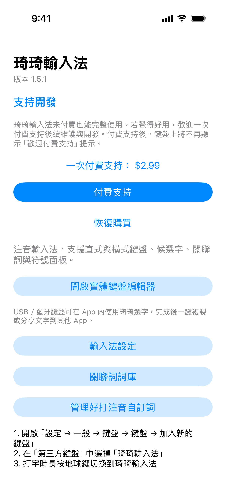

「支持開發」是可選擇的一次性購買，**未付費也能完整使用輸入功能**。實際金額以 Apple 付款畫面為準，曾購買者可按 **恢復購買**。購買或恢復成功後，支持區塊移到首頁最後面並顯示「謝謝支持」。

## 2. 把琦琦加入系統鍵盤

打開 **設定 → 一般 → 鍵盤 → 鍵盤**，點 **新增鍵盤**（部分系統版本顯示「加入新的鍵盤」）。在 **第三方鍵盤** 區塊找到 **琦琦輸入法**，點一下加入。

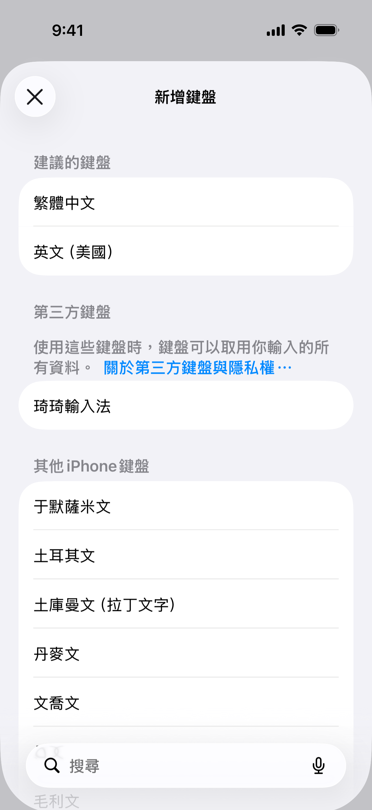

*在「第三方鍵盤」區塊點選琦琦輸入法。*

回到上一頁，確認清單出現 **琦琦輸入法／中文**，就完成啟用。琦琦不要求完整取用，**沒有「允許完整取用」開關是正常的**，可以直接開始試打。

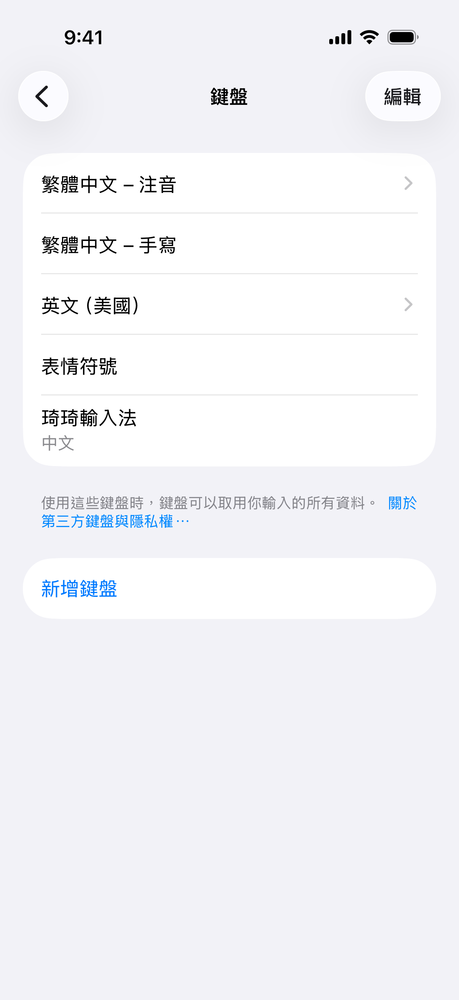

*清單中出現琦琦即完成加入。「英文（美國）」是另一種鍵盤配置，與商店的價格地區無關。*

首頁的 **開啟「設定」** 可帶你到系統設定。若沒有直接進入鍵盤清單，依上方路徑繼續操作。

## 3. 切換鍵盤，完成第一次組句與選字

開啟備忘錄或其他可輸入多行文字的 App，點進空白文字欄位，**按住地球圖示 🌐**，在清單選 **琦琦輸入法**。下圖以記事本的文字欄示範。

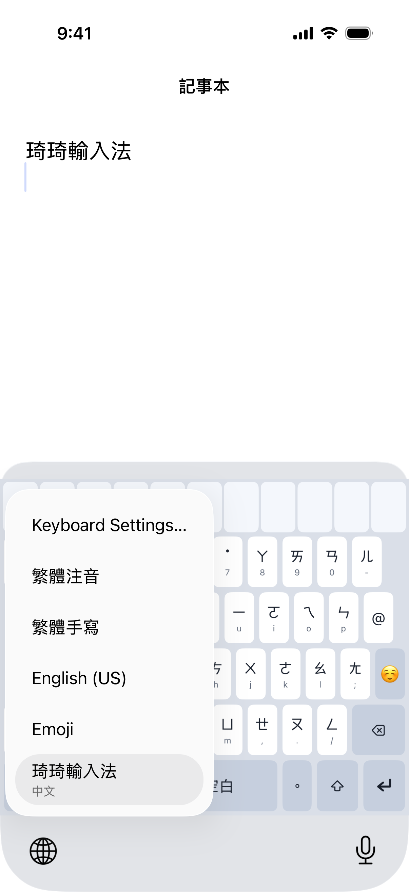

*長按地球鍵可選到琦琦。之後也可輕點地球鍵，在已加入的鍵盤間切換。*

預設的 **好打注音** 可連續輸入音節，由輸入法組成句子。先輸入「琦琦輸入法」，按 **↵** 確認並換行。第二行接著輸入「請假要去哪裡玩呢去海邊」，**先不要按 ↵**。

若想改句中的字，點鍵盤上方組字格中的 **玩**，就會展開它的候選。點選需要的字即可，不必刪掉整句重打。

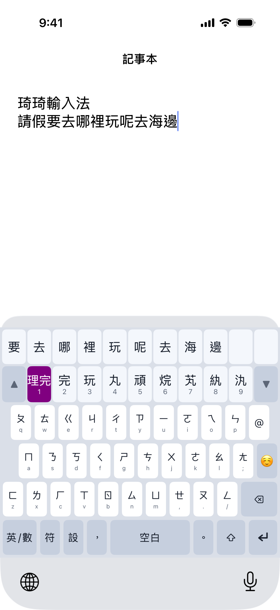

*第一行已確認，第二行尚未按 ↵。上方組字列保留「要去哪裡玩呢去海邊」，「玩」的候選已展開。候選順位會隨選字學習而改變。*

選好「玩」後，再輸入「散步」。新字會接在句尾，原句中的選字結果也會保留。

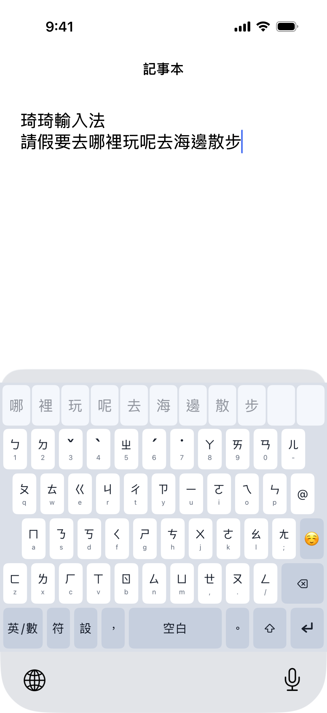

*句中改字後繼續打，結果為「請假要去哪裡玩呢去海邊散步」，最後九個音節仍可從組字格修改。*

完成後，按一次 **↵** 就會確認組字並換行。在搜尋、前往等欄位，按鍵會執行該欄位對應的動作。下圖的組字格已清空，文字保留在 App 中。

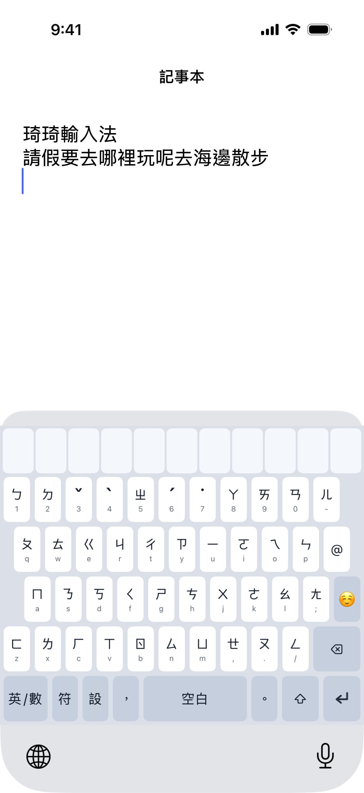

*確認後游標移到下一行，鍵盤上方不再保留這句的組字。*

文字在組字時就會出現在 App 欄位中，**有看到中文字不代表整句都已確認**。好打注音的組字格保留最近九個音節；完成第十個音節時，最前方的完整詞組會固定到文字欄，不能再從組字格回改。例如上面的「請假」已固定，後段仍可選字。切換 App 或輸入法後，已寫入欄位的中文字也會保留。

## 4. 常用按鍵與兩個設定入口

| 按鍵 | 可以做什麼 |
| --- | --- |
| **組字格／候選字** | 好打注音點句中要改的字，再點候選；傳統注音直接從候選選字。候選多時可翻頁。 |
| **英／數**、**數／ㄅ**、**ㄅ／英** | 切換中文、英文與數字，文字隨目前模式改變。 |
| **符**、**☺**、**@** | 開啟符號／Emoji，或輸入 @。 |
| **設** | 切換好打注音、傳統注音、倉頡、簡易，並調整鍵盤選項。 |
| **空白**、**⌫**、**↵** | 空白的選字功能可設定；⌫ 刪除，↵ 確認組字並換行或執行欄位動作。 |

正在打字時，點 **設** 即可選輸入法。例如喜歡逐字選字，可改選 **傳統注音**；想用字根輸入則選倉頡或簡易，選好再按 **完成** 回鍵盤。

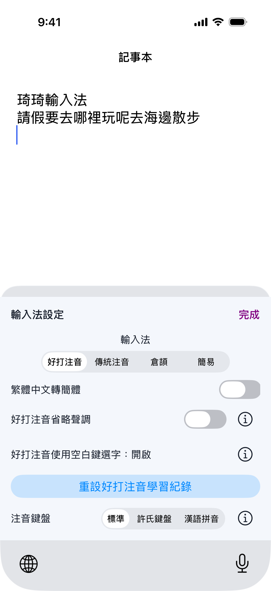

*鍵盤內的「設」頁保留目前文字欄位，可直接切換輸入方式。*

回到琦琦 App 首頁，按 **輸入法設定**，也能選模式、注音配置、候選字底色與按鍵音，並管理自訂詞或重設學習紀錄。關聯詞詞庫使用首頁的獨立入口。**好打注音使用空白鍵選字** 請在這裡調整，鍵盤內的「設」頁會顯示目前值。

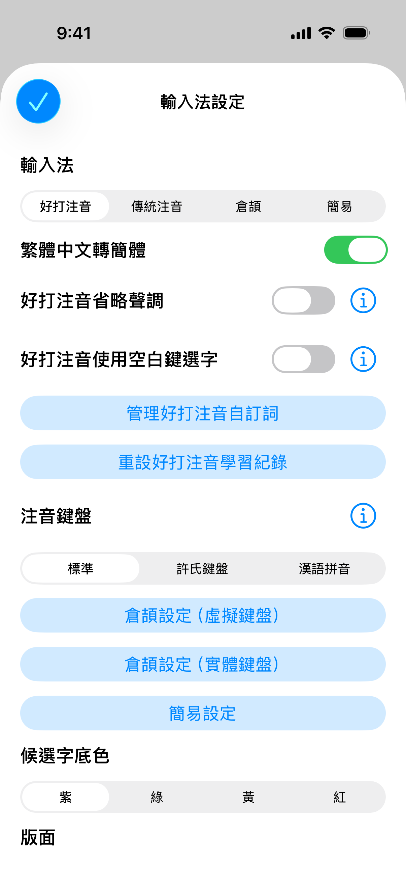

*App 設定畫面。輸入法選擇下方可調整繁體中文轉簡體、省略聲調與空白鍵選字。*

App 內的變更會在鍵盤下次開啟時套用。鍵盤內「設」頁的修改保存在鍵盤自己的資料區，不會反映回 App；日後在 App 再改同一選項，鍵盤會套用 App 的新值。

- **繁體中文轉簡體**在輸入法選擇下方，預設關閉。開啟後，輸入「臺灣」時，組字格與候選仍顯示繁體，送到 App 的文字為「台湾」。
- **好打注音省略聲調**支援標準注音、許氏鍵盤和漢語拼音。開啟後可接續輸入讀音，鍵盤保留最近 11 個音節供句中選字，輸入欄顯示未確認部分的讀音。
- 點鍵盤的 **設 → 調整鍵盤高度**，拖曳上緣或下緣，再按 **完成** 儲存。直向與橫向分開設定。下緣已貼齊底部時，可往上拉。

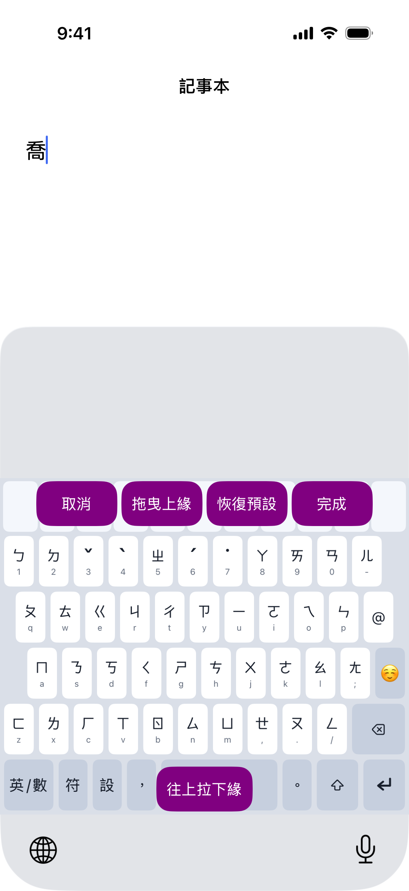

## 5. 倉頡輸入「竹大」，提前選「喬」

在鍵盤點 **設 → 倉頡設定（虛擬鍵盤）**，確認 **即時候選** 與 **未打完也能選字** 都有勾選。這是螢幕鍵盤的設定，與 App 實體鍵盤的倉頡設定分開。

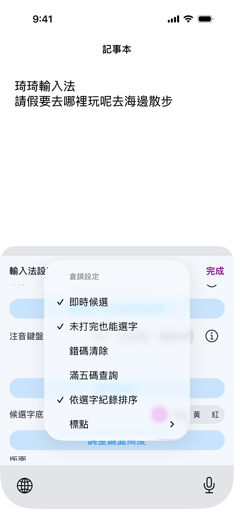

*兩個選項都開啟後，可在字碼尚未輸入完成時查看候選。*

收起選單，在 **輸入法** 選 **倉頡**，按 **完成**。鍵帽會換成字根；只輸入 **竹、大**，就能在候選中找到 **喬**，不必先輸入完整的「竹大口月口」。

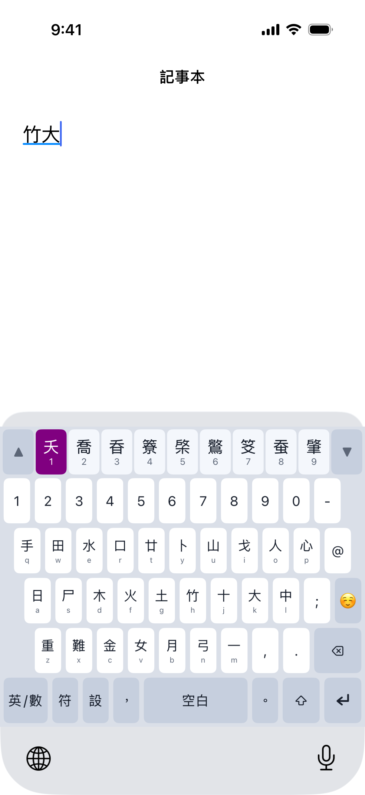

*「竹大」仍在組字。點候選列中的「喬」即可提前選字。*

倉頡最多五碼，也可按空白查詢；**簡易** 輸入兩碼就會顯示候選。倉頡支援 `?`／`*` 萬用字元，其他查詢與排序選項可在同一個選單調整。

## 6. 想用空白鍵開候選

好打注音的 **好打注音使用空白鍵選字** 預設關閉：讀音完成後按空白，會在組字區插入空白；未完成讀音時，空白仍用來結束一聲。

若習慣按空白選字，回到 **琦琦 App → 輸入法設定**，開啟 **好打注音使用空白鍵選字**，再回文字 App 重新開啟琦琦鍵盤。

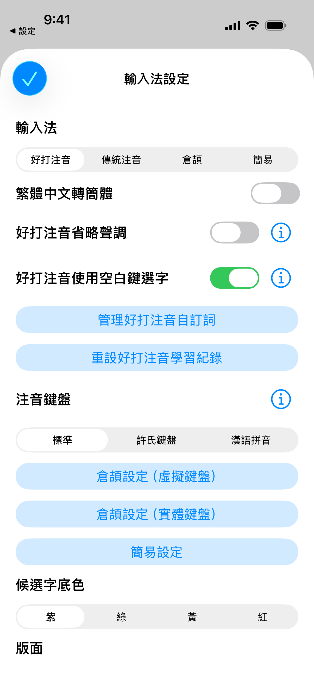

*開啟後，螢幕鍵盤與 App 內實體鍵盤編輯器共用這項設定。*

在文字欄輸入「請假要去哪裡玩呢去海邊」，先不要送出整句。句尾「邊」的注音 **ㄅㄧㄢ** 輸入後，先按 **空白** 完成一聲，再按一次 **空白** 開啟候選。候選有多頁時，可再按空白翻頁。即使關閉此選項，仍可點組字格開候選。

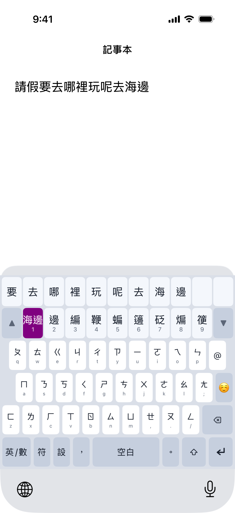

*原句完整保留，後段仍在組字狀態。「邊」的候選由空白鍵開啟。*

## 7. 接上 USB／藍牙鍵盤時

iOS 的第三方螢幕鍵盤無法接收其他 App 裡的一般 USB／藍牙鍵盤按鍵。要使用琦琦的實體鍵盤輸入，請先連接鍵盤，再到 **琦琦 App → 開啟實體鍵盤編輯器**，在 App 前景輸入。

確認上方顯示 **已連線**，左側選輸入法、右側選注音鍵盤配置。好打注音可連續組句，按 **↓** 開候選，再用 **1–9** 選字；**Page Up／Page Down** 可翻頁。方向鍵可移動組字游標，回頭改字。

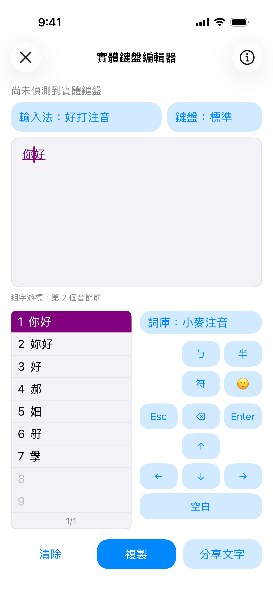

*「你好」仍在組字。左側是候選，右側可以移動游標，下方可複製或分享文字。上方的連線狀態在這張模擬器畫面顯示「尚未偵測到實體鍵盤」。*

輸入完成後按 **複製**，編輯器會確認目前組字並顯示 **已複製，可直接貼到其他 App**。接著到需要的 App 貼上文字；也可用 **分享文字** 開啟 iOS 分享功能。

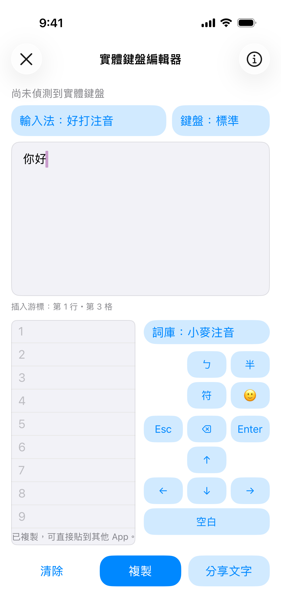

*按複製後，紫色組字已確認，左側候選清空並顯示複製確認。*

iPad 橫向時，編輯器把輸入區、候選、操作鍵及複製／分享按鈕分成四欄。下圖的「你好」仍在組字，可以從中央候選欄選字。

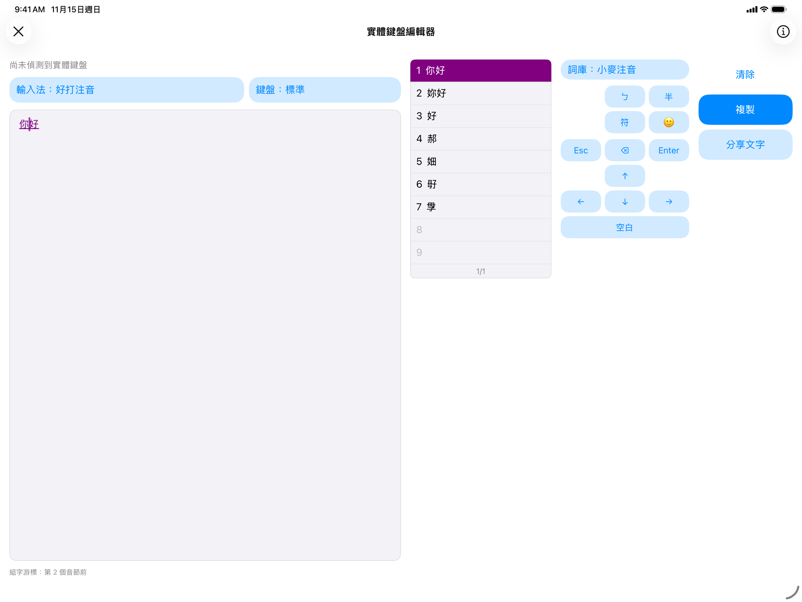

*左側是輸入區，中央是候選，右側是操作和複製／分享入口。*

實體鍵盤編輯器在琦琦 App 前景使用，完成後可把文字複製或分享到其他 App。

## 8. 在 iPad 啟用與使用

### 先確認鍵盤已開啟

iPad 也可依第 2 節新增鍵盤。若從琦琦 App 的 **開啟「設定」** 進入 App 設定頁，可到 **設定 → App → 琦琦輸入法 → 鍵盤**，開啟 **琦琦輸入法**。此頁不需要另外開啟完整取用。

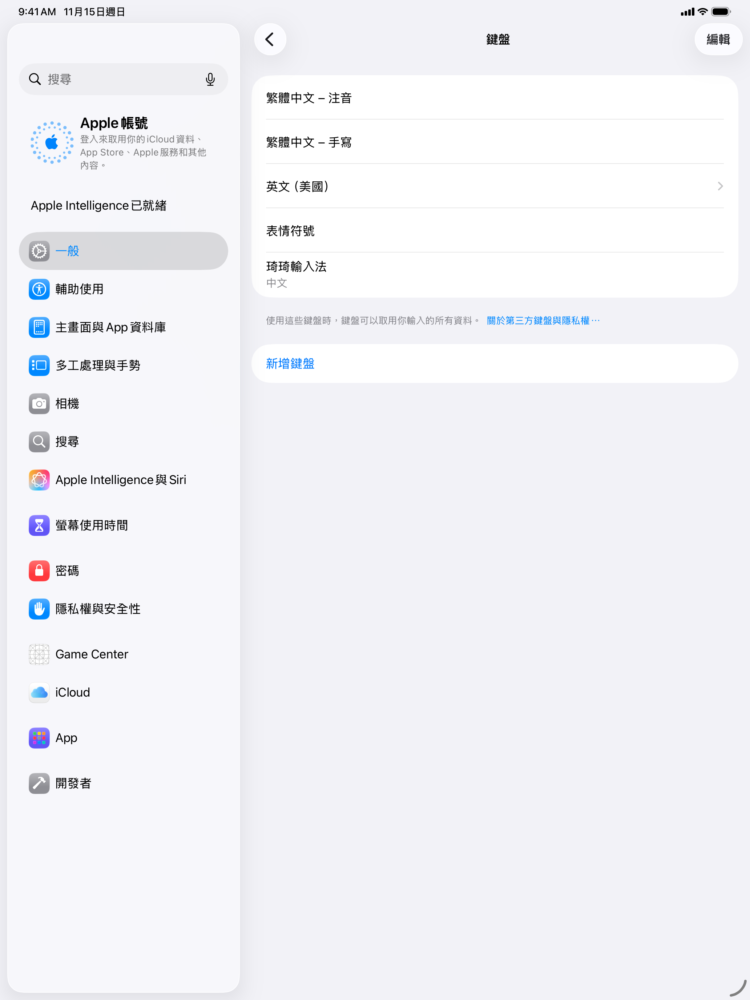

*在 iPad「一般」的鍵盤清單，看見「琦琦輸入法／中文」就表示已加入。*

### 直向與橫向的組字、選字

開啟可輸入多行文字的 App，長按鍵盤左下角的地球鍵，選 **琦琦輸入法**（[iPad 切換清單](docs/images/keykey-ios-v151-keyboard-switcher-ipadpro13m5-simulator.png)）。圖中使用記事本的多行文字欄示範。

先輸入「琦琦輸入法」並確認換行，第二行輸入「請假要去哪裡玩呢去海邊」，先不按 ↵。與 iPhone 相同，點組字格中的 **玩** 就能開候選。

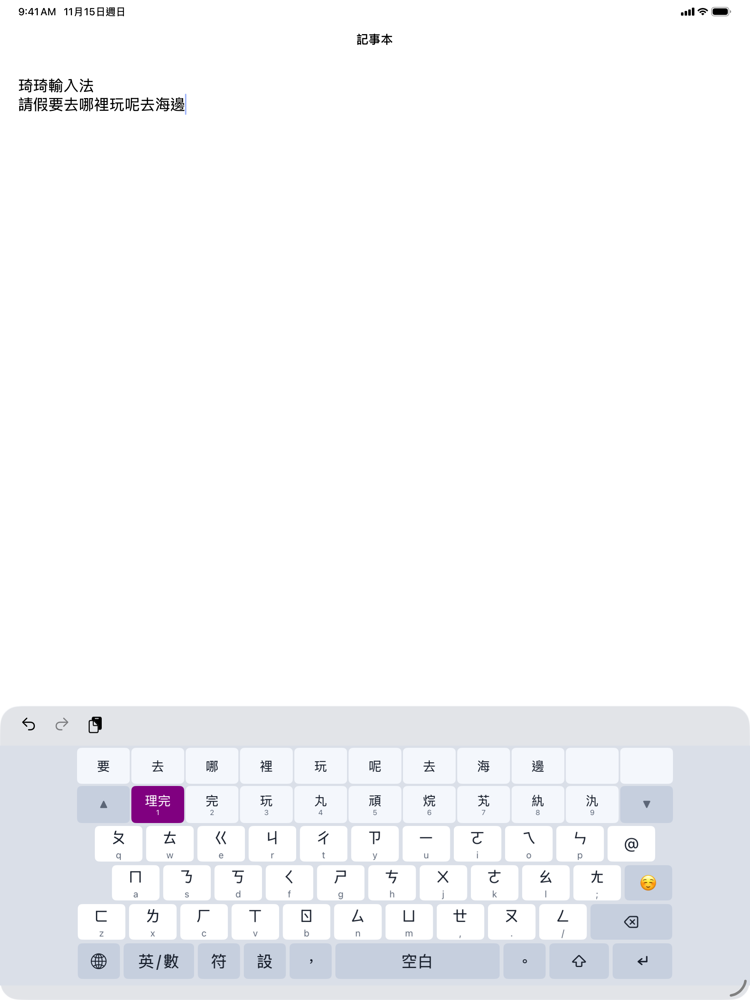

*iPad 直向畫面在下方琦琦鍵盤顯示組字與候選。第二行尚未確認，「玩」的候選仍開啟。*

選好「玩」後，也可以轉成橫向再輸入 **散步**，新字會接在句尾，前面的文字與選字結果保留。

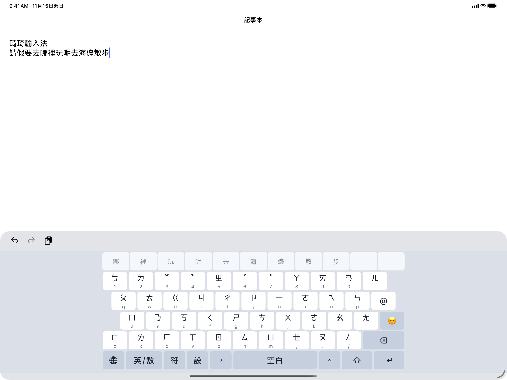

*iPad 橫向續打後顯示「請假要去哪裡玩呢去海邊散步」，最後九個音節仍在組字格中。*

按一次 **↵** 確認並換行，組字格會清空，兩行中文仍留在文字欄（[確認換行後原圖](docs/images/keykey-ios-v151-confirmed-ipadpro13m5-simulator.png)）。

### 倉頡也能從部分字根選字

在鍵盤的 **設 → 倉頡設定（虛擬鍵盤）** 確認 **即時候選** 與 **未打完也能選字** 都已勾選（[iPad 設定原圖](docs/images/keykey-ios-v151-cangjie-settings-ipadpro13m5-simulator.png)），再切換倉頡。只輸入 **竹、大**，就能從候選選 **喬**。

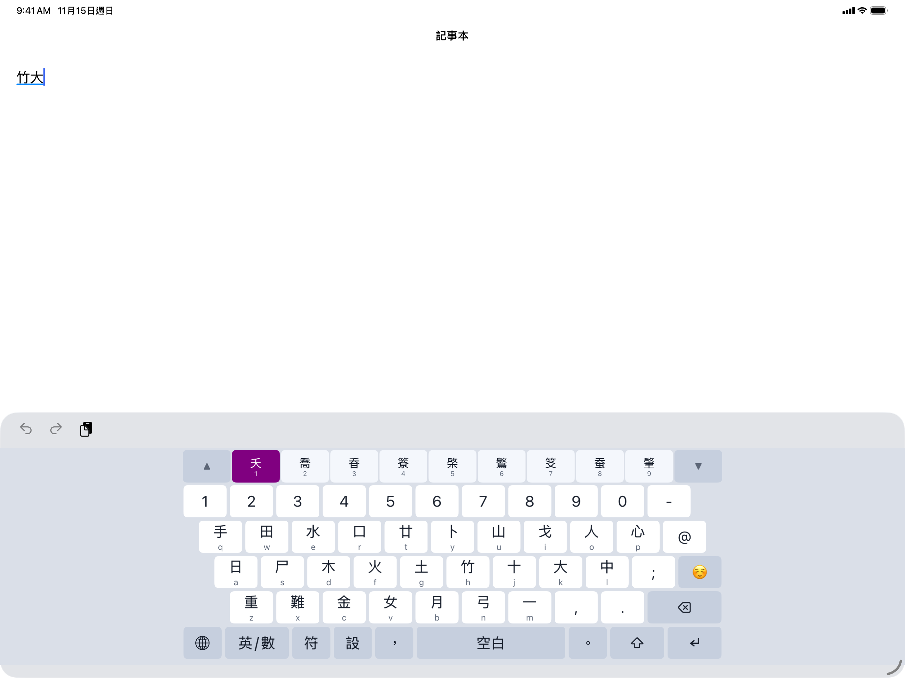

*iPad 倉頡。「竹大」尚未送出，候選列已出現「喬」。*

## 9. 在 iPhone Duo 使用分離鍵盤

展開 iPhone Duo，在一般文字欄切換到琦琦輸入法。點鍵盤的 **設**，在 **版面** 選 **對齊分離**，再按 **完成** 回到鍵盤。

按鍵分成左右兩區，中間留空，方便用雙手打字。左右各有一個空白鍵。直式和橫式沿用相同的左右鍵位，按鍵寬度會配合畫面調整。

### 直式

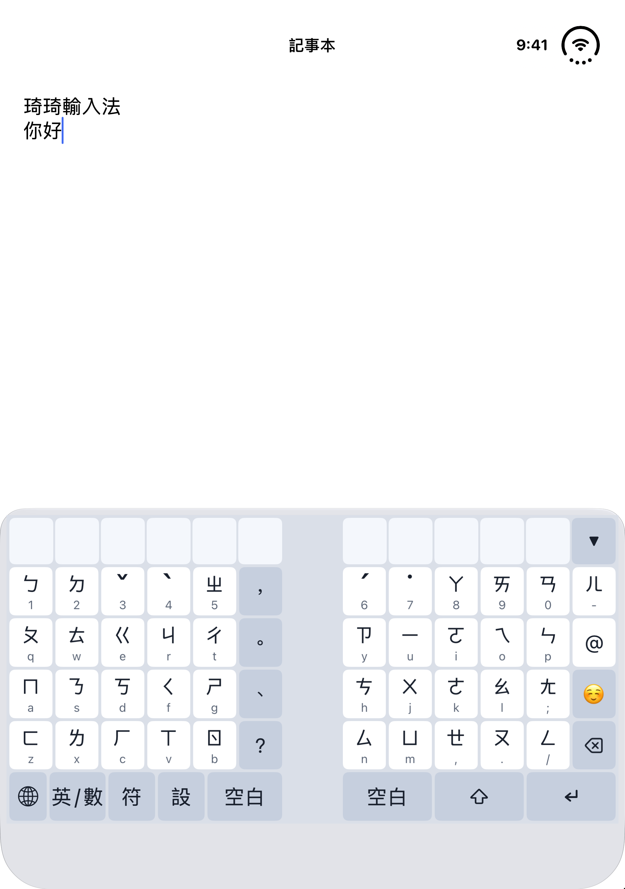

### 橫式

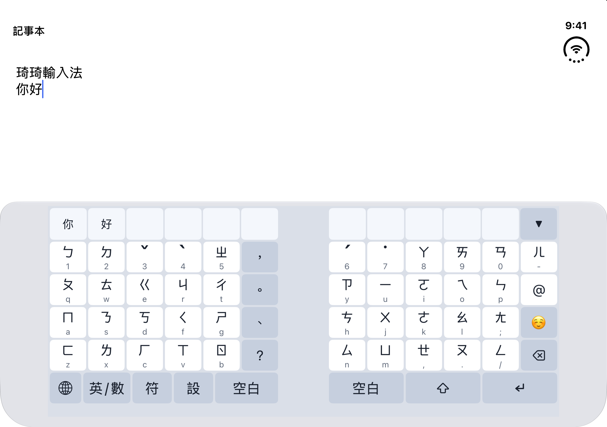

## 遇到問題時

| 情況 | 先檢查 |
| --- | --- |
| App Store 無法安裝 | 確認是 iPhone／iPad，系統為 iOS／iPadOS 17 以上；商店可用性也可能依 Apple 帳號地區而異。GitHub 的 iOS 模擬器包不能安裝到實機。 |
| 新增鍵盤清單找不到琦琦 | 先開啟一次琦琦 App，再回系統鍵盤清單；必要時關閉並重開「設定」。 |
| 找不到「允許完整取用」 | 琦琦不要求這項權限，沒有開關是正常的；確認已加入鍵盤後直接試打。 |
| 已加入，仍是原本的鍵盤 | 點進一般文字欄，長按地球鍵，明確選「琦琦輸入法」。 |
| 密碼、電話欄位變回系統鍵盤 | iOS 可能限制這些欄位使用第三方鍵盤，先在一般文字區試打。 |
| 外接鍵盤在其他 App 無法用琦琦 | 到琦琦 App 的實體鍵盤編輯器輸入，再複製或分享文字。 |
| App 設定與鍵盤內設定不同 | 兩處分別保存，請在要使用的地方調整；App 再修改後，鍵盤下次開啟會套用。 |

仍無法使用時，請記下裝置型號、系統版本、系統鍵盤清單是否有琦琦，以及切換後的畫面。

## 圖片來源

琦琦輸入法 **1.5.1** 的畫面擷取自 iPhone 17 Pro 與 iPad Pro 13 吋（M5）模擬器，系統版本為 iOS／iPadOS 26.5。 iPhone Duo 的分離鍵盤畫面擷取自 iOS 27.2 模擬器的內螢幕。

系統操作參考：[Apple：在 iPhone 上新增或更改鍵盤](https://support.apple.com/zh-tw/guide/iphone/iph73b71eb/ios)、[Apple：在 iPad 上新增或更改鍵盤](https://support.apple.com/zh-hk/guide/ipad/ipad1aa5a19a/ipados)。技術資訊另見 [iOS 鍵盤文件](Source/Loaders/iOS-Keyboard/README.md)。
