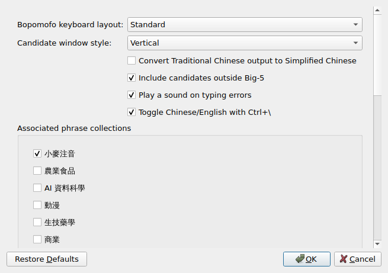
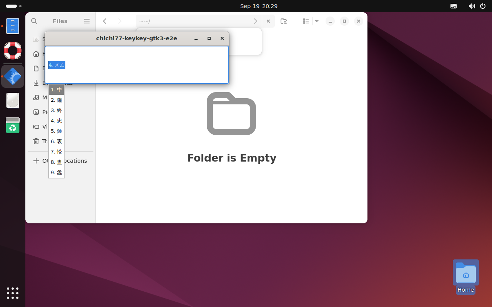
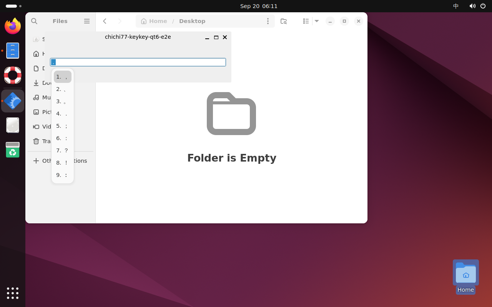

# Ubuntu 24.04 安裝與使用指南（v1.2.9）

這份指南給第一次在 Ubuntu 使用琦琦輸入法的人。Linux 版透過 **Fcitx 5** 在文字欄位輸入；安裝後不會出現獨立的打字主視窗。流程是：**下載套件 → 校驗並安裝 → 啟用 Fcitx 5 與候選面板 → 加入琦琦注音 → 試打**。

本指南使用與其他平台相同的 **`v1.2.9`** 發布標籤。**目前 `v1.2.9` 尚未發布，1.2.9 的 Linux 套件也尚未提供下載**；請等發布頁出現下列全部檔案，再執行安裝步驟。三張實拍取自先前在 Ubuntu 24.04／GNOME 46 的測試畫面，用來示範設定與操作，尚不代表 1.2.9 的驗收結果。

## 安裝前確認

`v1.2.9` 的預定 Linux 支援範圍是 **Ubuntu Desktop 24.04 LTS、GNOME Shell 46、Fcitx 5、amd64**。在「設定 → 關於」查看 Ubuntu 版本；打開終端機執行 `dpkg --print-architecture`，結果須為 `amd64`。首次安裝需要管理員密碼，並須登出、重新登入一次。其他 Ubuntu 版本、ARM64、IBus 與其他桌面環境尚未列入此版預定的支援範圍。

## 1. 下載 v1.2.9 套件（發布後）

屆時開啟 [琦琦輸入法發布頁](https://github.com/polobread/KeyKey/releases)，選擇 **`v1.2.9`**，展開 **Assets**，將下列五個檔案放進同一個資料夾，例如「下載項目」中的 `keykey-v1.2.9`。若 `v1.2.9` 或任一檔案尚未出現，表示此版的 Linux 安裝包尚未備齊。

| 檔案 | 用途 |
| --- | --- |
| `chichi77-keykey-data_1.2.9-1+ubuntu24.04_all.deb` | 注音與詞庫資料 |
| `fcitx5-chichi77-keykey_1.2.9-1+ubuntu24.04_amd64.deb` | Fcitx 5 輸入法 |
| `gnome-shell-extension-keykey-kimpanel_83+keykey1-1+ubuntu24.04_all.deb` | GNOME 候選字面板 |
| `gnome-shell-extension-keykey-kimpanel_83+keykey1-1+ubuntu24.04_source.tar.gz` | 面板對應原始碼，只供校驗及查閱，不須安裝 |
| `SHA256SUMS` | 上述四個檔案的校驗值 |

GNOME 面板套件的檔名保留其獨立的 `83+keykey1` 版號，但與琦琦輸入法套件一同放在 `v1.2.9` 發布頁。不要選 `Source code` 或其他平台套件。

## 2. 校驗並安裝

在該資料夾開啟終端機。若使用上述範例路徑，可執行：

```sh
cd ~/Downloads/keykey-v1.2.9
sha256sum -c SHA256SUMS
```

四個檔案都顯示 `OK` 才繼續。若路徑不同，先以 `cd` 切到實際下載資料夾；若出現 `FAILED` 或找不到檔案，重新確認下載內容。

```sh
sudo apt install \
  ./chichi77-keykey-data_1.2.9-1+ubuntu24.04_all.deb \
  ./fcitx5-chichi77-keykey_1.2.9-1+ubuntu24.04_amd64.deb \
  ./gnome-shell-extension-keykey-kimpanel_83+keykey1-1+ubuntu24.04_all.deb \
  fcitx5-frontend-gtk3 fcitx5-frontend-gtk4 fcitx5-frontend-qt6 \
  fcitx5-config-qt im-config
```

`apt` 會顯示要安裝的套件並要求確認；完成後保留三個 `.deb`，日後重裝時可使用。面板原始碼 `.tar.gz` 不要交給 `apt` 安裝。

## 3. 啟用 Fcitx 5 與 GNOME 候選面板

在已登入的 Ubuntu 桌面打開終端機，執行 `im-config`。在圖形精靈選 **fcitx5** 並完成設定。儲存手邊文件後，從畫面右上角的系統選單**登出，再登入同一個帳號**；只關閉終端機不會套用登入階段的輸入法設定。這是 [Fcitx 官方對 Ubuntu 的設定方式](https://fcitx-im.org/wiki/Setup_Fcitx_5)。

重新登入後，在終端機執行：

```sh
keykey-gnome-panel enable
keykey-gnome-panel status
```

`status` 顯示 `State: ACTIVE` 代表候選面板已啟用。若剛啟用後仍未生效，再登出、登入一次。面板與輸入法分屬不同套件；不要只安裝其中一個。

## 4. 加入琦琦注音

在「顯示應用程式」搜尋並開啟 **Fcitx 5 Configuration**，或在終端機執行 `fcitx5-config-qt`。在「輸入法」頁的可用清單搜尋 **琦琦注音**（英文介面為 `chichi77 KeyKey Bopomofo`），連按兩下或按中間的加入箭頭，確認它出現在目前使用的清單。若搜尋不到，檢查是否開了「只顯示目前語言」之類的篩選，並確認已重新登入。Fcitx 的 [設定工具說明](https://fcitx-im.org/wiki/Configtool_(Fcitx_5))也列出 Qt 介面的加入方式。

接著選取已加入的琦琦注音並開啟其設定。第一次使用可保留 **Standard** 注音布局、**Vertical** 直式候選與預設關聯詞庫；若你習慣倚天、倚天 26 鍵、許氏或漢語拼音，可在此切換。



*實拍：Ubuntu 24.04 的 Fcitx 5 設定視窗。畫面顯示注音布局、候選排列、中英文快捷鍵和關聯詞庫選項；這張圖擷取自已安裝套件的 X11 測試桌面，介面語言為英文。*

## 5. 在文字編輯器試打

從「顯示應用程式」開啟 **文字編輯器（琦琦注音）**（英文介面為 `Text Editor (琦琦注音)`），新增空白文件並點一下文字區。這個隨套件提供的啟動器會讓 GNOME 文字編輯器使用已驗證的 Fcitx 輸入路徑。若找不到該啟動器，先確認系統已安裝 GNOME 文字編輯器；也可先在 `gedit` 等一般文字欄位試打。

從 Fcitx 的輸入法選單選 **琦琦注音**。Fcitx 的切換快捷鍵通常是 **Ctrl + Space**，若沒有反應，從 Fcitx 設定的「全域選項」查看目前快捷鍵。確認目前選到琦琦注音，而非 Ubuntu 原有的注音或英文鍵盤。

使用 **Standard** 布局時，可依序按實體鍵盤上的 **`5`、`j`、`/`、`Space`**，也就是輸入 **ㄓㄨㄥ** 後以空白鍵叫出候選。候選窗出現後，按 **1** 選「中」，或直接點第一列。畫面可能因字型、主題與候選順序而略有不同。



*實拍：Ubuntu 24.04 GNOME Wayland VM 中，已安裝的琦琦注音在 GTK 3 測試文字欄位顯示注音與九列候選。視窗標題含測試程式名稱；正式使用時，候選窗會出現在你正在輸入的 App 旁。*

### 常用按鍵

| 按鍵 | 用法 |
| --- | --- |
| **1–9** 或滑鼠點選 | 選取對應的候選字。 |
| **Space／Page Down**、**Page Up** | 候選字有多頁時，往後或往前翻頁。 |
| **方向鍵**、**Enter** | 移動反白候選，並選取目前反白的字。 |
| **Backspace** | 刪除讀音中的一個部件。 |
| **Esc** | 關閉候選清單或取消尚未完成的讀音。 |
| `Ctrl + \` 或短按 **Shift** | 在琦琦注音內切換中文、英文；此快捷鍵可在設定中關閉。 |
| **Shift + Space** | 切換半形與全形。 |
| **Ctrl + 0** | 開啟符號候選清單。 |

選字後若出現關聯詞，**Shift + 1–9** 可選下一個字；也可以直接開始輸入下一個注音。輸入法以逐字選字為主，不會自動把整句轉成詞。符號清單開啟後可按號碼或用滑鼠選。



*實拍：Ubuntu 24.04 GNOME Wayland VM 的 Qt 6 文字欄位中，`Ctrl + 0` 顯示符號候選。圖中的 App 是測試程式。*

## 日常設定與已知情況

- 在 Fcitx 5 Configuration 選取琦琦注音並開啟設定，可改 **Standard、ETen、ETen26、Hsu、Hanyu Pinyin** 五種布局、直式／橫式候選、繁轉簡與關聯詞庫。候選窗的字體和外觀主要由 Fcitx／GNOME 面板管理。
- GNOME 文字編輯器 46 的一般啟動方式，在某些 Wayland 輸入路徑可能無法啟用 Fcitx；請改用套件附的 **文字編輯器（琦琦注音）** 啟動器。其他 GTK App 有相同情況時，可從終端機以 `keykey-fcitx-app 程式名稱` 啟動。
- 在不同文字欄位之間切換前，先選字或按 Esc 取消未完成的注音；不同輸入路徑在失焦時處理未完成組字的方式不同。
- 實體雙螢幕、熱插拔、所有 GNOME 主題與所有 App 都尚未逐一驗證；1.2.9 發布前仍須重新確認套件及支援範圍。

## 遇到問題時

| 情況 | 先檢查 |
| --- | --- |
| `sha256sum` 顯示 `FAILED` | 停止安裝，確認五個檔案都來自同一個 `v1.2.9` 發布頁並重新下載失敗的檔案。 |
| Fcitx 清單找不到琦琦注音 | 確認三個 `.deb` 已安裝、取消語言篩選，登出並重新登入後再開設定工具。 |
| 找得到輸入法，但打字只有英文 | 確認選到琦琦注音，並按 `Ctrl + \` 切回中文；一聲注音須在讀音後按 **Space**。 |
| 候選窗位置或滑鼠操作異常 | 執行 `keykey-gnome-panel status`，確認 `State: ACTIVE`；若曾自行安裝同名 GNOME 面板擴充，請參考發布說明處理重複版本。 |
| 只有 GNOME 文字編輯器無法輸入 | 用 **文字編輯器（琦琦注音）** 啟動器重試，再到其他文字欄位比較。 |

仍無法使用時，請記下 Ubuntu 版本、`dpkg --print-architecture` 的輸出、安裝檔名、`keykey-gnome-panel status` 的結果，以及哪個 App 的哪個欄位無法輸入。

## 移除

先在 Fcitx 5 Configuration 的目前使用清單移除琦琦注音，再執行：

```sh
keykey-gnome-panel disable
sudo apt remove fcitx5-chichi77-keykey chichi77-keykey-data \
  gnome-shell-extension-keykey-kimpanel
```

登出並重新登入後，GNOME 會重新載入擴充狀態。這不會刪除其他 Fcitx 輸入法或你的 Fcitx 個人設定。
