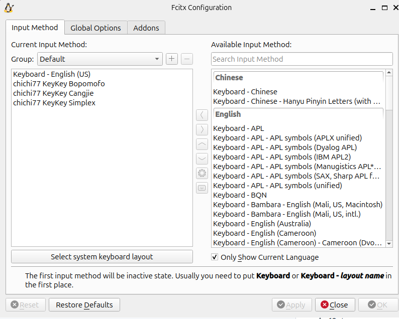
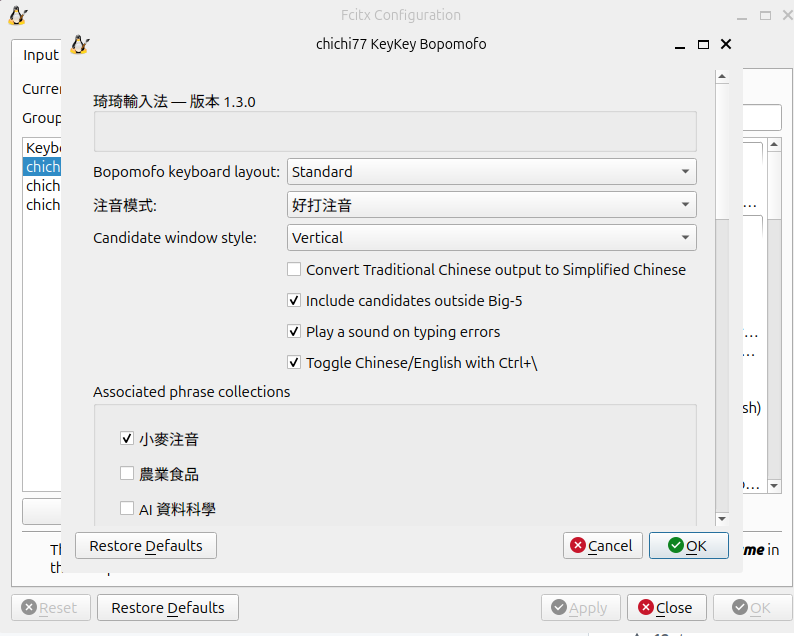
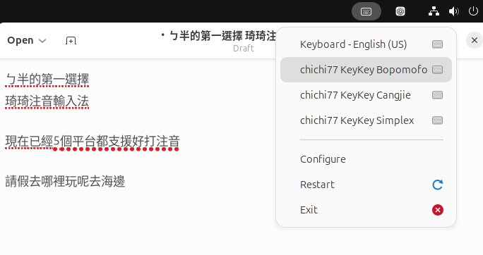
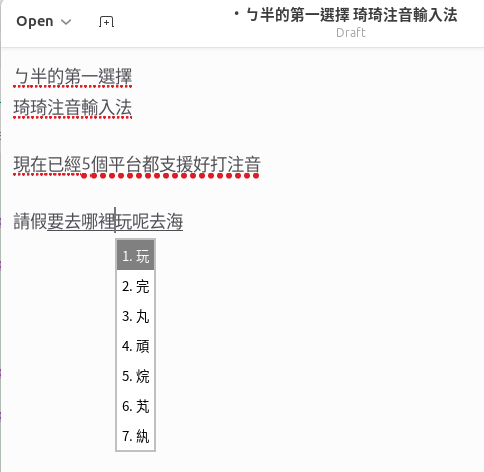

# Ubuntu 24.04 安裝與使用指南（v1.3.0）

這份指南說明如何在 Ubuntu Desktop 24.04 安裝琦琦輸入法 1.3.0，並使用預設的「好打注音」。Linux 版透過 Fcitx 5 在一般文字欄位輸入，不會開啟獨立的打字視窗。若要自行編譯，請看 [Linux `./configure` 編譯安裝指南](LINUX_CONFIGURE_INSTALL.md)。

## 安裝前確認

本版的 Linux 安裝步驟適用於 **Ubuntu Desktop 24.04 LTS、GNOME Shell 46、Fcitx 5、amd64**。在「設定 → 關於」確認 Ubuntu 版本，並執行 `dpkg --print-architecture`，結果應為 `amd64`。安裝需要管理員密碼，設定完成後需要重新啟動 Ubuntu。其他 Ubuntu 版本、ARM64、IBus 與其他桌面環境尚未列入這份指南的驗證範圍。

## 1. 下載 v1.3.0 套件

開啟 [琦琦輸入法 v1.3.0 發布頁](https://github.com/polobread/KeyKey/releases/tag/v1.3.0)，展開 **Assets**，將下列五個檔案下載到同一個資料夾，例如 `~/Downloads/keykey-v1.3.0`。檔案尚未全部出現時，等 Assets 備齊再安裝。

| 檔案 | 用途 |
| --- | --- |
| `chichi77-keykey-data_1.3.0-1+ubuntu24.04_all.deb` | 注音、詞庫與語言模型資料 |
| `fcitx5-chichi77-keykey_1.3.0-1+ubuntu24.04_amd64.deb` | Fcitx 5 輸入法與好打注音 |
| `gnome-shell-extension-keykey-kimpanel_83+keykey1-1+ubuntu24.04_all.deb` | GNOME 候選字面板 |
| `gnome-shell-extension-keykey-kimpanel_83+keykey1-1+ubuntu24.04_source.tar.gz` | 面板對應原始碼；只需校驗，不須安裝 |
| `SHA256SUMS` | 上述四個檔案的校驗值 |

面板套件沿用獨立的 `83+keykey1` 版號。請下載此頁的 Linux Assets；GitHub 自動產生的 **Source code** 壓縮檔不是 `.deb` 安裝包。

## 2. 校驗並安裝

在下載資料夾開啟終端機。若使用上面的範例路徑，執行：

```sh
cd ~/Downloads/keykey-v1.3.0
sha256sum -c SHA256SUMS
```

四個檔案都顯示 `OK` 後再安裝。若資料夾不同，將 `cd` 改成實際路徑；若顯示 `FAILED`，重新下載對應檔案。

```sh
sudo apt install \
  ./chichi77-keykey-data_1.3.0-1+ubuntu24.04_all.deb \
  ./fcitx5-chichi77-keykey_1.3.0-1+ubuntu24.04_amd64.deb \
  ./gnome-shell-extension-keykey-kimpanel_83+keykey1-1+ubuntu24.04_all.deb \
  fcitx5-frontend-gtk3 fcitx5-frontend-gtk4 fcitx5-frontend-qt6 \
  fcitx5-config-qt im-config
```

**不必另外安裝 SQLite。** 輸入法套件依賴執行期的 `libsqlite3-0`，上面的 `apt install` 會一併處理。`libsqlite3-dev` 只供[從原始碼編譯](LINUX_CONFIGURE_INSTALL.md)使用；一般安裝 `.deb` 不需要它，也不需要 `sqlite3` 命令列程式。

## 3. 啟用 Fcitx 5 與 GNOME 候選面板

執行 `im-config`，在圖形精靈選 **fcitx5**。儲存手邊文件後**重新啟動 Ubuntu**，再登入同一個帳號。重新啟動可讓新開啟的 App 取得 Fcitx 的登入環境；只關閉終端機不會套用設定。Fcitx 的 [Ubuntu 設定說明](https://fcitx-im.org/wiki/Setup_Fcitx_5)也使用 `im-config`。

重新登入後執行：

```sh
keykey-gnome-panel enable
keykey-gnome-panel status
```

`status` 顯示 `State: ACTIVE` 表示面板已啟用。若啟用後仍看不到候選窗，再登出並登入一次。

## 4. 加入琦琦注音並設定模式

從「顯示應用程式」開啟 **Fcitx 5 Configuration**，或執行 `fcitx5-config-qt`。在「輸入法」頁搜尋 **KeyKey**，將 **chichi77 KeyKey Bopomofo** 加入目前使用清單。**chichi77 KeyKey Cangjie** 和 **chichi77 KeyKey Simplex** 分別是倉頡與簡易；使用注音時請選 Bopomofo。若清單搜尋不到，取消「Only Show Current Language／只顯示目前語言」的勾選，並確認已重新登入。



*Ubuntu 24.04 的 Fcitx 5 輸入法清單；琦琦注音在英文介面顯示為 chichi77 KeyKey Bopomofo。*

選取清單中的 Bopomofo，開啟設定。**「注音模式」預設為「好打注音」**，可在此改成「傳統注音」。第一次使用可先保留 **Standard** 鍵盤布局和 **Vertical** 直式候選；習慣倚天、倚天 26 鍵、許氏或漢語拼音時，再切換鍵盤布局。此頁也可調整繁轉簡、Big-5 範圍外候選、打字錯誤提示音、中英文快捷鍵和關聯詞庫。



*1.3.0 設定頁：在「注音模式」選擇好打注音或傳統注音。*

## 5. 試打與基本操作

開啟 **文字編輯器（琦琦注音）**，新增空白文件並點選文字區。此啟動器讓 GNOME 文字編輯器使用 Fcitx 的輸入路徑；若找不到，先確認已安裝 GNOME 文字編輯器，也可在其他一般文字欄位試打。

從桌面右上角的 Fcitx 選單選 **chichi77 KeyKey Bopomofo**。按 **Ctrl + Space** 可以在 Fcitx 的英文鍵盤和琦琦注音間切換；快捷鍵若已自行更改，以 Fcitx 5 Configuration 的「全域選項」為準。



*Fcitx 選單中的琦琦注音、倉頡與簡易。*

### 好打注音（預設）

依所選鍵盤布局連續輸入注音與聲調，好打注音會把完整音節留在同一段有底線的組字文字，依詞頻自動選字。**Enter** 送出整段；輸入到第十個音節時，會先送出最前面的完整詞段，其餘文字仍保留組字狀態。第一聲沒有聲調符號，需在讀音後按 **Space** 完成該音節；其他聲調輸入聲調鍵即可完成。

若有錯字，先用**方向鍵**將組字游標移到該字，按 **Space** 或 **↓** 開啟該位置的候選；支援組字滑鼠點擊的 App 也可直接點字。按 **1–9**、用滑鼠點選，或用方向鍵反白後按 **Enter** 選字。**選字只修改組字內容，不會立即送出整句**；沒有候選窗時，再按 **Enter** 才送出。**Backspace／Delete** 可修改組字位置的讀音或文字，**Esc** 可關閉候選窗或取消未完成的讀音。



*Ubuntu 24.04 文字編輯器中的 1.3.0 好打注音：句子仍在組字時，對「玩」字開啟候選清單，更正後可繼續輸入。*

### 傳統注音

在 Fcitx 的 Bopomofo 設定頁把「注音模式」改成 **傳統注音**。傳統注音以逐字選字為主：輸入完整讀音和聲調後顯示候選；第一聲讀音可按 **Space** 開啟候選，再按候選編號或用滑鼠選字。選字後若出現關聯詞，可按 **Shift + 1–9** 選取對應詞，也可直接開始輸入下一個字。

### 常用按鍵

| 按鍵 | 用法 |
| --- | --- |
| **Ctrl + Space** | 切換 Fcitx 的英文鍵盤與琦琦注音。 |
| `Ctrl + \` 或短按 **Shift** | 已選琦琦注音時，切換其中文／英文模式；`Ctrl + \` 可在設定中關閉。 |
| **Shift + Space** | 切換半形與全形。 |
| **Space／↓** | 好打注音組字時，開啟游標所在字的候選。 |
| **1–9**、滑鼠或方向鍵後按 **Enter** | 選取候選字；選字後可繼續組字。 |
| 候選窗中的 **Space／Page Down**、**Page Up** | 候選有多頁時翻頁。 |
| **Enter** | 候選窗開啟時選字；好打注音沒有候選窗時送出整段組字。 |
| **Ctrl + 0** | 開啟符號候選清單。 |

已選琦琦注音卻仍直接輸出英文字母時，按 `Ctrl + \` 或短按 **Shift** 切回中文；這和 **Ctrl + Space** 切換 Fcitx 輸入法是兩種不同操作。

好打注音會在目前 Linux 使用者的資料目錄保存自訂詞和選字學習紀錄。進階使用者可用 `keykey-smart-phrases list` 查看自訂詞，或執行 `man keykey-smart-phrases` 查看新增、移除與重設學習紀錄的指令。

## 日常設定與已知情況

- 在 Fcitx 5 Configuration 的 Bopomofo 設定頁可切換好打／傳統注音、五種鍵盤布局、直／橫式候選、繁轉簡與關聯詞庫。候選窗字體和外觀也受 Fcitx／GNOME 主題影響。
- GNOME 文字編輯器 46 的一般啟動方式，在某些 Wayland 輸入路徑可能無法啟用 Fcitx；可改用套件附的 **文字編輯器（琦琦注音）** 啟動器。其他 GTK App 遇到相同情況時，可用 `keykey-fcitx-app 程式名稱` 啟動。
- 切換輸入法或中英文模式時，好打注音會先完成可辨識的讀音並送出目前的組字文字。尚未完成的讀音會以原始按鍵保留。
- 實體雙螢幕、熱插拔、所有 GNOME 主題與所有 App 尚未逐一驗證；若遇到問題，請記下環境與重現步驟。

## 遇到問題時

| 情況 | 先檢查 |
| --- | --- |
| `sha256sum` 顯示 `FAILED` | 停止安裝，確認五個檔案都來自同一個 `v1.3.0` 發布頁，重新下載失敗的檔案。 |
| Fcitx 清單找不到琦琦注音 | 確認三個 `.deb` 已安裝、取消語言篩選，重新登入後再開設定工具。 |
| 找得到輸入法，但打字只有英文 | 確認選到 Bopomofo，按 `Ctrl + \` 切回中文；第一聲讀音後按 **Space** 完成音節。 |
| 只有「文字編輯器（琦琦注音）」可用，Firefox 或終端機只輸出英文 | 重新啟動 Ubuntu 後再開啟這些 App。執行 `printenv GTK_IM_MODULE QT_IM_MODULE XMODIFIERS`，三行應依序為 `fcitx`、`fcitx`、`@im=fcitx`；若仍是 `ibus`，重新執行 `im-config` 選 **fcitx5** 並重啟。 |
| 候選窗位置或滑鼠操作異常 | 執行 `keykey-gnome-panel status`，確認 `State: ACTIVE`；若曾自行安裝同名 GNOME 擴充，檢查是否存在重複版本。 |
| 只有 GNOME 文字編輯器無法輸入 | 用 **文字編輯器（琦琦注音）** 啟動器重試，並到其他文字欄位比較。 |

仍無法使用時，請記下 Ubuntu 版本、`dpkg --print-architecture` 的輸出、安裝檔名、`keykey-gnome-panel status` 的結果，以及無法輸入的 App 和文字欄位。

## 移除

先在 Fcitx 5 Configuration 的目前使用清單移除琦琦注音，再執行：

```sh
keykey-gnome-panel disable
sudo apt remove fcitx5-chichi77-keykey chichi77-keykey-data \
  gnome-shell-extension-keykey-kimpanel
```

登出並重新登入後，GNOME 會重新載入擴充狀態。這不會刪除其他 Fcitx 輸入法或 Fcitx 個人設定。
