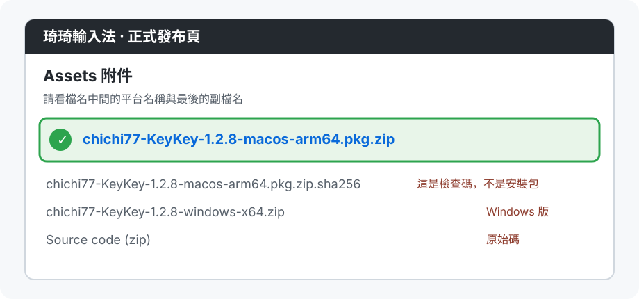
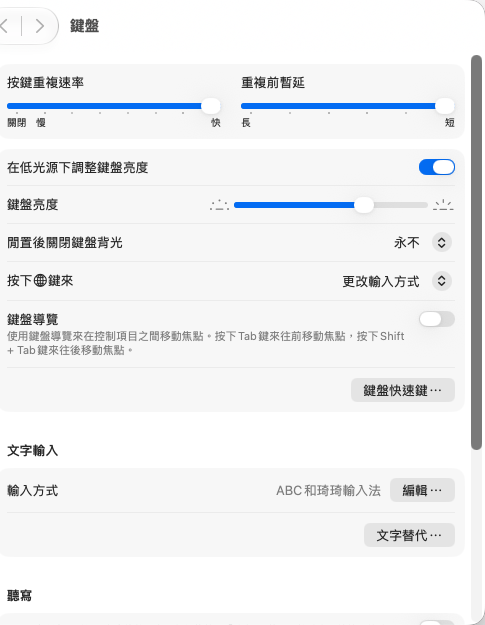
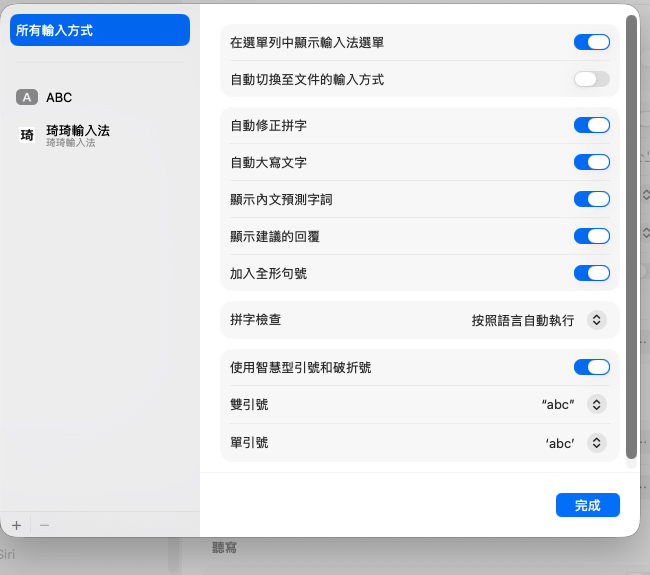
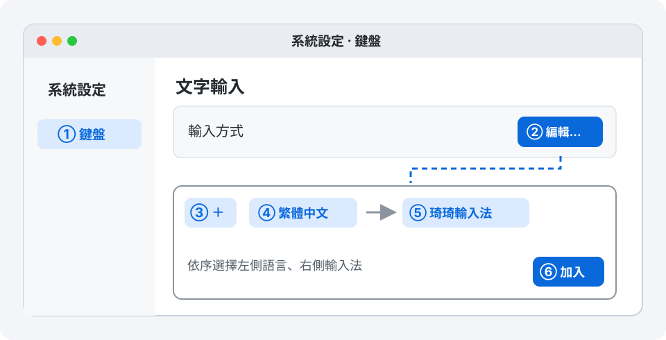
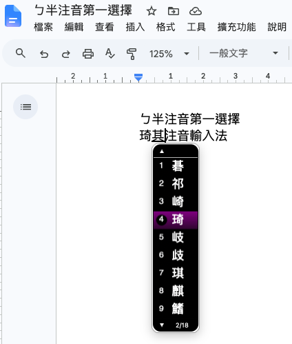

# macOS 安裝與使用指南

這份指南給第一次安裝琦琦輸入法的 Mac 使用者。**照著畫面點選即可，不需要輸入指令。**

安裝後，琦琦輸入法會出現在 Mac 的「輸入法」選單中；它不會像一般 App 一樣開啟主視窗。整個流程是：**下載安裝包 → 安裝 → 登出並重新登入 → 加入輸入法 → 試打**。

> 請從正式發布頁下載目前已發布的 macOS 版本。下圖以 1.2.8 為例；實際檔名中的版本數字會隨發布更新。

## 安裝前，確認你的 Mac

按畫面左上角的 ** → 關於這台 Mac**，確認：

- 「晶片」顯示 Apple M 系列；如果顯示 Intel，這版目前不支援。
- macOS 版本是 **15 或更新版本**。

符合條件後，請先儲存正在編輯的文件；首次安裝後需要登出一次。

## 1. 下載 macOS 安裝包

1. 打開 [琦琦輸入法的正式桌面版下載頁](https://github.com/polobread/KeyKey/releases/latest)。若看到很多檔案，往下找到 **Assets**，必要時按一下展開。
2. 點選檔名包含 **`macos-arm64.pkg.zip`** 的檔案。以 1.2.8 為例，完整檔名是 `chichi77-KeyKey-1.2.8-macos-arm64.pkg.zip`。
3. 在「下載項目」資料夾中連按兩下下載的 ZIP，會得到 `.pkg` 安裝檔。請不要選旁邊的 `.sha256`、Windows、Linux 或 `Source code` 檔案。



*圖 1：下載檔案的操作示意；實際發布頁的排列和版本號可能不同。*

## 2. 執行安裝程式

在「下載項目」中連按兩下剛解壓縮的 `.pkg`，依畫面提示按 **繼續 → 安裝**。Mac 若要求密碼或 Touch ID，使用你平常登入這台 Mac 的帳號完成授權。看到「安裝成功」後，關閉安裝程式。

如果 macOS 拒絕開啟安裝檔，先確認檔案來自上述正式發布頁、檔名包含 `macos-arm64.pkg.zip`，再記下畫面上的完整訊息回報；不要下載來路不明的替代安裝包。

## 3. 登出，再重新登入

首次安裝後，先儲存工作，再按畫面左上角 ** → 登出〔你的使用者名稱〕**，接著重新登入同一個 Mac 帳號。這一步讓 macOS 找到新安裝的輸入法；只關閉「系統設定」或安裝程式不算登出。

若你原本已經安裝並啟用琦琦輸入法，這次只是覆蓋升級，通常可直接使用新版；若仍顯示舊版或無法切換，再登出並重新登入。

## 4. 把琦琦輸入法加入 Mac

1. 按左上角 ** → 系統設定 → 鍵盤**。
2. 在「文字輸入」區按 **編輯…**，接著按左下角 **＋**。
3. 在左側選 **繁體中文**，在右側選 **琦琦輸入法**，再按 **加入**。
4. 回到「文字輸入」清單，確認「琦琦輸入法」已出現。如果沒看到右上角的輸入法選單，開啟 **在選單列中顯示輸入法選單**。



*macOS 27.0 實拍：在「鍵盤」設定往下找到「文字輸入」，按「編輯…」。畫面只取設定區，沒有個人帳號側欄。*



*macOS 27.0 實拍：清單左側顯示已加入的輸入法；若還沒有琦琦輸入法，按左下角「＋」加入。這台 Mac 已加入，因此清單可直接看到。*



*圖 2：加入輸入法的操作示意；macOS 版本不同時，視窗外觀可能略有差異，請依照上面的按鈕名稱操作。*

## 5. 切換輸入法並試打

1. 點畫面右上角的**輸入法選單**，選 **琦琦輸入法**。若選單顯示「ABC」，表示目前仍是英文輸入法，請再切換一次。
2. 打開 Mac 內建的 **文字編輯**，新增空白文件，點一下空白頁。
3. 用你平常的注音鍵位輸入完整音節和聲調，例如 **ㄊㄞˊ**。看到候選字後，用候選字旁的數字鍵或滑鼠選「台」。
4. 再輸入 **ㄅㄟˇ** 並選「北」。目前是**逐字選字**，因此「台北」要分兩次選；選字後出現的聯想詞可協助接著輸入。



*圖 3：專案既有的實際輸入截圖。候選字左邊的 `1–9` 是選字鍵，底部的 `2/18` 表示目前是第 2 頁、共 18 頁；畫面中的 App 與候選字可能和你試打時不同。*

## 日常使用

### 注音與選字

選好琦琦輸入法後，在想打字的 App 點一下文字欄位，再依鍵盤上的注音配置輸入一個字的讀音。有聲調時，打完聲調通常就會出現候選字；**一聲沒有聲調符號**，可按 **空白鍵**叫出候選字。選字後再打下一個字，例如「台北」是先選「台」，再輸入並選「北」。目前不會一次輸入整個詞後自動選字。

| 畫面或按鍵 | 用法 |
| --- | --- |
| 候選字旁的 **1–9** | 按對應數字鍵選字；也可以用滑鼠點候選字。 |
| **空白鍵／Page Down**、**Page Up** | 候選字有多頁時，分別往後、往前翻頁。 |
| **方向鍵** | 直式候選窗用上／下移動反白字；橫式候選窗用左／右移動。 |
| **Return** | 一般候選字清單開啟時，選取目前反白的字。 |
| **Esc** | 關閉目前的候選字或聯想詞清單。 |

如果選完字後出現「聯想詞」，那是推薦**下一個字**，不是把整句自動完成。例如選了「台」後可能看到「灣」或「北」。可按畫面提示的 **Shift + 數字鍵**選推薦字，或直接繼續輸入下一個注音。

### 切換輸入法與符號

- 想改打一般英文時，在 Mac 右上角的**輸入法選單**改選 **ABC**；要打注音時再選 **琦琦輸入法**。
- 琦琦輸入法的同一個選單內可選 **傳統注音、倉頡、簡易**。第一次使用先選「傳統注音」；選「倉頡」或「簡易」後，按鍵規則會跟著改變。
- 需要特殊符號時，從琦琦輸入法的選單點 **符號表**，在表內選取符號。

### 調整偏好設定

先切到琦琦輸入法，再打開右上角輸入法選單，點 **偏好設定…**：

- **注音**：選擇熟悉的注音鍵盤配置；使用標準鍵盤的話可維持「標準」。
- **詞彙管理**：勾選想要的聯想詞庫。第一次使用可以維持預設值。
- **一般**：選擇候選字直排或橫排，以及候選窗比例。調整比例後若畫面尚未更新，切到 ABC 再切回琦琦輸入法即可重新載入。

琦琦輸入法的設定與 Mac 系統的「鍵盤 → 文字輸入」是兩個地方：前者調整打字習慣，後者負責加入或移除輸入法。

## 遇到問題時

| 你看到的情況 | 可以怎麼做 |
| --- | --- |
| 在「＋」清單找不到「琦琦輸入法」 | 確認安裝程式顯示「安裝成功」；首次安裝後登出並重新登入；回到「繁體中文」清單找。 |
| 已加入，但右上角選單找不到它 | 回到「系統設定 → 鍵盤 → 文字輸入 → 編輯…」確認已加入，並開啟「在選單列中顯示輸入法選單」。 |
| 選到了，但打字還是英文或沒有候選字 | 在「文字編輯」的空白文件裡試打完整注音和聲調，確認右上角顯示琦琦輸入法；重新登入後再試。 |
| 輸入一聲的注音後沒有候選字 | 一聲沒有聲調符號，輸入讀音後按空白鍵，再從候選字選取。 |
| 選完字後又看到「Shift + 數字鍵」 | 這是聯想詞推薦，可選一個作為下一個字，也可以直接繼續打下一個注音。 |
| 數字鍵能選字，但滑鼠點候選字沒反應 | 先用數字鍵繼續輸入；這可能涉及 macOS 的控制權限。回報你的 macOS 版本，以及滑鼠點選時出現的權限畫面。 |
| 權限頁的圖示異常，或開關是關閉的 | 「隱私權與安全性 → 裝置控制和資料取用」不是加入輸入法的地方。先依第 5 步測試實際打字；若打字正常，單看該圖示或開關無法判定輸入法故障。 |

仍無法使用時，請附上：安裝檔名、Mac 晶片與 macOS 版本（在「關於這台 Mac」查看）、第 4 步清單是否有琦琦輸入法、右上角選單目前顯示什麼，以及在「文字編輯」試打後的畫面。這些資訊比單一權限頁截圖更能幫助定位問題。

<details>
<summary>進階檢查（提供給協助排查的人）</summary>

安裝位置應為 `/Library/Input Methods/chichi77 KeyKey.app`。以下指令只讀取版本和簽章資訊，不是一般使用者安裝時必須執行的步驟：

```sh
/usr/libexec/PlistBuddy -c 'Print :CFBundleShortVersionString' '/Library/Input Methods/chichi77 KeyKey.app/Contents/Info.plist'
codesign -dv '/Library/Input Methods/chichi77 KeyKey.app' 2>&1 | grep -E 'Signature=|TeamIdentifier='
```

開發者文件：[安裝包建置與簽章](Installer/README.md)。

</details>

Mac 系統操作的參考資料：[Apple：在 Mac 上登出帳號](https://support.apple.com/zh-tw/guide/mac-help/mchlcc122483/mac)、[Apple：設定中文輸入方式](https://support.apple.com/zh-hk/guide/chinese-input-method/cim6023ab944/mac)。
