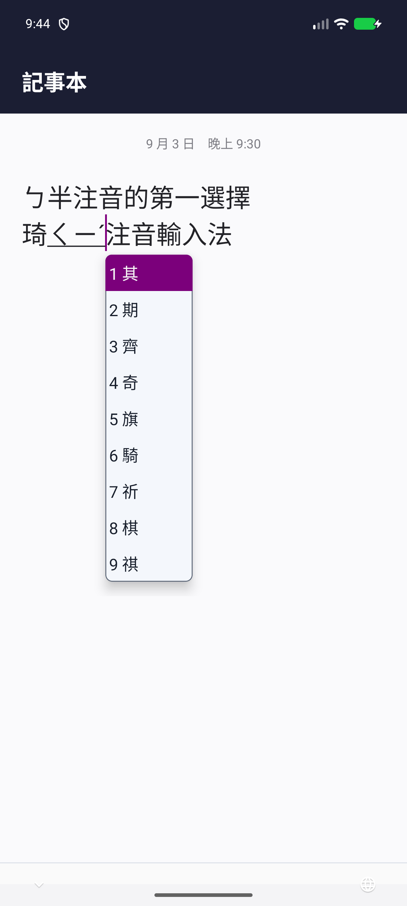

# 琦琦輸入法 Android IME 1.3.2

產品版號為 `1.3.2`，`versionCode` 為 `1003002`，尚未發布。版本預設值及 Android
自動封裝均以 `app/build.gradle.kts` 為準，獨立於其他平台的版號。

一般使用者請先看[Android 手機、平板安裝與使用指南](../../../ANDROID_INSTALL.md)；本頁包含開發、建置與實作細節。

Android 原生繁體中文注音輸入法，使用 KeyKey 共用的
`Source/DataTables/bpmf-ext.cin` 字表。建置時會自動把字表與關聯詞詞庫加入 APK，
不需要手動複製。

設定頁可選「好打注音」、「傳統注音」、「倉頡」或「簡易」，新安裝預設好打注音。觸控好打注音將已完成的
中文字即時寫入 App，並保留最近九個音節供句中選字及退格修正；更早的詞段留在 App。
組句使用 APK 內的 `KeyKey.db` Bigram 模型。外接實體鍵盤保留句中游標組字；第十一個
音節完成時會送出前方完整詞段，剩餘最多十個音節仍可移動游標改選。傳統注音保留
逐字選字與關聯詞流程。19 音節完整句「請假要去哪裡玩呢去海邊因為那裡有比基尼」
的實體鍵盤檢查點與測試界線見[交接紀錄](../../../docs/SMART_MANDARIN_PHYSICAL_KEYBOARD_HANDOFF.md)。

設定頁的「好打注音使用上下文選字（Bigram）」預設開啟。關閉後，組句與候選排序
只依字詞頻率及選字記憶，不查詢內建或已學習的 Bigram，也暫停相鄰詞學習；
既有學習資料保留，重新開啟即可繼續使用。整句編輯、自訂詞及選字記憶仍可用，
但自動選字可能較不準。變更會先結束目前好打組字並保留文字，再套用新設定；
傳統注音不受影響。這個選項減少輸入期間的查詢負擔，仍會使用同一份 SQLite
模型及原有的啟動完整性檢查，不能視為已修復特定裝置的崩潰。

設定頁的「管理好打注音自訂詞」可新增、編輯、刪除詞句，並匯入／匯出 macOS
`MJSR version 1.0.0` 檔案的自訂詞段落。輸入每字一組注音，例如 `ㄋㄧˇ ㄏㄠˇ`，
或用標準鍵位 `su3cl3`。自訂詞與好打注音學習紀錄儲存在 App 的本機 SQLite 資料庫，
虛擬鍵盤與實體鍵盤共用。選字及確定整句後會學習候選與相鄰詞關係；設定頁可重設
學習紀錄而保留自訂詞。macOS 匯出檔內加密的學習資料區塊不會匯入行動版。

保留熟悉的五排標準注音鍵位與固定 `1–9` 候選位置；接上實體鍵盤時也能用跟隨游標的
浮動候選字窗延續選字習慣。畫面在記事本輸入
`ㄅ半注音的第一選擇 琦ㄑㄧˊ注音輸入法`，其中 `ㄑㄧˊ` 保持組字與選字狀態。



## 倉頡與簡易

點觸控鍵盤的「設」，或從 App 首頁進入「調整設定」，在設定頁上方的「輸入法」
選單切換四種輸入法；USB／藍牙鍵盤會沿用所選方法。觸控鍵盤保留第二排末端的 @ 鍵。
A–Z 顯示倉頡字根，候選、翻頁、關聯詞與送字共用傳統注音流程。
倉頡最多五碼、支援 `?`／`*`，按空白查詢；只有一頁候選時空白確定首選，多頁則翻頁。
簡易最多兩碼、滿碼開啟候選，`1–9` 或 Enter 選字。

兩者直接查詢 APK 內同一份唯讀 `KeyKey.db` 的 `Generic-cj-cin`／
`Generic-simplex-cin` 表，不複製或重建字表。預設依 macOS：倉頡錯碼清除、選字排序
開啟，滿五碼查詢關閉；簡易保留錯碼、固定候選順序。這些選項位於設定頁獨立的
「倉頡與簡易」區塊。即時候選預設關閉，與錯碼清除互斥；倉頡另可調整標點寬度。
排序紀錄保存在 App 私有偏好設定，不修改內建字表。
切換中英文、輸入法或結束輸入時，先保留選定文字或未完成字根。

共用案例 `tests/fixtures/mobile-table-input/cases.tsv` 同時由 Swift、Android JVM 與
Android 真實 SQLite instrumentation 測試執行，涵蓋兩種輸入法的碼長、候選、翻頁、
萬用字元、退格、錯碼及切換。

## 畫面模式

設定頁的「注音鍵盤」可選「標準」或「許氏鍵盤」，新安裝預設標準；好打與傳統注音、
虛擬與實體鍵盤共用此設定。許氏虛擬鍵盤沿用原有 QWERTY 位置，只顯示英文鍵帽，
例如 `nef` 輸入 `ㄋㄧˇ`；標準配置維持既有注音與英數雙標籤。
解析及退格對齊 macOS／Windows 的 Formosa 核心，候選仍使用行動版的 `1–9`。

- 直式：最上方是上一頁 ▲、9 個候選字與下一頁 ▼。下方四排注音鍵都固定為
  11 個等寬按鍵，依序為 `ㄅ…ㄦ`、`ㄆ…ㄣ／@`、`ㄇ…ㄤ／Emoji`、
  `ㄈ…ㄥ／Shift`。第五排為「模式、符、設、逗號、長空白、句號、Backspace、
  Enter」。每個注音鍵同時保留實體鍵位提示，例如 `ㄅ／1`、`ㄉ／2`。
- 橫式：沿用相同的候選列、四排 11 等寬鍵與功能列，100% 時內容高度為一般比例的
  230dp，並使用較小字級避免裁切。設定頁可把直式與橫式虛擬鍵盤分別調成
  50%、75%、90%、100%、110%、125%、150%、175% 或 200%。
- USB／藍牙鍵盤：候選列依序為 9 個候選字、Emoji、`ㄅ／英` 與 `半／全`，共 12 個
  完全等寬按鍵。語言鍵只顯示 `ㄅ／英`，全半形鍵顯示 `半／全`；兩鍵都可
  直接觸控切換，也分別對應 `Ctrl+Space` 與 `Shift+Space`。不再顯示
  ▲／▼ 翻頁鍵。候選列下方會保留系統安全區，避免被多國語系地球鍵蓋住。一般候選用 `1–9` 選字；
  關聯詞依 Windows 行為改用 `Shift+1–9`，但為了維持選字習慣，候選角標一律仍顯示
  `1–9`，不顯示 Shift 後的符號。`Page Up`／`Page Down` 換頁。`Ctrl+Space` 切換
  注音／英文模式，`Shift+Space` 切換半形／全形；全形模式會比照 Windows，把實體
  鍵盤輸入的 ASCII 英文字母、數字、空白與符號轉成全型，中文字與非 ASCII 字元不變。
  `Ctrl+,`、`Ctrl+.` 分別輸入全型逗號 `，` 與句號 `。`。
  若關閉浮動候選字窗，可在設定頁選擇於原候選列下方加顯兩排 12 格按鍵：
  數字列為 `1!` 至 `0)`、`符`、`設`；符號列依序為 `-_`、`=+`、`[{`、
  `]}`、`;:`、`'"`、`,<`、`.>`、`/?`、反斜線／`|`、反引號／`~`、`⇧`。
  點 `⇧` 可同時切換兩排按鍵的上標符號，`符` 會在原候選列顯示符號候選，
  `設` 會開啟設定。此選項預設關閉。
  macOS 的 Traditional Mandarin 是用 `Ctrl+0` 或 `Ctrl+1` 開啟符號候選，Android
  外接鍵盤也支援這兩組快捷鍵，效果和觸控版的「符」完全相同。
  好打注音遇到語言模型無法組出的讀音時會保留原句與注音；按 Esc 可只取消該讀音。

  設定頁可改用跟隨文字游標的浮動候選字窗；啟用後會收起底部實體鍵盤候選列，
  候選出現時才顯示可觸控的垂直或水平選字窗。每頁仍是 9 個候選，候選文字最多顯示
  三個完整文字圖形，超過時加省略號，但選取後送出的仍是完整文字。垂直窗採緊湊寬度，
  每列仍可容納選字數字與三個中文字。垂直窗以上下鍵
  移動反白、左右鍵換頁；水平窗以左右鍵移動反白、上下鍵換頁。Enter 選取一般候選的反白項目；顯示關聯詞時，Enter 不會誤選關聯詞，而是關閉候選並直接送出原本的 Enter 或欄位 action。
  ESC 關閉候選並清除讀音。開啟候選時會重新請求游標座標；尚未收到時暫放底部中央，
  300ms 後補取一次，再等 300ms 仍無有效座標就自動關閉浮窗、切回一般候選列。
  保留當前文字及候選，設定頁會顯示原因，須手動重新勾選才會再啟用。
  尚未開啟候選時不會因缺少座標而停用；隱藏候選或結束輸入時取消待執行的重試。

觸控鍵盤候選列可按 ▲／▼ 或左右滑動換頁；候選開啟時按空白也會前往下一頁。翻過最後一頁
會回到第一頁，從第一頁往前則會回到最後一頁。中文模式使用台灣標準注音鍵位；
聲調鍵會立即查詢候選，未輸入聲調時可按空白查詢。觸控選字直接點候選列，不會讓
注音列的數字鍵誤選候選。確定單一中文字後，若已啟用的詞庫有相同開頭，候選列會
接著顯示關聯詞的後半段，選取後直接接在已輸入的字後。

按下單一文字、注音或符號鍵時，按鍵上方或附近會顯示約 1.4 倍大的同款按鍵預覽，
方便在手指遮住標籤時確認內容；滑出原按鍵、放開或取消觸控後立即隱藏。功能鍵與
候選字不顯示預覽，也不會因預覽增加可點擊範圍。

觸控注音版面按一次 Shift 會暫時切到英文小寫，輸入下一個觸控字元後立即回到注音。
暫時英文版保留相同雙標籤，但交換上下順序，例如注音版的「上方 ㄅ、下方 1」會
變成「上方 1、下方 ㄅ」。
以左下模式鍵進入的英文版面則可按 Shift 持續切換小寫與大寫，大寫時第一排的
`123…` 同時改為 `!@#…`，小寫版的 `; , . /` 分別改為 `: < > ?`。
外接鍵盤的實體 Shift 不會切換觸控版面。左下模式鍵
依序循環注音、英文與數字符號版面；注音、英文、數字符號模式分別顯示
「英/數」、「數/ㄅ」、「ㄅ/英」，提示接下來可切換的兩個模式。
「符」會在候選區開啟 90 個標點、括號、數學、單位、貨幣、箭頭及圖形符號；第三排
右側 Emoji 鍵則開啟 90 個常用表情符號。兩者都是每頁 9 個、共 10 頁，翻頁與直接
點選方式和中文字候選相同。

數字與符號版面本身分成兩套 44 鍵排列。第一套提供數字與常用符號；按 Shift 會留在
數字符號模式並切到第二套貨幣、數學、箭頭及圖形符號，再按一次 Shift 回第一套。
「外觀與操作」及「實體鍵盤」各有獨立的「預留底部切換語言空間」開關，預設皆開啟。
開啟時保留直式 40dp／橫式 35dp，避開 Android 系統的地球切換語言按鈕；關閉時
虛擬鍵盤或底部候選列貼齊輸入法視窗底部，整體高度減少直式 40dp／橫式 35dp。
按鍵及候選列尺寸不變；即使系統限制最大高度或使用 200% 鍵盤，也不把節省的空間用來放大按鍵。
「實體鍵盤」中的「使用浮動候選字窗」開啟時，「顯示虛擬數字與符號鍵」及底部空間
開關變灰且無法操作；關閉浮動候選窗後恢復可調整，並保留各自先前選擇。

Backspace 在注音組字期間逐一刪除聲調、韻母、介音與聲母，例如 `ㄋㄧˇ` 會先退回
`ㄋㄧ`，不會刪除游標前的文字。已送出的 Emoji 會按使用者看到的一個完整圖形刪除，
包含代理字元、變體選擇符、膚色及連接字元組合。
觸控和實體鍵盤的 Backspace 按下時先刪一次；持續按住約 450 毫秒後開始連續刪除，
逐步加快但最多約每 70 毫秒一次，放開或中斷輸入時立即停止。

組字或候選開啟期間，若使用者以觸控、滑鼠或 App 改變游標位置或選取範圍，IME 會
結束目前組字並清除引擎內的讀音／候選，避免下一個按鍵沿用舊位置。觸控好打注音
已寫入 App 的中文字會保留；實體鍵盤與傳統注音的 composing text 則會確認。
輸入法自己更新文字或確定候選所造成的 selection callback 會被辨識，不會誤清候選。

## 欄位模式與 Enter

IME 會讀取 App 透過 `EditorInfo.inputType` 提供的欄位提示，第一次進入欄位時提供
適合該類型的精簡模式。Email、密碼、可見密碼與 `IME_FLAG_FORCE_ASCII` 先以英文
開始，暫時只保留英文／數字及適用字元；電話、整數、小數與日期時間先以數字開始，
暫時只開放該類型常用字元。一般文字、姓名、地址、搜尋，以及 URL／URI 則一開始就是
完整「ㄅ → 英 → 數」；因此瀏覽器網址列可直接輸入中文搜尋。

所有精簡模式的左下模式鍵都保持可用。第一次按下模式鍵時會解除這次欄位的精簡限制，
同時切換到下一個模式；之後便使用完整「ㄅ → 英 → 數」循環、空白、符號與 Emoji，
重新顯示鍵盤或收到同一 editor 的 restart 也不會再鎖回精簡模式。離開欄位後，下次
進入新的欄位才重新依 `inputType` 選擇起始模式。欄位最後接受哪些內容，仍由目標
App 自己驗證。

App 若為軟鍵盤指定 `IME_ACTION_DONE`、`NEXT`、`SEARCH`、`SEND`、`GO` 或
`PREVIOUS`，直式與橫式 Enter 會分別顯示「完成、下一個、搜尋、傳送、前往、上一個」，
並呼叫對應 editor action。好打注音仍有組字時，第一次按鍵就會確認文字並執行動作。
App 也可用 `EditorInfo.actionLabel`／`actionId` 提供自訂
Enter 文字與 action；過長的標籤會自動縮小。App 拒絕 action 時會安全退回一般 Enter。
USB／藍牙實體鍵盤的 Enter 永遠維持 Enter key event，不會被改成軟鍵盤 action。

欄位的起始精簡模式只套用觸控鍵盤。外接實體鍵盤的字元與快捷鍵維持
Windows／macOS 版的完整輸入與修飾鍵習慣，不依 `inputType` 擋字。

## App 設定

App 首頁會避開狀態列與前相機挖孔，標題下顯示目前安裝的版本，並提供第三個
「調整設定」按鈕。設定頁上方的「輸入法」選單可選好打注音、傳統注音、倉頡或
簡易，預設好打注音。下方以「注音與選字」、「倉頡與簡易」、「外觀與操作」、
「實體鍵盤」、「關聯詞詞庫」五個可展開區塊整理，預設收合，標題下顯示摘要。
「注音與選字」包含注音鍵盤、Bigram、自訂詞與學習紀錄；「倉頡與簡易」獨立放置
兩種字根輸入法的選項。未贊助時「支持開發」放在最上方；贊助完成後移到
詞庫區塊之後，改顯示感謝文字。區塊展開狀態與捲動位置在畫面重建時保留。
「外觀與操作」包含虛擬鍵盤高度、震動、按鍵預覽與候選字底色。震動可選
0、1、2、3、5、10、20、30、50、100 毫秒；0 表示關閉。舊版儲存的其他
時間會對應到最接近的一段，相同距離時選較短的一段；超過 0.1 秒則限制為 0.1 秒。
放開震動時間滑桿後會以所選時間試震一次（0 不震動）；
變更後會立即套用到螢幕鍵盤的按鍵、候選字及翻頁按鈕。

「虛擬鍵盤高度」提供獨立的直式與橫式拉桿，兩者都能選擇 50%、75%、90%、100%、
110%、125%、150%、175% 或 200%，預設為 100%。舊版儲存的其他比例會對應到最接近
的一段，等距時選較小的一段。比例只調整觸控鍵盤內容；底部系統安全區、一般實體
鍵盤候選列及浮動候選字窗不受影響。

「顯示觸控按鍵預覽」預設開啟，可隨時關閉；變更後會立即套用，不影響按鍵本身的
觸控範圍或震動設定。

候選字選取底色可選紫、綠、黃、紅，預設為與 macOS 相同的紫色。此設定會立即套用到
觸控鍵盤候選列、一般實體鍵盤候選列與浮動候選字窗；黃底使用黑字，其餘使用白字。

「實體鍵盤」區塊可勾選「實體鍵盤使用浮動候選字窗」，並選擇垂直或水平排列。此設定
預設關閉，所以升級後仍使用原本的底部候選列；排列設定只影響 USB／藍牙實體鍵盤，
不改變螢幕觸控鍵盤。

展開「關聯詞詞庫」後可勾選 30 個關聯詞詞庫：基本的「小麥注音」加上 29 個分類詞庫，並提供
「全部啟用」、「僅小麥注音」及「全部關閉」。初次安裝預設只啟用小麥注音；30 個全部取消
時不會載入或查詢任何關聯詞詞庫。跨詞庫的重複候選會依畫面順序保留第一筆。

## 支持開發提示

支持購買不會鎖住任何輸入功能。鍵盤提示沿用安裝滿 30 天且未付費的條件；
購買或恢復購買成功後隱藏。好打注音的提示位置如下：

- 虛擬鍵盤完全沒有組字、未完成讀音、候選或關聯詞時，11 格組字列的第 9–11 格
  依序顯示「歡迎」「付費」「支持」，每格兩字。
- 實體鍵盤使用底部候選列且沒有候選時，第 7–9 個候選格依序顯示
  「歡迎」「付費」「支持」；右側 `☺`、`ㄅ`、`半` 三個功能格保持可用。
- 浮動候選窗在候選區下方另加一列「歡迎付費支持」。直式使用 13dp 字級置中，
  橫式使用 15dp 字級靠右；提示不佔用候選格。

App 設定頁的「支持開發」區塊未付費時放在最上方，付費後移到最後面，
位置只依付費狀態調整，不套用 30 天條件。

## Google Play 發布

`Android Play Release` 在 PR 合併回 `master` 時自動建置、簽署並上傳 AAB 到
Google Play 內部測試；也保留 Actions 頁面的 **Run workflow**。直接 push `master`、
開啟或更新 PR、關閉但未合併的 PR 都不發布。自動建置使用該次合併的 commit，
手動建置使用所選分支或 tag。

Workflow 依序執行 release lint、單元測試、AAB 建置、簽章與共用 DB 驗證，
再以 `changesNotSentForReview: true` 儲存上傳變更。送審及測試群組推廣由
Play Console 操作；Actions 上傳成功不代表已公開發布。`Package Android`
則只提供 debug APK，與正式上傳流程分開。

所有原始碼、文件與 CI 修改都在工作分支提交，再透過 PR 合併回 `master`。
版號來源為本專案的 `app/build.gradle.kts`，上傳版號須符合 Play 的版本要求。

## 建置

需求：Android Studio、JDK 17 以上、Android SDK 36.1／Build Tools 36.0.0、Python 3，以及版控內預先產生的
`Source/Distributions/Takao/CookedDatabase/KeyKey.db`。從 repo 根目錄可先驗證共用檔：

```sh
python3 Source/Distributions/Takao/DatabaseCooker/verify-smart-mandarin-db.py \
  Source/Distributions/Takao/CookedDatabase/KeyKey.db
```

```powershell
cd Source\Loaders\Android-IME
.\gradlew.bat test assembleDebug
```

基本小麥注音詞庫取自 `DataSource/McBopomofo/phrase.occ`，另會固定加入
`DataSource/chichi77Collection` 的 29 個公開分類詞庫。建置會把共用 CIN 與這些文字詞庫
編譯成 `.kki` 索引；執行時直接讀索引，候選內容在查詢該鍵時才解碼。關聯詞索引在背景
載入，不阻塞虛擬鍵盤顯示。原始文字檔仍是唯一資料來源，不能手動修改 generated 索引。
分類詞庫由自動化方式生成、推論與整理，沒有逐筆人工校正，也不保證正確性或完整性。
建置也會把 `Source/Distributions/Takao/CookedDatabase/KeyKey.db` 複製為好打注音的唯讀
語言模型資產，建置時驗證其 Bigram 恰為 883,372 筆且 SQLite 完整性正常；首次載入
輸入法時安裝到 App 的 no-backup 目錄，後續以 SQLite 懶查詢。

APK 位於 `app/build/outputs/apk/debug/app-debug.apk`。

Bigram 開關另有使用 Android 真實 SQLite 的 instrumentation 回歸，驗證無 Bigram 表
仍可組句、候選與自訂詞、學習資料保留，以及兩種設定的觸控／實體長句邊界。
在本目錄執行 `./gradlew assembleDebug assembleDebugAndroidTest` 後，指定測試模擬器：

```sh
adb -s emulator-XXXX install -r app/build/outputs/apk/debug/app-debug.apk
adb -s emulator-XXXX install -r app/build/outputs/apk/androidTest/debug/app-debug-androidTest.apk
adb -s emulator-XXXX shell am instrument -w -r \
  -e class tw.chichi77.keykey.android.SmartMandarinBigramInstrumentedTest \
  tw.chichi77.keykey.android.test/androidx.test.runner.AndroidJUnitRunner
```

測試會暫時修改並還原 Bigram／注音模式偏好，請只對測試模擬器執行。


任何 Android IME 行為、版面、設定、字典或建置變更，都必須依
[`VIRTUAL_DEVICE_TEST_PLAN.md`](VIRTUAL_DEVICE_TEST_PLAN.md) 跑完 API 26、28、30、33、35、37
六台 AVD 的完整功能矩陣；只完成單元測試、安裝或單一輸入情境不算測試完成。debug APK
另含 `ImeTestActivity`，用來實測所有欄位型態與 Enter action，release APK 不包含該頁。

## 在手機啟用

1. 安裝 APK 並開啟「琦琦輸入法」。
2. 點「啟用輸入法」，在 Android 設定中開啟「琦琦輸入法」。
3. 回到程式點「選擇琦琦輸入法」。
4. 如需調整震動、直橫式虛擬鍵盤高度、觸控按鍵預覽或實體鍵盤浮動候選字窗，點
   「調整設定」進行選擇。

輸入法沒有宣告網路權限；查字與選字都在裝置本機進行。

## 授權

本目錄的原創 Android frontend 程式碼以 MIT License 釋出，著作權為
Copyright (c) 2026 Chui-Ping Cheng。Gradle wrapper、建置時複製的共用字表、
McBopomofo 詞庫及公開分類詞庫維持各自原授權。完整範圍見本目錄的 `LICENSE.txt`
與 repository 根目錄的 `LICENSING.md`。
