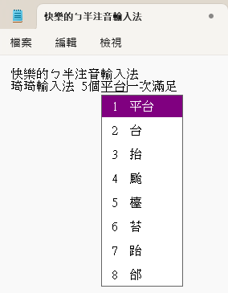
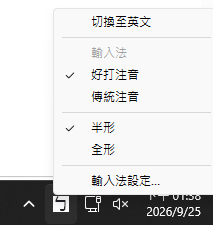
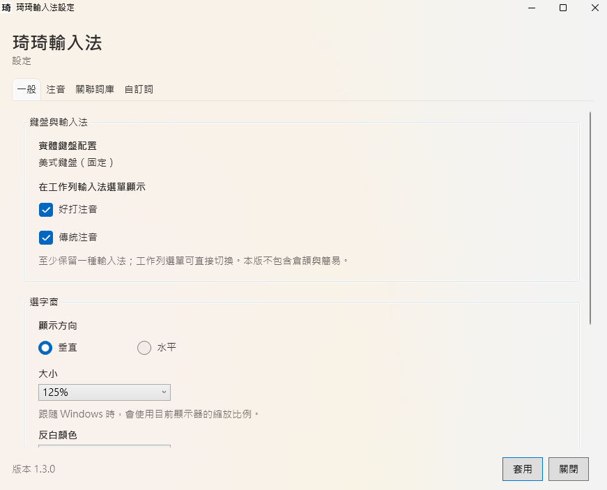
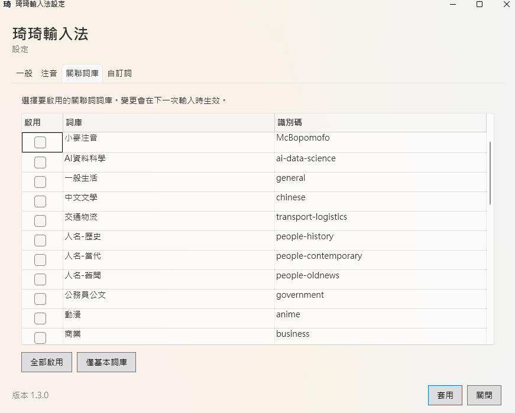
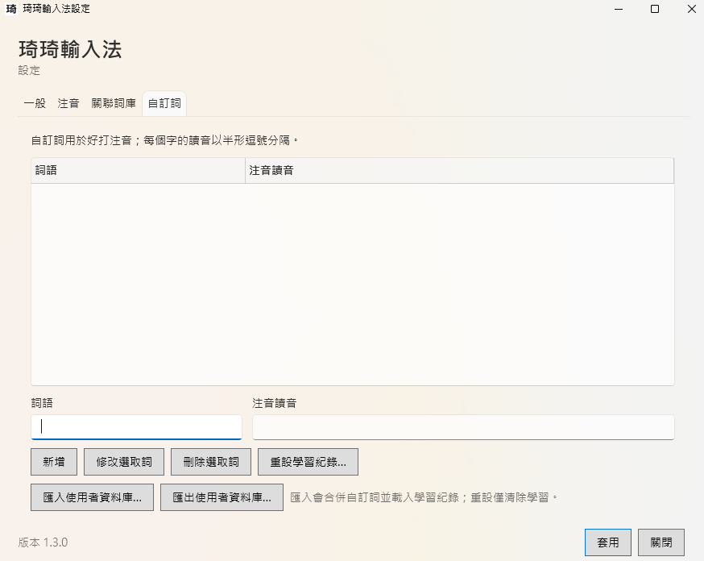

# 琦琦輸入法 Windows TSF frontend

Windows 1.3.0 的安裝與日常操作見 [Windows 安裝與使用指南](../../../WINDOWS_INSTALL.md)；本頁記錄實作、建置與部署細節。

This directory contains the Windows 10 and 11 Text Services Framework (TSF)
frontend. It is separate from `Windows-IMM`, so the existing macOS IMK target
and its Xcode project remain unchanged.

## Current milestone

- Smart Mandarin (好打注音) sentence composition and the existing Traditional
  Mandarin mode through the OpenVanilla and PlainVanilla core
- per-user phrases, candidate overrides, and contextual learning stored in
  `%APPDATA%\chichi77 KeyKey\SmartMandarinUserData.db`
- TSF composition, caret placement, commit, and candidate-window flow
- Immersive TSF registration for modern Windows text hosts such as Start/Search
- Taskbar language-bar indicators for Chinese/English (`ㄅ`/`英`) and
  half-/full-width (`半`/`全`) modes, with a menu section for direct Smart or
  Traditional Mandarin selection
- `ITfFnConfigure` keyboard-options entry and a standalone four-page Fluent WPF
  settings app that follows the Windows light/dark preference; its native backend
  retains the existing user phrase and learning-data behavior
- vertical or horizontal candidate windows with independent Windows-style
  scaling choices and purple, green, yellow, or red highlighting; optional
  typing-error sound and `Ctrl+\` mode switching
- Standard, ETen, ETen 26, Hsu, and Hanyu Pinyin Bopomofo layouts, plus a
  switch between Big-5-only candidates and the full CNS11643 character set
- Traditional Chinese language profiles for Taiwan (`zh-TW`), Hong Kong
  (`zh-HK`), and Macao (`zh-MO`); Taiwan is enabled by default, while Hong Kong
  and Macao can be added under those languages
- x86 and x64 builds completed for 1.3.0; a Notepad Bopomofo smoke test passed,
  with broader application testing pending

New profiles start in Smart Mandarin. Existing profiles retain their selected
mode. The settings app's General page controls which input methods appear in
the taskbar menu; the Bopomofo page keeps layout and character-set options.
The reset-learning button removes learned bigrams and
candidate overrides while preserving user phrases. Cangjie and Simplex are
outside this Windows package. The old IMM32 loader is retained as historical
reference and is not linked into this DLL.

## Screenshots

The [Windows installation guide](../../../WINDOWS_INSTALL.md) also shows the
1.3.0 installer welcome and destination pages.
After installation, select KeyKey under Traditional Chinese (Taiwan), Hong Kong,
or Macao in the Windows taskbar input selector. The installer does not add
Windows languages or change the default input method.

In Notepad, Smart Mandarin composes Bopomofo and displays numbered Chinese
candidate choices. The underline on active composition text may look different
in other applications because the text host controls its rendering.



The taskbar menu directly selects Smart Mandarin (好打注音) or Traditional
Mandarin (傳統注音). Check marks show the selected input method and width mode;
the same menu switches Chinese/English and opens settings. After upgrading,
sign out and back in once so Explorer loads the new menu.



The General settings page controls which input methods appear in the taskbar
menu, candidate-window direction and size, and other keyboard options. At
least one input method must remain visible.



The Associated Phrases page selects the public phrase collections to load;
changes take effect on the next input. The User Phrases page adds, edits,
deletes, imports, and exports personal phrases and learning data.





These captures show the light appearance. The Fluent settings app follows
the Windows light/dark preference.

## Prerequisites

- Windows 10 or later; development builds have been launched on Windows 11,
  while Windows 10 x64/x86 device verification remains pending
- .NET 10 SDK for building the self-contained settings app (not needed on user PCs)
- Visual Studio 2026 with **Desktop development with C++** (a Visual Studio
  2022 compatibility preset is also included)
- CMake 3.25 or newer
- Ruby 3.x when cooking the database from source (the Windows CI installs it)
- Python 3 to verify the cooked Smart Mandarin database
- NSIS 3.12 when building the Store EXE

Windows uses the operating system's `winsqlite3.dll` through the Windows SDK's
`winsqlite3.h` and `winsqlite3.lib`. The runtime SQLite version can vary with
Windows Update. No GNU Make, `awk`, `sed`, or standalone `sqlite3` program is
required. By default CMake runs the native C++ `KeyKeyDatabaseCooker` and the
same Ruby Smart Mandarin language-model generator used by macOS. It creates
`Databases\KeyKey.db` from the repository's CIN tables, McBopomofo data,
supplemental and numeric lexicons, three bootstrap corpora, typing feedback,
the 2,300-article corpus, and all 29 categorized associated-phrase
collections. These are the same Smart Mandarin language-model inputs used by
the macOS database cooker. The categorized data was
generated and normalized automatically and has not been reviewed item by item.
Both the source cooker and externally supplied databases must pass the
Smart Mandarin first-syllable ranking check before packaging.

To deploy a database cooked elsewhere instead, pass
`-DKEYKEY_DATABASE_PATH=C:\path\to\KeyKey.db` when configuring.
It must contain the 885,614-row Smart Mandarin bigram model and pass the
SQLite integrity check. CMake verifies both during the build.
If an existing CMake build directory cached the old default database path,
reconfigure with `cmake --fresh --preset windows-x64` (and likewise for x86)
to use the new source cooker.

## Build and register (x64 and x86)

Open an **x64 Native Tools Command Prompt/PowerShell for Visual Studio**, then
run from this directory:

```powershell
cmake --preset windows-x64
cmake --build --preset windows-x64-release
cmake --preset windows-x86
cmake --build --preset windows-x86-release --target KeyKeySettings
powershell -NoProfile -ExecutionPolicy Bypass -File .\Register-Tip.ps1 `
  -DllPath .\out\build\x64-ninja\KeyKeyTsf.dll
powershell -NoProfile -ExecutionPolicy Bypass -File .\Register-Tip.ps1 `
  -DllPath .\out\build\x86\Release\KeyKeyTsf.dll
```

The build creates `KeyKeyTsf.dll`, `KeyKeySettings.exe`,
`KeyKeySettingsBackend.dll`, and `out\build\x64-ninja\Databases\KeyKey.db`.
Keep the settings backend beside the executable;
Windows Keyboard options and the language-bar settings button both launch it.
The settings app has a 自訂詞 tab: enter a word and comma-separated Bopomofo
readings, one syllable per character, then add or update the row. Deletion and
editing use the stored SQLite `rowid`, so gaps from earlier deletions are safe.
The same tab can import a `SmartMandarinUserData.db` backup: user phrases are
merged by reading and text, while the imported candidate and contextual
learning replace the current learning tables. Export uses SQLite's online
backup API, so a database can be saved while the input method is active.
The settings window footer shows `1.3.0`; the frontend validation script checks
that this visible version matches the CMake project and packaging version.
Re-run the build after changing a source CIN, plist, or phrase file; CMake will
automatically recook the database.

To verify the Bopomofo core independently of TSF, run:

```powershell
ctest --test-dir .\out\build\x64-ninja --output-on-failure
```

The smoke test sends the Standard-layout `1`, `u`, `3` sequence and fails if
the engine passes those keys through as ASCII instead of producing a Bopomofo
reading and candidates.

The TSF service marks active composition text with a solid underline display
attribute. Text hosts decide how to render that attribute, so the underline
may differ between apps. Switching to English mode or away from the TIP ends
the active composition while keeping its visible text in the document.

The registration script adds **琦琦輸入法** to the current user's Traditional
Chinese input-method list. Sign out and sign in if it does not immediately
appear in `Win+Space`. Registration needs elevation because the COM server is
registered machine-wide.

To unregister:

```powershell
powershell -NoProfile -ExecutionPolicy Bypass -File .\Register-Tip.ps1 `
  -DllPath .\out\build\x64-ninja\KeyKeyTsf.dll -Unregister
powershell -NoProfile -ExecutionPolicy Bypass -File .\Register-Tip.ps1 `
  -DllPath .\out\build\x86\Release\KeyKeyTsf.dll -Unregister
```

The DLL and the hosting application must have matching architectures. In
particular, any 32-bit application cannot load the x64 TIP even on x64 Windows.
The x64 package therefore includes and registers both x64 and x86 DLLs.
The separate x86 ZIP serves 32-bit Windows and contains an x86 settings executable
and an x86 settings backend. The NSIS EXE is still x64-only.

## Package for another Windows PC

`Register-Tip.ps1` registers a DLL at its current location, so it is intended
for development. To create a self-contained home installation package after a
successful build and test, run:

```powershell
.\Package-Windows.ps1 -BuildDirectory .\out\build\x64-ninja `
  -X86BuildDirectory .\out\build\x86
.\Package-Windows.ps1 -BuildDirectory .\out\build\x64-ninja `
  -X86BuildDirectory .\out\build\x86 -Architecture x86
```

The results are x64 and x86 ZIPs. Use the package that matches the Windows OS
architecture. On the other PC, extract the entire ZIP and copy the folder to a local
`C:\` path such as `C:\KeyKeyInstaller`, and run `Install.cmd` there. Do not
install directly from a mapped network drive, NAS, or UNC path: it can become
inaccessible after UAC elevation and the installer window can close
immediately. Failures are recorded in `%TEMP%\chichi77-keykey-install.log`.
The elevated installer:

- copies the x64 and x86 DLLs, settings app, database, and notices to
  `C:\Program Files\chichi77 KeyKey`;
- registers the TSF from that permanent location; and
- adds **琦琦輸入法** to Windows Installed apps for uninstallation.

Windows shows the registered input method under installed Traditional Chinese
(Taiwan, Hong Kong, or Macao) languages; sign out and back in if it does not
appear immediately. The package is unsigned and is intended for trusted home
testing; Windows may warn after a download.

## Build and sign a Microsoft Store NSIS EXE

The Windows GitHub Actions workflow installs NSIS 3.12 and emits this test-only
installer in addition to the ZIP package:

```text
out\store-package\chichi77-KeyKey-1.3.0-windows-x64-setup.unsigned.exe
```

To build the same unsigned installer locally after building x64 and x86, run:

```powershell
.\Package-Store-Windows.ps1 -BuildDirectory .\out\build\x64-ninja `
  -X86BuildDirectory .\out\build\x86 -UnsignedTest
```

The `.unsigned.exe` artifact supports `/S` silent installation but is not
eligible for Store submission. It contains unsigned TSF DLLs and an unsigned
settings executable, and the outer installer is unsigned as well.
It retains product version `1.3.0` but installs into a fingerprinted local
test directory such as `C:\Program Files\chichi77 KeyKey\1.3.0-test-xxxxxxxxxxxx`.
Rebuilding changed binaries gets a new directory, so an existing text host
can continue using its previously loaded DLL. Signed production packages use
the plain version directory, such as `1.3.0` or `1.3.1`.

The interactive finish page offers to open the KeyKey settings app by default.
Silent `/S` installs do not launch the settings app.

Pushing a tag that exactly matches the repository version, such as `v1.3.0`,
automatically publishes this unsigned EXE, the ZIP package, and SHA-256 files.
The workflow uploads to the corresponding Release when it already exists, or
creates the Release when needed; it never creates the tag or overwrites an
existing asset. For recovery after a failed tag run, manually run the workflow
from the version's branch and enter the existing tag in `release_tag`. Leave
`release_tag` blank to keep the files only as a seven-day Actions artifact. The
unsigned EXE must never be used for Store submission.

The NSIS installer displays the licensing pages in this order: the mixed-license
scope map (`LICENSING.md`), the MIT terms for the original Windows TSF frontend,
then the Yahoo BSD 3-Clause terms. The scope map must stay first so the MIT page
does not imply that the bundled database or Yahoo-derived material is MIT-only.
The installed `LICENSES` directory also retains the collection and third-party
notices.

The production release path is intentionally local and interactive, so a
private key is not stored in GitHub Actions. Install NSIS 3.12 and a CA-issued
code-signing certificate that exposes its private key through the Windows
certificate store, then run:

```powershell
$thumbprint = 'YOUR_40_CHARACTER_CERTIFICATE_THUMBPRINT'
$timestampUrl = 'YOUR_CA_RFC3161_TIMESTAMP_URL'

powershell.exe -NoProfile -ExecutionPolicy Bypass `
  -File .\Package-Store-Windows.ps1 `
  -BuildDirectory .\out\build\x64-ninja `
  -X86BuildDirectory .\out\build\x86 `
  -CertificateThumbprint $thumbprint `
  -TimestampUrl $timestampUrl
```

The certificate defaults to `Cert:\CurrentUser\My`. Add
`-CertificateStoreLocation LocalMachine` if the certificate provider installed
it in `Cert:\LocalMachine\My`. Use `-MakensisPath` if NSIS is not in `PATH` or
its default installation directory. The script requires NSIS 3.12, copies the
build outputs to a temporary staging directory, signs and verifies
`KeyKeyTsf_x64.dll`, `KeyKeyTsf_x86.dll`, `KeyKeySettings.exe`, and
`KeyKeySettingsBackend.dll`, builds an
offline x64 installer, and finally signs and verifies the outer EXE. It never
edits the original build outputs and does not accept or store a PFX password.

The output is:

```text
out\store-package\chichi77-KeyKey-1.3.0-windows-x64-setup.exe
out\store-package\chichi77-KeyKey-1.3.0-windows-x64-setup.exe.sha256
```

Test the signed installer's silent installation and uninstallation on a
disposable clean Windows 11 VM before submission. NSIS treats `/S` as
case-sensitive:

```powershell
.\chichi77-KeyKey-1.3.0-windows-x64-setup.exe /S
& "$env:ProgramFiles\chichi77 KeyKey\Uninstall.exe" /S
```

For an EXE Store submission, Partner Center takes a versioned HTTPS package URL
rather than a direct file upload. The automated version Release contains only
the unsigned test assets. Upload the separately signed EXE as a distinct asset
to that existing Release, then use a URL such as:

```text
https://github.com/polobread/KeyKey/releases/download/v1.3.0/chichi77-KeyKey-1.3.0-windows-x64-setup.exe
```

Do not replace an asset after submitting its URL. In Partner Center select
`EXE`, architecture `x64`, and enter `/S` as the silent install parameter. The
installer reports `0` on success, `1633` on a non-x64 system, and `1638` when a
newer version is already installed. Publish a new versioned URL for every
update.

## Deployment layout

```text
KeyKeyTsf_x64.dll
KeyKeyTsf_x86.dll
KeyKeySettings.exe
KeyKeySettingsBackend.dll
Databases/
  KeyKey.db
```

The ZIP installer places this layout directly under
`C:\Program Files\chichi77 KeyKey`. The NSIS installer places it in a versioned
subdirectory such as `C:\Program Files\chichi77 KeyKey\1.3.0`; its uninstaller
remains one level above. Versioned payload directories let an upgrade register
new DLL paths even while an application still has the previous TSF DLL loaded.
NSIS registers the new DLLs without unregistering the old ones, so the active
Taiwan profile stays available throughout the upgrade. It leaves earlier
payload directories in place because running text hosts can still use their DLL,
database, and settings executable. Remove those directories only after the old
text hosts have exited.

Runtime preferences are stored under `%APPDATA%\chichi77 KeyKey`. General
frontend settings share the PlainVanilla loader plist, while Traditional
Mandarin and associated-phrase options use their module plists. Settings are
picked up on the next key or candidate-window update. `KeyKey.db` remains
external runtime data rather than being compiled into the TSF DLL.

## Verification checklist

Test at least Notepad, Windows Terminal, Edge, Word, the lock/sign-in boundary,
and an elevated desktop application. Verify Bopomofo input, backspace, arrow
navigation, candidate paging/selection, commit with Enter/Space, focus changes,
and repeated enable/disable cycles. Also verify every Bopomofo layout, both
candidate-window orientations, all four colors, `Ctrl+\`, disabled error sound,
and the CNS11643 switch. Compare composition underlines in Notepad and another
text host, check that switching to English keeps the composed text, and verify
the taskbar mode menu and settings after signing out and back in. On upgrade,
check that Windows does not request a Simplified Chinese input dictionary.
Secure desktop and Microsoft Store app coverage should
be treated as release gates, not assumed from registration.

## License

Original Windows TSF frontend code in this directory is Copyright (c) 2026
Chui-Ping Cheng and distributed under the MIT License. OpenVanilla,
PlainVanilla, input-method modules, and the packaged database retain their
respective licenses. See `LICENSE.txt` in this directory and `LICENSING.md` at
the repository root for the complete scope map.
