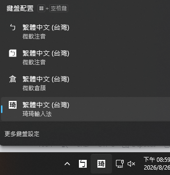
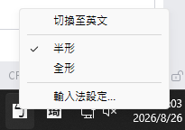
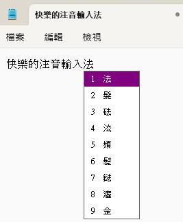
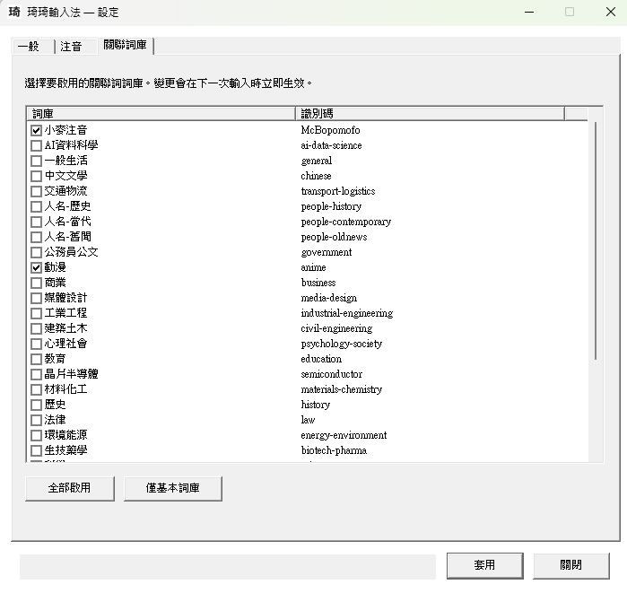

# 琦琦輸入法 Windows TSF frontend

This directory contains the modern Windows 11 Text Services Framework (TSF)
frontend. It is separate from `Windows-IMM`, so the existing macOS IMK target
and its Xcode project remain unchanged.

## Current milestone

- Traditional Mandarin/Bopomofo input through the existing OpenVanilla and
  PlainVanilla core
- TSF composition, caret placement, commit, and candidate-window flow
- Immersive TSF registration for modern Windows text hosts such as Start/Search
- Taskbar language-bar indicators for Chinese/English (`ㄅ`/`英`) and
  half-/full-width (`半`/`全`) modes
- `ITfFnConfigure` keyboard-options entry and a standalone three-page settings
  app for general, Traditional Bopomofo, and associated-phrase options
- vertical or horizontal candidate windows with purple, green, yellow, or red
  highlighting; optional typing-error sound and `Ctrl+\` mode switching
- Standard, ETen, ETen 26, Hsu, and Hanyu Pinyin Bopomofo layouts, plus a
  switch between Big-5-only candidates and the full CNS11643 character set
- Traditional Chinese (`zh-TW`) language profile registration
- verified x86 and x64 builds; an unverified ARM64 CMake preset is retained for
  future bring-up

Smart Mandarin is intentionally not enabled because its language-model corpus
is not present in this repository. Cangjie and Simplex are also outside this
Windows package. The old IMM32 loader is retained as historical reference and
is not linked into this DLL.

## Screenshots

After installation, select the Traditional Chinese KeyKey input method from the
Windows taskbar input selector.



The language-bar button provides Chinese/English and half-/full-width mode
switching, plus an entry to the input-method settings.



Typing Bopomofo shows the composition text and numbered candidate list in the
active application.



The settings app lets users choose the public associated-phrase collections to
load.



## Prerequisites

- Windows 11
- Visual Studio 2026 with **Desktop development with C++** (a Visual Studio
  2022 compatibility preset is also included)
- CMake 3.25 or newer
- NSIS 3.12 when building the Store EXE

No Ruby, GNU Make, `awk`, `sed`, or standalone `sqlite3` program is required.
When the legacy cooked database is absent, CMake builds the new native C++
`KeyKeyDatabaseCooker` and creates `Databases\KeyKey.db` from the repository's
CIN tables and public associated-phrase sources, including all 29 categorized
collections in `DataSource\chichi77Collection`. The legacy cooker remains
unchanged. The categorized data was generated, inferred, and normalized
automatically, has not been reviewed item by item, and is not guaranteed to be
accurate or complete.

To deploy a database cooked elsewhere instead, pass
`-DKEYKEY_DATABASE_PATH=C:\path\to\KeyKey.db` when configuring.

## Build and register (x64 and x86)

Open an **x64 Native Tools Command Prompt/PowerShell for Visual Studio**, then
run from this directory:

```powershell
cmake --preset windows-x64
cmake --build --preset windows-x64-release
cmake --preset windows-x86
cmake --build --preset windows-x86-release --target KeyKeyTsf
powershell -NoProfile -ExecutionPolicy Bypass -File .\Register-Tip.ps1 `
  -DllPath .\out\build\x64-ninja\KeyKeyTsf.dll
powershell -NoProfile -ExecutionPolicy Bypass -File .\Register-Tip.ps1 `
  -DllPath .\out\build\x86\Release\KeyKeyTsf.dll
```

The build creates `KeyKeyTsf.dll`, `KeyKeySettings.exe`, and
`out\build\x64-ninja\Databases\KeyKey.db`. Keep the executable beside the DLL;
Windows Keyboard options and the language-bar settings button both launch it.
Re-run the build after changing a source CIN, plist, or phrase file; CMake will
automatically recook the database.

To verify the Traditional Bopomofo core independently of TSF, run:

```powershell
ctest --test-dir .\out\build\x64-ninja --output-on-failure
```

The smoke test sends the Standard-layout `1`, `u`, `3` sequence and fails if
the engine passes those keys through as ASCII instead of producing a Bopomofo
reading and candidates.

The registration script adds **琦琦輸入法** to the current user's Traditional
Chinese input-method list. Sign out and sign in if it does not immediately
appear in `Win+Space`. Registration needs elevation because the COM server is
registered machine-wide.

To unregister:

```powershell
powershell -NoProfile -ExecutionPolicy Bypass -File .\Register-Tip.ps1 `
  -DllPath .\out\build\x64-ninja\KeyKeyTsf.dll -Unregister
powershell -NoProfile -ExecutionPolicy Bypass -File .\Register-Tip.ps1 `
  -DllPath .\out\build\x86\Release\KeyKeyTsf.dll -Unregister
```

The DLL and the hosting application must have matching architectures. In
particular, 32-bit Office cannot load the x64 TIP even on x64 Windows. The x64
package therefore includes and registers both x64 and x86 DLLs.

## Package for another Windows PC

`Register-Tip.ps1` registers a DLL at its current location, so it is intended
for development. To create a self-contained home installation package after a
successful build and test, run:

```powershell
.\Package-Windows.ps1 -BuildDirectory .\out\build\x64-ninja `
  -X86BuildDirectory .\out\build\x86
```

The result is `out\package\chichi77-KeyKey-1.2.3-windows-x64.zip`. On the other
PC, extract the entire ZIP, copy the complete extracted folder to a local
`C:\` path such as `C:\KeyKeyInstaller`, and run `Install.cmd` there. Do not
install directly from a mapped network drive, NAS, or UNC path: it can become
inaccessible after UAC elevation and the installer window can close
immediately. Failures are recorded in `%TEMP%\chichi77-keykey-install.log`.
The elevated installer:

- copies the x64 and x86 DLLs, settings app, database, and notices to
  `C:\Program Files\chichi77 KeyKey`;
- registers the TSF from that permanent location; and
- adds **琦琦輸入法** to Windows Installed apps for uninstallation.

The installer adds the input method to the current user's `Win+Space` list;
sign out and back in if it does not appear immediately. The package is unsigned
and is intended for trusted home testing; Windows may warn after a download.
ARM64 is not part of the currently verified or published package. Its preset
and packaging option are retained for future bring-up.

## Build and sign a Microsoft Store NSIS EXE

The Windows GitHub Actions workflow installs NSIS 3.12 and emits this test-only
installer in addition to the ZIP package:

```text
out\store-package\chichi77-KeyKey-1.2.3-windows-x64-setup.unsigned.exe
```

The `.unsigned.exe` artifact supports `/S` silent installation but is not
eligible for Store submission. It contains unsigned TSF DLLs and an unsigned
settings executable, and the outer installer is unsigned as well.

Pushing a tag that exactly matches the repository version, such as `v1.2.3`,
automatically creates a public GitHub Release containing this unsigned EXE, the
ZIP package, and SHA-256 files. A manual workflow run keeps the same files only
as a seven-day Actions artifact. The unsigned EXE must never be used for Store
submission.

The NSIS installer displays the licensing pages in this order: the mixed-license
scope map (`LICENSING.md`), the MIT terms for the original Windows TSF frontend,
then the Yahoo BSD 3-Clause terms. The scope map must stay first so the MIT page
does not imply that the bundled database or Yahoo-derived material is MIT-only.
The installed `LICENSES` directory also retains the collection and third-party
notices.

The production release path is intentionally local and interactive, so a
private key is not stored in GitHub Actions. Install NSIS 3.12 and a CA-issued
code-signing certificate that exposes its private key through the Windows
certificate store, then run:

```powershell
$thumbprint = 'YOUR_40_CHARACTER_CERTIFICATE_THUMBPRINT'
$timestampUrl = 'YOUR_CA_RFC3161_TIMESTAMP_URL'

powershell.exe -NoProfile -ExecutionPolicy Bypass `
  -File .\Package-Store-Windows.ps1 `
  -BuildDirectory .\out\build\x64-ninja `
  -X86BuildDirectory .\out\build\x86 `
  -CertificateThumbprint $thumbprint `
  -TimestampUrl $timestampUrl
```

The certificate defaults to `Cert:\CurrentUser\My`. Add
`-CertificateStoreLocation LocalMachine` if the certificate provider installed
it in `Cert:\LocalMachine\My`. Use `-MakensisPath` if NSIS is not in `PATH` or
its default installation directory. The script requires NSIS 3.12, copies the
build outputs to a temporary staging directory, signs and verifies
`KeyKeyTsf_x64.dll`, `KeyKeyTsf_x86.dll`, and `KeyKeySettings.exe`, builds an
offline x64 installer, and finally signs and verifies the outer EXE. It never
edits the original build outputs and does not accept or store a PFX password.

The output is:

```text
out\store-package\chichi77-KeyKey-1.2.3-windows-x64-setup.exe
out\store-package\chichi77-KeyKey-1.2.3-windows-x64-setup.exe.sha256
```

Test the signed installer's silent installation and uninstallation on a
disposable clean Windows 11 VM before submission. NSIS treats `/S` as
case-sensitive:

```powershell
.\chichi77-KeyKey-1.2.3-windows-x64-setup.exe /S
& "$env:ProgramFiles\chichi77 KeyKey\Uninstall.exe" /S
```

For an EXE Store submission, Partner Center takes a versioned HTTPS package URL
rather than a direct file upload. The automated version Release contains only
the unsigned test assets. Upload the separately signed EXE as a distinct asset
to that existing Release, then use a URL such as:

```text
https://github.com/polobread/KeyKey/releases/download/v1.2.3/chichi77-KeyKey-1.2.3-windows-x64-setup.exe
```

Do not replace an asset after submitting its URL. In Partner Center select
`EXE`, architecture `x64`, and enter `/S` as the silent install parameter. The
installer reports `0` on success, `1633` on a non-x64 system, and `1638` when a
newer version is already installed. Publish a new versioned URL for every
update.

## Deployment layout

```text
KeyKeyTsf_x64.dll
KeyKeyTsf_x86.dll
KeyKeySettings.exe
Databases/
  KeyKey.db
```

The ZIP installer places this layout directly under
`C:\Program Files\chichi77 KeyKey`. The NSIS installer places it in a versioned
subdirectory such as `C:\Program Files\chichi77 KeyKey\1.2.3`; its uninstaller
remains one level above. Versioned payload directories let an upgrade register
new DLL paths even while an application still has the previous TSF DLL loaded.

Runtime preferences are stored under `%APPDATA%\chichi77 KeyKey`. General
frontend settings share the PlainVanilla loader plist, while Traditional
Mandarin and associated-phrase options use their module plists. Settings are
picked up on the next key or candidate-window update. `KeyKey.db` remains
external runtime data rather than being compiled into the TSF DLL.

## Verification checklist

Test at least Notepad, Windows Terminal, Edge, Word, the lock/sign-in boundary,
and an elevated desktop application. Verify Bopomofo input, backspace, arrow
navigation, candidate paging/selection, commit with Enter/Space, focus changes,
and repeated enable/disable cycles. Also verify every Bopomofo layout, both
candidate-window orientations, all four colors, `Ctrl+\`, disabled error sound,
and the CNS11643 switch. Secure desktop and Microsoft Store app coverage should
be treated as release gates, not assumed from registration.

## License

Original Windows TSF frontend code in this directory is Copyright (c) 2026
Chui-Ping Cheng and distributed under the MIT License. OpenVanilla,
PlainVanilla, input-method modules, and the packaged database retain their
respective licenses. See `LICENSE.txt` in this directory and `LICENSING.md` at
the repository root for the complete scope map.
