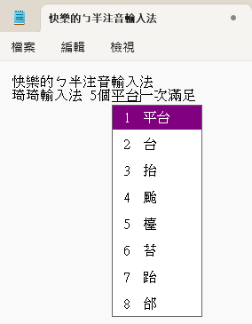
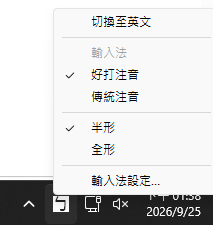
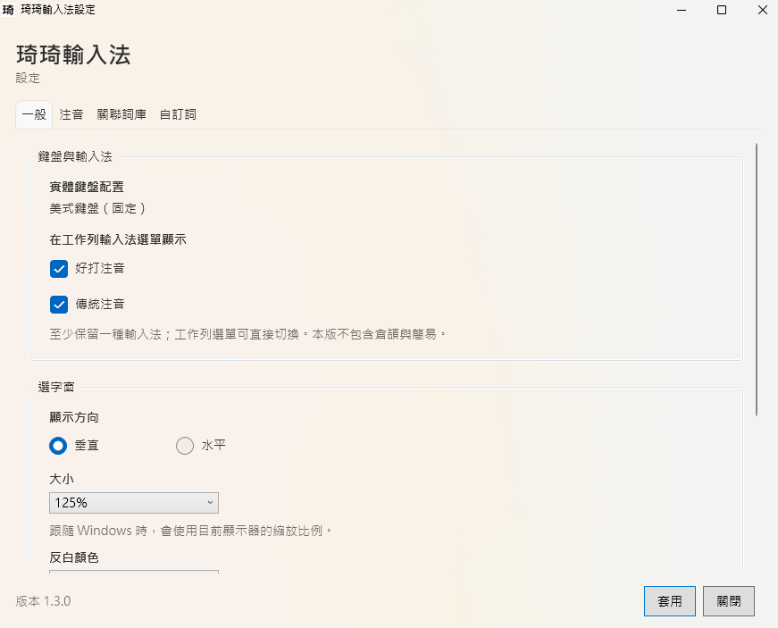
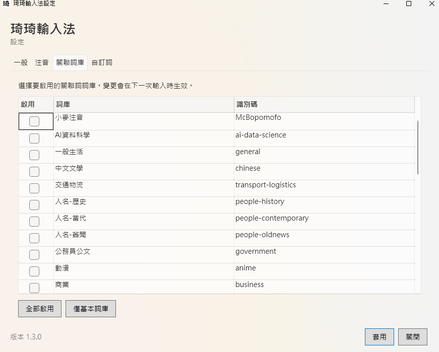
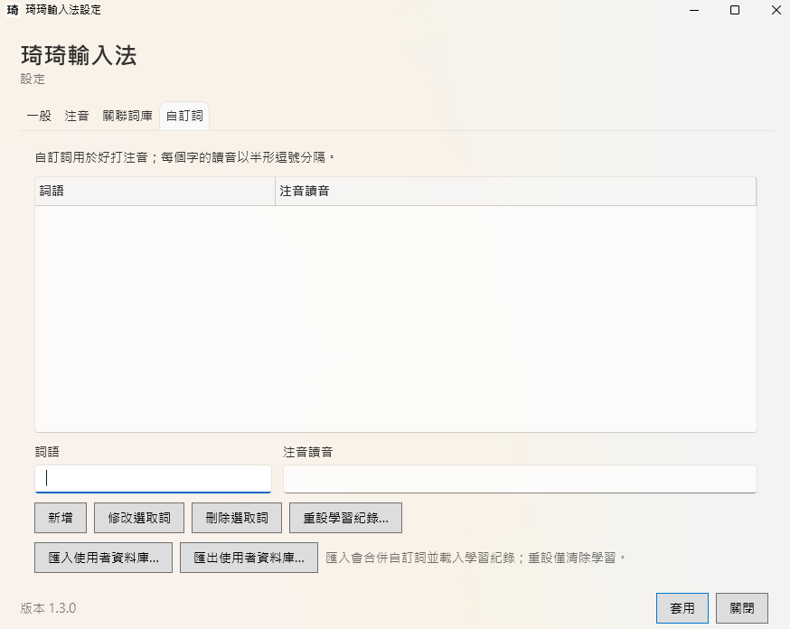

# 琦琦輸入法 Windows TSF frontend

本機 `v1.3.2` 功能分支新增進階設定、讀音輔助、符號表與簡體輸出；
Windows 產品版號為 1.3.2，尚未發布；iOS、Android 1.3.2 已在各自商店正式上線，macOS、Linux 及共用模型維持 1.3.1。實作與驗證記錄見
[Windows v1.3.2 功能驗證](../../../docs/WINDOWS_V1_3_2_FEATURE_VALIDATION.md)。

「一般」新增「啟動時預設輸入模式」中文／英文，預設為中文。設定在輸入法服務下次
啟用時生效；中文沿用目前選擇的好打注音、傳統注音、倉頡或簡易，Shift 仍可切換。
切換輸入欄位不會強制還原啟動偏好。設定另以獨立 TSF compartment 提供給受限宿主；
若該宿主尚未取得桌面發布的偏好，沿用其本地設定（未設定時為中文）。

Num Lock 開啟時，右側數字鍵盤的數字與小數點直接輸入；加減乘除也直接輸入。
有組字時先送出目前顯示的文字（包含未完成注音），再插入數字或運算符並關閉候選窗。
主鍵盤數字列保留注音及選字功能，Num Lock 關閉時的導覽鍵維持原行為。
此處只修改 Windows adapter，未改動其他平台共用的注音核心。

2026-10-05：以上三項修正以 MSVC/Ninja 完成 x64、x86 建置，選定回歸分別
13/13、12/12 通過，涵蓋數字鍵盤、既有注音／倉頡／簡易、Esc、候選狀態、
候選窗延遲版面、偏好讀取、四種輸入法的啟動模式及 x64 WPF 套用／重開。
啟動模式測試使用真實 TSF compartments 與隔離設定，直接呼叫服務啟動時的模式
初始化；不註冊 TIP，也不能代替完整 ActivateEx 或實際 Firefox 驗收。
TSF 共享狀態與 WPF 測試需一般使用者環境，受限命令沙箱會拒絕狀態寫入。

2026-10-06：同一 TSF 服務的按鍵、輸入法／中英文／全半形／輸出模式切換與符號插入，
依同一佇列執行。已接受的非同步按鍵先完成，再取得切換時的組字快照；成功送出原文字、
未完成注音或字根後才切換引擎及工作列狀態。內部設定刷新保留當前中英文模式，
焦點與按鍵查詢不會把尚未發布的顯式選擇改回舊設定。宿主拒絕建立組字時不先修改引擎；
宿主已接受但送字失敗的按鍵保留結果，下一次同欄位輸入先重試，不重跑原按鍵或重複插入。
TSF 取消未執行的 session 會撤銷其待處理狀態，過期或重複回呼不影響新作業。

失焦、欄位銷毀或尚無組字的待處理按鍵期間移動游標，會取消未執行的舊按鍵；不重播到
新欄位。舊欄位仍存在時只盡力結束原組字，無法保證已銷毀欄位可寫回。導覽鍵與快捷鍵
仍交宿主處理；隔離測試不能代替 Firefox、Office 或其他實際宿主驗收。Windows 引擎
固定每個服務已生效的方法，並在佇列邊界載入指定方法的設定；共用模組欄位未做完整設定
快照隔離，送字重試也不回滾已發生的候選／學習決策。

候選窗與符號表在宿主暫時隱藏 owned popup 後取消，會退役待還原的視窗，避免 Windows
之後自動還原空白框。此生命週期序列已有兩架構原生回歸；其他白塊與分類 hover 消字
未確認相同原因，仍待使用者實機複測。

本輪 x64／x86 各 27 項原生回歸全數通過，包括進階設定、表格輸入、候選狀態及 popup
生命週期。每架構先在沙箱通過 25 項，再以一般使用者權限重跑被檔案／HKCU 權限阻擋的
兩項隔離測試；沒有安裝或切換使用者輸入法。完整證據與限制見功能驗證文件。

「注音」頁可設定空白開候選、選字目標在游標前方或後方、8 個唯一的可輸入 ASCII 候選鍵，
以及 10–20 音節的組字長度。候選鍵留空時沿用鍵盤配置（許氏 `asdfzxcv`、倚天26 `asdfjkl;`、
其餘 `12345678`）；可按「使用數字」明確改用數字。無效設定不會先儲存其他欄位。
套用後，下一次輸入先保留並送出原組字，再啟用新設定；關閉未套用視窗不更改引擎。

「自訂詞」頁輸入詞語後按「取得讀音」，優先查本地正式詞庫的完整詞讀音，
再提供逐字下拉選單供修改。多音字須按語境確認；沒有讀音的位置會標出並須手動補齊。
手動逗號分隔讀音仍可使用，編輯既有詞語不會自動覆蓋讀音。最多 64 個 Unicode 字元、
每字及完整詞最多 32 個讀音選項，不展開所有組合；查詢不修改正式詞庫。

工作列輸入法選單依序排列「半形／全形 → 簡體中文輸出 → 分隔線 → 符號表… → 輸入法設定…」。
「符號表…」提供原有 17 個分類、807 個符號與完整顏文字，保留手機版 90 個 emoji 的
順序並加入 110 個 Windows 專用補充，共 18 個分類、1,007 項。Emoji 共 200 個，
一般大小每頁 40 個、五頁；頁面容量會依工作區及 DPI 調整。
分類使用下拉選單；符號與 Emoji 使用最多十欄的格狀按鈕，顏文字以整列顯示。
Emoji 使用 Direct2D／DirectWrite 的 Segoe UI Emoji 彩色字型，圖案依作業系統字型版本；
高對比模式或彩色渲染不可用時回退 GDI 單色，不下載圖片或改動手機資料。
視窗從滑鼠所在螢幕的工作區右側開啟，可由標題列拖曳；位置只在同一輸入服務生命週期內
記住，不跨 App 或重新啟動保存，重開及 DPI 變更時會限制於可用工作區。
以滑鼠選取後送入原輸入欄位並關閉。面板開啟時保留組字；選取時先送出原組字，再插入符號。
Esc、關閉或切換輸入欄位只關閉面板；符號保留原全半形格式，避免全形模式破壞顏文字。

「簡體中文輸出」可在工作列選單或一般設定切換，四種輸入法與關聯詞皆適用。
組字與候選維持繁體，自訂詞及選字學習保存繁體；只在送出文字時使用既有繁簡字表。
切換時以舊設定完成目前組字，後續輸入採新設定。符號中的漢字也使用同一輸出策略，
英文、數字、標點、emoji 與無對照字維持原樣。各文字宿主透過 TSF 全域 compartment
同步狀態；受限宿主採用隔離的本地設定，桌面宿主會保存其最新全域選項。

Windows 1.3.1 的兩種安裝流程稽核、舊版遷移設計與待驗收矩陣見
[Windows 安裝與舊版遷移規劃](../../../docs/WINDOWS_INSTALLATION_1_3_1_PLAN.md)。
共用安裝核心、兩種入口與文件已依規劃修改；歷代實際安裝包的 VM 升級／移除驗收仍待完成。

Windows 1.3.2 的安裝與日常操作見 [Windows 安裝與使用指南](../../../WINDOWS_INSTALL.md)；本頁記錄實作、建置與部署細節。

The standard `GUID_LBI_INPUTMODE` item exposes a menu style (without a split-button arrow):
Windows can invoke `InitMenu`/`OnMenuSelect` to switch all four methods even when
an immersive host cannot use the desktop popup. `KeyKeyTsfSystemTrayTest` checks
the item through the native TSF language-bar manager and verifies its mode menu.
Chinese/English mode synchronizes both open/close and the conversion compartment's
`NATIVE` bit, retaining width and the other conversion flags.
If a restricted Search/Store process cannot access Roaming preferences, the
frontend and engine share that process's sandboxed Temp profile. Preferences and
learning data remain private; no file permissions are expanded. The current input
method is shared through a TSF global compartment, read at activation, focus, menu,
and key dispatch. A stale profile cannot overwrite that choice on activation.
Desktop settings changes and explicit menu selections publish a new choice.
`KeyKeySharedInputMethodTest` uses a random compartment GUID and separate processes
and profiles to verify all four modes, actual composition, and reverse propagation.
Pass the other architecture's executable as its argument to test x64/x86 sharing.
`--container` creates a temporary AppContainer, gives only that SID read/execute
access to disposable executable/database copies, and runs all four child cases
with private writable profiles. The AppContainer registration is removed afterward.
Run this test in the normal user session: a restricted command sandbox cannot
write the session-wide TSF compartment and reports `E_FAIL`.
Local verification passed 15 x64 and 14 x86 tests, plus both directions of
x64/x86 mode sharing. On 2026-10-01, the user confirmed that the installed
Windows Search mode switching and menu fixes work. This is separate from
the automated AppContainer tests and from release/upgrade validation.

This directory contains the Windows 10 and 11 Text Services Framework (TSF)
frontend. It is separate from `Windows-IMM`, so the existing macOS IMK target
and its Xcode project remain unchanged.

## Current milestone

- Smart Mandarin (好打注音) sentence composition and the existing Traditional
  Mandarin mode through the OpenVanilla and PlainVanilla core
- Cangjie (倉頡) and Simplex (簡易) through the shared `OVIMGeneric` engine and
  canonical database, with Windows-specific settings and short learning transactions
- per-user phrases, candidate overrides, and contextual learning stored in
  `%APPDATA%\chichi77 KeyKey\SmartMandarinUserData.db`
- TSF composition, caret placement, commit, and candidate-window flow
- Immersive TSF registration for modern Windows text hosts such as Start/Search
- Taskbar language-bar indicators for Chinese/English (`ㄅ`/`倉`/`簡`/`英`) and
  half-/full-width (`半`/`全`) modes, with a menu section for direct Smart or
  Traditional Mandarin, Cangjie or Simplex selection
- `ITfFnConfigure` keyboard-options entry and a standalone five-page Fluent WPF
  settings app that follows the Windows light/dark preference; its native backend
  retains the existing user phrase and learning-data behavior
- vertical or horizontal candidate windows with independent Windows-style
  scaling choices and purple, green, yellow, or red highlighting; optional
  typing-error sound and `Ctrl+\` mode switching
- Standard, ETen, ETen 26, Hsu, and Hanyu Pinyin Bopomofo layouts, plus a
  switch between Big-5-only candidates and the full CNS11643 character set
- One selectable Traditional Chinese profile (`zh-TW`), disabled by default.
  All regions share this entry; users add it themselves in Settings. Upgrades
  retire both old Hong Kong/Macao definitions. Users of those old entries must
  select the shared entry in Settings; personal preferences and data are retained.
- x86 and x64 builds completed for 1.3.0; a Notepad Bopomofo smoke test passed,
  with broader application testing pending

New profiles start in Smart Mandarin. Existing profiles retain their selected
mode. The settings app's General page controls which input methods appear in
the taskbar menu; the Bopomofo page keeps layout and character-set options.
The reset-learning button removes Smart Mandarin learned bigrams and
candidate overrides while preserving user phrases and table candidate ordering.
The old IMM32 loader and Windows preference panels supply behavioral references
for Cangjie and Simplex. The old IMM32 loader is retained as historical
reference and is not linked into this DLL.

### Cangjie and Simplex development build

This source includes these modes in Windows 1.3.2 local builds; published installers and
already installed DLLs are separate artifacts and may still contain only Mandarin.
Cangjie retains up to five radicals and queries with Space/Enter; Simplex queries
at two radicals. Number keys select candidates, Page Up/Down page, Backspace
edits radicals and Esc cancels. Cangjie supports `?` and `*` wildcard lookup.
The table settings page controls live lookup, clear-on-error and Big-5 filtering;
Cangjie also offers full-code querying, punctuation overrides and dynamic ordering.
Live lookup and clear-on-error are mutually exclusive. Dynamic ordering defaults
off, as in the old Windows preference application. Each input method uses its own
`Generic-*-cin-DynamicCandidateOrder.sqlite3` file. Learned candidates remain
subject to the current character-set restriction. Busy or unwritable learning
storage does not block text input.

The current `com.polobread` preference files take precedence over the earlier
`org.openvanilla.chichi77-keykey.windows` files. Migration now includes both table
modules and preserves the old files. The old Simplex `ComposeWhenTyping` alias
is accepted until `ComposeWhenTypingMigrated=true` records a modern setting.
Raw Yahoo IMM/MSI installation state and its different profile directory are not
automatically imported. Mode changes preserve visible text (including unfinished
radicals) before new input starts in the selected mode.

Local verification uses `KeyKeyTableInputTest` for basic input, paging, live
lookup, Windows-translated Backspace/Enter/Esc events, legacy settings, Unicode, settings reload, mode changes, and an independent
SQLite writer while an engine session remains active. Settings tests cover all
15 non-empty visibility combinations and native-backend WPF control events,
Apply and reopening. `KEYKEY_TSF_TEST_PROFILE_DIR` isolates both the engine and
settings backend. Desktop visual QA, actual TSF host input, and installer
upgrade verification remain separate acceptance steps.

## Screenshots

### First-character candidate layout investigation (2026-10-05)

A user video of Firefox's address bar shows Bopomofo by about 1.5 seconds
and the first Chinese character (`書`) by about 3 seconds, with no candidate
window during the following pause. A candidate window is visible later for
`法`. The video does not show physical key events, so the pause cannot be
reported as a measured key-to-display latency or attributed to CPU/GPU speed.

The TSF frontend used to hide and discard its candidate display state whenever
`GetTextExt` failed. It did not subscribe to `ITfTextLayoutSink`, so a host
returning `TS_E_NOLAYOUT` could finish layout without the candidate window ever
being retried until another key arrived. This path is also present in tag
`v1.3.1`. Microsoft's [layout notification contract](https://learn.microsoft.com/en-us/windows/win32/api/msctf/nf-msctf-itfcontextownerservices-onlayoutchange)
requires hosts to notify when the layout becomes available.

The frontend now retains the candidates and requests an asynchronous read-only
layout refresh on that notification. Each candidate update invalidates older
requests; cancellation, focus loss, mode completion and deactivation discard
pending display state. This does not replay keys, query the language model,
or modify the document. A zero-width caret remains a valid anchor; invisible
text with an empty bounding rectangle keeps the window hidden.

`KeyKeyTsfOutputBehaviorTest` covers no-layout recovery without another key,
duplicate notifications, cancellation and stale callbacks, failed requests,
new candidate pages, another document, associated-phrase anchors, and invisible
text. These isolated COM tests are separate from actual Firefox acceptance.
The x64 and x86 MSVC/Ninja builds and all six selected CTest entries per
architecture passed (layout/output behavior, TSF interface, Bopomofo, both Esc
policies, and candidate key state machine). The Visual Studio x86 generator
encountered a sandbox FileTracker access error; the existing x86 Ninja build
provided the x86 verification. No installed input method was replaced.
On the reporting PC, repeat the first syllable in Firefox's address bar, a web
text field and Notepad, then test Esc and switching focus while candidates are
pending. Record the installed version and whether this happens only after
launch or on every new composition. `%TEMP%\KeyKeyTsf.log` now records
`Candidate layout deferred` with the HRESULT and the later refresh request,
which distinguishes a layout failure from slow engine input. Only the relevant
reproduction interval is needed; review the log before sharing it.

For comparison, a local isolated Traditional Mandarin engine run on the
unmodified branch measured 0.1–0.5 ms per key (including candidate lookup and
selection). Its first session creation took 244 ms, versus 24 ms in the next
fresh process with warm OS caches. This excludes TSF, Firefox, window painting
and the reporting PC. Startup still counts the full shared unigram/bigram
tables and initializes available modules; it remains a separate performance
lead, not the explanation for missing candidates after text is already visible.

The [Windows installation guide](../../../WINDOWS_INSTALL.md) uses clearly
labelled 1.3.0 reference captures; the 1.3.1 installer has no destination page.
After first installation, add KeyKey under Traditional Chinese (Taiwan), Hong
Kong or Macao in Windows Settings > Language options > Add a keyboard, then
select it using Win+Space. The shared entry selection is preserved; users of the
retired regional entries must add and select the shared entry.

In Notepad, Smart Mandarin composes Bopomofo and displays numbered Chinese
candidate choices. The underline on active composition text may look different
in other applications because the text host controls its rendering.
Esc closes an open candidate list or cancels an unfinished reading while keeping
the completed sentence. By default, Esc also keeps a completed sentence in
composition; the Phonetic settings tab offers an explicit option to clear it.



The taskbar menu directly selects Smart Mandarin (好打注音), Traditional
Mandarin (傳統注音), Cangjie (倉頡), or Simplex (簡易). Check marks show the selected input method and width mode;
the same menu switches Chinese/English and opens settings. After upgrading,
sign out and back in once so Explorer loads the new menu.



The General settings page controls which input methods appear in the taskbar
menu, candidate-window direction and size, and other keyboard options. At
least one input method must remain visible.



The Associated Phrases page selects the public phrase collections to load;
changes take effect on the next input. The User Phrases page adds, edits,
deletes, imports, and exports personal phrases and learning data.





These captures show the light appearance. The Fluent settings app follows
the Windows light/dark preference.

## Prerequisites

- Windows 10 or later; development builds have been launched on Windows 11,
  while Windows 10 x64/x86 device verification remains pending
- .NET 10 SDK for building the self-contained settings and deployment apps (not needed on user PCs)
- Visual Studio 2026 with **Desktop development with C++** (a Visual Studio
  2022 compatibility preset is also included)
- CMake 3.25 or newer
- Python 3 to verify the pre-generated Smart Mandarin database
- NSIS 3.12 when building the Store EXE

Windows uses the operating system's `winsqlite3.dll` through the Windows SDK's
`winsqlite3.h` and `winsqlite3.lib`. The runtime SQLite version can vary with
Windows Update. No GNU Make, `awk`, `sed`, or standalone `sqlite3` program is
required. CMake verifies and packages the repository's pre-generated shared
`Source\Distributions\Takao\CookedDatabase\KeyKey.db`; Windows builds do not
recook the language model. This keeps Windows, macOS, iOS, Android, and Linux
on the exact same validated bytes.

To verify and deploy another pre-generated database, pass
`-DKEYKEY_DATABASE_PATH=C:\path\to\KeyKey.db` when configuring.
It must contain the 885,627-row Smart Mandarin bigram model and pass the
manifest, file hash, and SQLite integrity checks. CMake verifies it during the build.
If an existing CMake build directory cached the old default database path,
reconfigure with `cmake --fresh --preset windows-x64` (and likewise for x86)
to use the checked-in shared database.

## Build and register (x64 and x86)

MSVC/Ninja builds detect the compiler's localized `/showIncludes` prefix and
normalize it through `MsvcCompiler.py`, using the required Python interpreter.
This preserves header dependencies on Windows hosts whose console and compiler
output encodings differ. Existing Ninja build directories with missing header
dependencies need a clean rebuild after reconfiguration.

Open an **x64 Native Tools Command Prompt/PowerShell for Visual Studio**, then
run from this directory:

```powershell
cmake --preset windows-x64
cmake --build --preset windows-x64-release
cmake --preset windows-x86
cmake --build --preset windows-x86-release
powershell -NoProfile -ExecutionPolicy Bypass -File .\Register-Tip.ps1 `
  -DllPath .\out\build\x64-ninja\KeyKeyTsf.dll
powershell -NoProfile -ExecutionPolicy Bypass -File .\Register-Tip.ps1 `
  -DllPath .\out\build\x86\Release\KeyKeyTsf.dll
```

The build creates `KeyKeyTsf.dll`, `KeyKeySettings.exe`,
`KeyKeySettingsBackend.dll`, `KeyKeyDeployment.exe`, `KeyKeyRegistration.exe`,
and `out\build\x64-ninja\Databases\KeyKey.db`.
Keep the settings backend beside the executable;
Windows Keyboard options and the language-bar settings button both launch it.
The settings app has a 自訂詞 tab: enter a word and comma-separated Bopomofo
readings, one syllable per character, then add or update the row. Deletion and
editing use the stored SQLite `rowid`, so gaps from earlier deletions are safe.
The same tab can import a `SmartMandarinUserData.db` backup: user phrases are
merged by reading and text, while the imported candidate and contextual
learning replace the current learning tables. Export uses SQLite's online
backup API, so a database can be saved while the input method is active.
The settings window footer shows `1.3.2`; the frontend validation script checks
that this visible version matches the CMake project and packaging version.
Language-model source changes do not alter a platform build automatically.
Generate and validate a new canonical `KeyKey.db` first, then commit the file
and its manifest before rebuilding the package.

To verify the Bopomofo core independently of TSF, run:

```powershell
ctest --test-dir .\out\build\x64-ninja --output-on-failure
```

The smoke test sends the Standard-layout `1`, `u`, `3` sequence and fails if
the engine passes those keys through as ASCII instead of producing a Bopomofo
reading and candidates.

The TSF service marks active composition text with a solid underline display
attribute. Text hosts decide how to render that attribute, so the underline
may differ between apps. Switching to English mode or away from the TIP ends
the active composition while keeping its visible text in the document.

The development registration script makes **琦琦輸入法** available in Windows
Settings. Add it yourself under a Traditional Chinese language's keyboard
options before selecting it with `Win+Space`. Existing profile choices are
preserved. Registration needs elevation because COM is machine-wide.

To unregister:

```powershell
powershell -NoProfile -ExecutionPolicy Bypass -File .\Register-Tip.ps1 `
  -DllPath .\out\build\x64-ninja\KeyKeyTsf.dll -Unregister
powershell -NoProfile -ExecutionPolicy Bypass -File .\Register-Tip.ps1 `
  -DllPath .\out\build\x86\Release\KeyKeyTsf.dll -Unregister
```

The DLL and the hosting application must have matching architectures. In
particular, any 32-bit application cannot load the x64 TIP even on x64 Windows.
The x64 package therefore includes and registers both x64 and x86 DLLs.
The separate x86 ZIP serves 32-bit Windows and contains an x86 settings executable
and an x86 settings backend. The NSIS EXE is still x64-only.

## Package for another Windows PC

`Register-Tip.ps1` registers a DLL at its current location, so it is intended
for development. To create a self-contained home installation package after a
successful build and test, run:

```powershell
.\Package-Windows.ps1 -BuildDirectory .\out\build\x64-ninja `
  -X86BuildDirectory .\out\build\x86
.\Package-Windows.ps1 -BuildDirectory .\out\build\x64-ninja `
  -X86BuildDirectory .\out\build\x86 -Architecture x86
```

The results are x64 and x86 ZIPs. Use the package that matches the Windows OS
architecture. On the other PC, extract the entire ZIP and copy the folder to a local
`C:\` path such as `C:\KeyKeyInstaller`, and run `Install.cmd` there. Do not
install directly from a mapped network drive, NAS, or UNC path: it can become
inaccessible after UAC elevation and the installer window can close
immediately. Record any exit code; once deployment starts, diagnostics are in
`%ProgramFiles%\chichi77 KeyKey\Deployment.log`.
The elevated installer:

- copies the x64 and x86 DLLs, settings app, database, and notices to
  `C:\Program Files\chichi77 KeyKey\1.3.2-<fingerprint>`;
- registers the TSF from that permanent location; and
- adds **琦琦輸入法** to Windows Installed apps for uninstallation.

On first installation, add the keyboard in Windows Settings under Traditional
Chinese (Taiwan, Hong Kong or Macao). On upgrade, sign out and back in to load
the new DLLs; existing keyboard choices are kept. The ZIP is unsigned for trusted home
testing; Windows may warn after a download.

## Build and sign a Microsoft Store NSIS EXE

The Windows GitHub Actions workflow installs NSIS 3.12 and emits this test-only
installer in addition to the ZIP package:

```text
out\store-package\chichi77-KeyKey-1.3.2-windows-x64-setup.unsigned.exe
```

To build the same unsigned installer locally after building x64 and x86, run:

```powershell
.\Package-Store-Windows.ps1 -BuildDirectory .\out\build\x64-ninja `
  -X86BuildDirectory .\out\build\x86 -UnsignedTest
```

The `.unsigned.exe` artifact supports `/S` silent installation but is not
eligible for Store submission. It contains unsigned TSF DLLs and an unsigned
settings executable, and the outer installer is unsigned as well.
Its product version is `1.3.2` and installs into a fingerprinted directory
such as `C:\Program Files\chichi77 KeyKey\1.3.2-xxxxxxxxxxxx`.
Rebuilding changed binaries gets a new directory, so an existing text host
can continue using its previously loaded DLL. Signed production packages use
the same version-and-fingerprint naming scheme.

The finish page explains how users add KeyKey in Windows Settings. Installation
does not launch the settings app, enable a keyboard, or change a default.

Publishing a GitHub Release with a tag matching the repository version, such
as `v1.3.2`, automatically builds and uploads this unsigned EXE, the x64/x86 ZIP
packages, and SHA-256 files. To recover a failed build, merge the fix into
`master`, manually run `Package Windows` from `master`, and enter the existing
tag in `release_tag`. The workflow replaces only Windows assets and records the
actual build commit in a build-info JSON asset; it does not move the tag.
Leave `release_tag` blank to keep the files only as a seven-day Actions artifact.
The unsigned EXE must never be used for Store submission.

The NSIS installer displays the licensing pages in this order: the mixed-license
scope map (`LICENSING.md`), the MIT terms for the original Windows TSF frontend,
then the Yahoo BSD 3-Clause terms. The scope map must stay first so the MIT page
does not imply that the bundled database or Yahoo-derived material is MIT-only.
The installed `LICENSES` directory also retains the collection and third-party
notices.

The production release path is intentionally local and interactive, so a
private key is not stored in GitHub Actions. Install NSIS 3.12 and a CA-issued
code-signing certificate that exposes its private key through the Windows
certificate store, then run:

```powershell
$thumbprint = 'YOUR_40_CHARACTER_CERTIFICATE_THUMBPRINT'
$timestampUrl = 'YOUR_CA_RFC3161_TIMESTAMP_URL'

powershell.exe -NoProfile -ExecutionPolicy Bypass `
  -File .\Package-Store-Windows.ps1 `
  -BuildDirectory .\out\build\x64-ninja `
  -X86BuildDirectory .\out\build\x86 `
  -CertificateThumbprint $thumbprint `
  -TimestampUrl $timestampUrl
```

The certificate defaults to `Cert:\CurrentUser\My`. Add
`-CertificateStoreLocation LocalMachine` if the certificate provider installed
it in `Cert:\LocalMachine\My`. Use `-MakensisPath` if NSIS is not in `PATH` or
its default installation directory. The script requires NSIS 3.12, copies the
build outputs to a temporary staging directory, signs and verifies
`KeyKeyTsf_x64.dll`, `KeyKeyTsf_x86.dll`, `KeyKeySettings.exe`, and
`KeyKeySettingsBackend.dll`, `KeyKeyDeployment.exe` and
`KeyKeyRegistration_x86.exe`, builds an
offline x64 installer, and finally signs and verifies the outer EXE. It never
edits the original build outputs and does not accept or store a PFX password.
The installed uninstaller is a copy of the signed deployment executable;
NSIS does not generate a separate unsigned uninstaller. Payload hashes are
recorded after signing, so the manifest describes the actual installed bytes.

The output is:

```text
out\store-package\chichi77-KeyKey-1.3.2-windows-x64-setup.exe
out\store-package\chichi77-KeyKey-1.3.2-windows-x64-setup.exe.sha256
```

Test the signed installer's silent installation and uninstallation on a
disposable clean Windows 11 VM before submission. NSIS treats `/S` as
case-sensitive:

```powershell
.\chichi77-KeyKey-1.3.2-windows-x64-setup.exe /S
& "$env:ProgramFiles\chichi77 KeyKey\Uninstall.exe" uninstall --quiet
```

For an EXE Store submission, Partner Center takes a versioned HTTPS package URL
rather than a direct file upload. The automated version Release contains only
the unsigned test assets. Upload the separately signed EXE as a distinct asset
to that existing Release, then use its versioned URL. The following is a Windows
1.3.2 URL template; it does not mean that this version or signed file has been published:

```text
https://github.com/polobread/KeyKey/releases/download/v1.3.2/chichi77-KeyKey-1.3.2-windows-x64-setup.exe
```

Do not replace an asset after submitting its URL. In Partner Center select
`EXE`, architecture `x64`, and enter `/S` as the silent install parameter. The
installer and deployment tool report `0` on success, `3010` when file removal
needs a restart, `1602` on UAC cancellation, `1618` when another deployment is
running, `1633` for unsupported architecture, and `1638` for a downgrade or
stale owner. Other failures remain nonzero. Quiet removal needs an elevated
caller and uses `uninstall --quiet` (the installed ARP QuietUninstallString also
includes an owner ID). Publish a new versioned URL for every update.

## Deployment layout

```text
KeyKeyTsf_x64.dll
KeyKeyTsf_x86.dll
KeyKeySettings.exe
KeyKeySettingsBackend.dll
KeyKeyDeployment.exe
KeyKeyRegistration_x86.exe
Databases/
  KeyKey.db
LICENSES/
```

ZIP and NSIS invoke the same deployment executable and use the same layout in
`C:\Program Files\chichi77 KeyKey\1.3.2-<fingerprint>`. Repair or reinstall before
a pending reboot uses a fresh `1.3.2-<instance-id>` path. New directory names do
not contain `test` or `repair`; old directories with those labels remain
recognizable for migration. The product root holds protected state, a durable
transaction journal while installing, diagnostics and compatibility uninstall
entrypoints. Neither installer overwrites an occupied version directory.

Upgrades snapshot the product's two COM views, TSF profiles/categories and ARP
values, register the new DLLs without `/u`, then commit. Failures restore the
previous registration; interrupted transactions recover on the next deployment.
The existing shared profile is preserved, including its user enable state.
After the main installation commits, TSF APIs unregister exactly the two obsolete
Hong Kong/Macao definitions in each registry view. No user-hive scan is needed.
Users who selected a retired entry must add/select the shared entry in Windows
Settings, including choosing it again as default if desired. Deployment does not
rewrite language lists or select a replacement for users; personal data is kept.
Cleanup failure is logged and retried on rerun; it does not undo a working install.
The native registration bridge reports the actual HRESULT and failure phase.
Category snapshots read the five exact machine definition keys: TSF enumeration
can cache an empty list across DLL reloads inside the installer STA apartment.
The regression test reproduces the old 0x1 vs. required 0x1f01 failure in separate
processes, then verifies install/remove/reinstall with the corrected snapshot.
The documented hidden flag was accepted but ignored by RegisterProfile on the
Windows build used for testing, so deployment does not depend on that flag.
Earlier payloads remain while installed for existing icon references.

Uninstall checks current ownership, uses the verified new TSF maintenance APIs
instead of executing old DLLs, and deletes only inventoried, unchanged files.
Occupied payloads and maintenance files (including the running uninstaller)
are queued together for removal at restart. Empty version subdirectories are
removed or queued after their children; the shared root is never queued.
After all removals/deletion requests succeed, the app list entry is removed.
Exit 3010 asks for a restart without a second uninstall. Failures retain a retry
entry. Extra/modified files, per-user data and root diagnostic/state records stay.
`RemovalQueued` records accepted deletion requests, not proof of reboot completion. Use the current Windows Installed apps entry or a new package's
`Uninstall.cmd`; saved historical uninstallers outside the managed directory
cannot be made safe by this code. Yahoo IMM/MSI is a separate product.

`KeyKeyDeployment.exe inspect` is read-only. For package maintenance use
`install --package <extracted-directory>`, `repair --package <directory>`,
`uninstall --package <directory>` (can prepare maintenance for a legacy TSF
installation without registering the new IME), or `cleanup`. Protected/custom
legacy path inconsistencies stop automatic migration for individual diagnosis.

Runtime preferences are stored under `%APPDATA%\chichi77 KeyKey`. General
frontend settings share the PlainVanilla loader plist, while Traditional
Mandarin and associated-phrase options use their module plists. Settings are
picked up on the next key or candidate-window update. `KeyKey.db` remains
external runtime data rather than being compiled into the TSF DLL.

## Verification checklist

Test at least Notepad, Windows Terminal, Edge, Word, the lock/sign-in boundary,
and an elevated desktop application. Verify Bopomofo input, backspace, arrow
navigation, candidate paging/selection, commit with Enter/Space, focus changes,
and repeated enable/disable cycles. Also verify every Bopomofo layout, both
candidate-window orientations, all four colors, `Ctrl+\`, disabled error sound,
and the CNS11643 switch. Compare composition underlines in Notepad and another
text host, check that switching to English keeps the composed text, and verify
the taskbar mode menu and settings after signing out and back in. On upgrade,
check that Windows does not request a Simplified Chinese input dictionary.
Secure desktop and Microsoft Store app coverage should
be treated as release gates, not assumed from registration.

## License

Original Windows TSF frontend code in this directory is Copyright (c) 2026
Chui-Ping Cheng and distributed under the MIT License. OpenVanilla,
PlainVanilla, input-method modules, and the packaged database retain their
respective licenses. See `LICENSE.txt` in this directory and `LICENSING.md` at
the repository root for the complete scope map.
