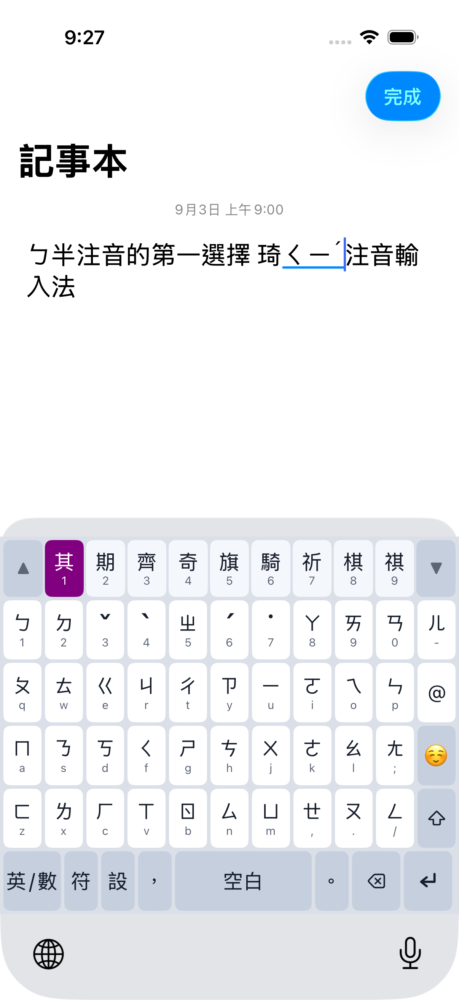

# iOS 鍵盤

琦琦注音的 iOS 版：一個 custom keyboard extension，加上帶安裝引導的容器 App。

為熟悉五排標準注音鍵位的使用者保留完整排列與固定 `1–9` 候選位置，讓輸入延續
肌肉記憶。畫面在記事本輸入 `ㄅ半注音的第一選擇 琦ㄑㄧˊ注音輸入法`，其中
`ㄑㄧˊ` 保持組字與選字狀態。



```
KeyKeyEngine/     Swift Package，純邏輯，可用 swift test 在 Mac 上驗
ContainerApp/     容器 App（安裝引導）
Keyboard/         UIInputViewController extension
KeyKeyiOS.xcodeproj
```

## 建置

```sh
make -C ../../Distributions/Takao/DatabaseCooker
xcodebuild -project KeyKeyiOS.xcodeproj -scheme "chichi77 KeyKey" \
  -configuration Debug -destination 'platform=iOS Simulator,name=iPhone 17 Pro' \
  CODE_SIGNING_ALLOWED=NO build
```

`KeyKey.db` 是建置輸入，但不進版控。Xcode Cloud 會自動執行
`ci_scripts/ci_post_clone.sh` cook 資料庫，並以 `CI_BUILD_NUMBER` 同步容器 App 與
Keyboard extension 的 build number；本機建置維持專案內的預設 build number。

引擎的測試不需要模擬器：

```sh
cd KeyKeyEngine && swift test
```

首次在一台新機器上需要先取得模擬器 runtime：`xcodebuild -downloadPlatform iOS`。

## 與其他平台的差異

- **引擎是 Swift 重寫**，不載入 `Source/Frameworks` 的 C++ core。
- **但資料層走已 cook 好的 `KeyKey.db`**，不像 Android 在執行時解析 `.cin`。
  keyboard extension 的記憶體上限約 60 MB，超過會被系統直接終止且沒有 crash
  log；SQLite 只映射查詢用到的頁，資料層常駐足跡不到 1 MB。
- `Mandarin-bpmf-cin` 的 key 是 Formosa 的 absolute-order 編碼，不是鍵盤按鍵，
  所以 `BopomofoSyllable` 必須實作該編碼才查得到東西。
- **`RequestsOpenAccess = false`**：不連網、設定存在 extension 自己的沙箱。代價是
  iOS 把 `UIFeedbackGenerator` 綁在這個權限後面，因此沒有按鍵震動。
- **沒有實體鍵盤支援與浮動候選窗**：extension 收不到硬體按鍵事件，也只能在自己的
  input view 內繪製。
- **inline 組字**：專案最低 iOS 17，而 `UITextDocumentProxy.setMarkedText` 自 iOS 13
  可用。注音讀音會以 marked text 顯示在目標欄位；選字時以候選字取代讀音。
- 會讀取 `textDocumentProxy.keyboardType` 的 11 種 UIKit 提示。`default` 與
  `webSearch` 保留注音；ASCII、URL、Email 與姓名電話鍵盤預設英文；數字符號、數字、
  電話、小數與 ASCII 數字鍵盤預設數字。不適用的鍵保留原位置但會淡化、停用並退出
  VoiceOver 元素的可操作狀態。
- **密碼與電話欄位是 iOS 系統限制**：第三方鍵盤不會出現在 secure text field、
  `phonePad` 或 `namePhonePad`，系統會自動換回內建鍵盤。引擎仍保留這三種映射，方便
  測試與處理 host 實際提供相同 trait 的情況，但 extension 無法繞過系統封鎖；App 也能
  選擇全面禁止第三方鍵盤。
- 候選選取底色可在鍵盤的「設」中選擇紫、綠、黃、紅；預設為與 macOS 相同的紫色，
  黃底自動使用黑字，其餘使用白字。設定重開 extension 後仍會保留。
- 容器 App 提供產品 ID `chichi_supporter` 的非消耗型一次性支持。未購買不會鎖住任何
  輸入功能；首次使用滿 30 天後，注音鍵盤只會在尚未輸入、沒有候選字時顯示
  「歡迎付費支持」。購買或恢復購買成功後，容器 App 透過 App Group
  `group.io.github.polobread.inputmethod.chichi77.ios` 將授權快取給 extension，提示便會
  永久隱藏。實際售價由 App Store 依地區顯示，設定頁也提供 Apple 要求的「恢復購買」。

正式簽署前，Apple Developer 帳號必須建立上述 App Group，並同時指派給容器 App
`io.github.polobread.inputmethod.chichi77.ios` 與 keyboard extension
`io.github.polobread.inputmethod.chichi77.ios.keyboard`。StoreKit 查詢、驗證與交易監聽只在
容器 App 執行；extension 只讀本機 entitlement cache，不會在輸入路徑連線。

`KeyKeyiOS.xcodeproj/xcshareddata/xcschemes` 內的 scheme 必須保留在版控中 ——
Swift Package 依賴只有透過 scheme 才會被建置，`-target` 不會。

## 授權

本目錄的原創 iOS frontend 程式碼以 MIT License 釋出，著作權為
Copyright (c) 2026 Chui-Ping Cheng。打包進 extension 的 `KeyKey.db` 維持其
輸入資料的原授權。完整範圍見本目錄的 `LICENSE.txt` 與 repository 根目錄的
`LICENSING.md`。
App 內的「授權與致謝」會顯示二進位散布所需的完整授權條款。
