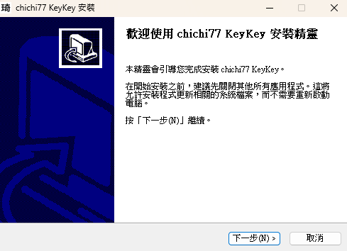
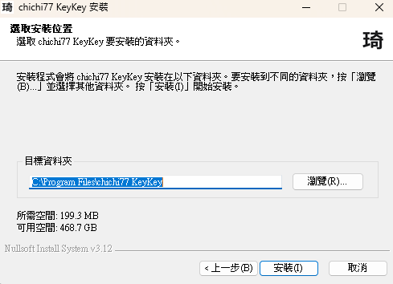

# Windows 1.3.0 安裝與使用指南

琦琦輸入法是 Windows 輸入法，安裝後從工作列或 **Win + Space** 選用，不會開啟獨立的打字視窗。本指南使用 1.3.0 的安裝精靈與設定介面；一般使用者不需要安裝開發工具或執行指令。

目前 1.3.0 尚未提供正式下載，以下安裝步驟適用於已取得 1.3.0 安裝檔的使用者。已公開的 [v1.2.9 安裝包](https://github.com/polobread/KeyKey/releases/tag/v1.2.9)使用不同畫面，請先確認手上的檔案版本。

## 1. 確認系統與安裝檔

開啟 **開始 → 設定 → 系統 → 關於**，查看「系統類型」。1.3.0 以 Windows 10 起為目標；目前已在 Windows 11 x64 建置與測試，Windows 10 x64／x86 尚待實機驗證。

- **64 位元 x64 Windows**：使用 `chichi77-KeyKey-1.3.0-windows-x64-setup.unsigned.exe` 安裝精靈。日後簽章的安裝檔會以 `setup.exe` 結尾。x64 套件同時包含 x64 與 x86 輸入法 DLL，可供 64 位元及 32 位元應用程式使用。
- **32 位元 x86 Windows**：使用 `chichi77-KeyKey-1.3.0-windows-x86.zip` 內的 `Install.cmd`；本頁的安裝精靈截圖只適用於 x64 EXE。

目前的未簽署安裝檔可能引發 Windows 安全提示。先確認檔案來源與版本；不要為了安裝而關閉整台電腦的安全防護。自行建置與打包方式見 [BUILDING.md](BUILDING.md#windows-10-與-11)。

## 2. 執行 x64 安裝精靈

1. 連按兩下 1.3.0 的 x64 安裝檔。Windows 詢問是否允許程式變更裝置時，確認檔案後按 **是**。安裝精靈會顯示歡迎畫面，按 **下一步**。

   

2. 依序閱讀授權範圍、Windows frontend 的 MIT 授權及原始 KeyKey 的 BSD 授權，接受條款後繼續。
3. 在「選取安裝位置」確認目標資料夾。預設顯示 `C:\Program Files\chichi77 KeyKey`；一般情況保留預設值，按 **安裝**。安裝器會自行管理版號目錄，不需手動建立子資料夾。

   

4. 等待安裝完成，再按 **完成**。完成頁可選擇開啟「琦琦輸入法設定」。若是從舊版升級，請儲存工作、登出 Windows 再登入，讓工作列載入新版選單與設定頁。

安裝器不會加入簡體中文語言或變更 Windows 語言清單。琦琦輸入法預設註冊於繁體中文（台灣）；已使用繁體中文（香港）或繁體中文（澳門）的使用者也可在相應語言下加入。

### 使用 x86 ZIP 安裝

將 ZIP **完整解壓縮**，把解壓後的資料夾放在本機磁碟（例如 `C:\KeyKeyInstaller`），再連按兩下 `Install.cmd` 並允許 UAC。不要直接從 ZIP 預覽視窗、網路磁碟、NAS 或共享路徑執行。若安裝視窗立即關閉，查看 `%TEMP%\chichi77-keykey-install.log`。升級後同樣請登出再登入。

## 3. 選用琦琦輸入法

1. 開啟 Windows **記事本**，點一下文字區。
2. 按 **Win + Space**，選擇 **繁體中文（台灣）— 琦琦輸入法**；也可從工作列的輸入法清單選取。香港、澳門的繁體中文使用者可在已安裝的對應語言下選取。
3. 工作列顯示「ㄅ」時可輸入中文；若顯示「英」，按 **Ctrl + Space** 切回中文。

第一次安裝後若清單尚未出現琦琦輸入法，先登出再登入，然後重新檢查 **Win + Space**。

## 4. 在記事本試打好打注音

新安裝預設使用「好打注音」。依所選的注音鍵盤配置連續輸入多個音節，候選窗會顯示可選的中文字或詞。按候選編號或用滑鼠選字；完成後按 **Enter** 送出組字。下圖是記事本中的組字與候選畫面。組字底線的外觀由使用中的 App 決定，在其他程式可能不同。

點工作列的琦琦圖示，可直接選「好打注音」或「傳統注音」；勾號表示目前使用的模式。傳統注音依原有方式逐字選字。同一個選單也能切換中英文、全半形，並開啟「輸入法設定…」。

| 按鍵或操作 | 用途 |
| --- | --- |
| **Win + Space** | 在 Windows 已安裝的輸入法之間切換。 |
| **Ctrl + Space** | 在琦琦輸入法內切換中英文；切換時保留並送出正在組的文字。 |
| **Shift + Space** | 切換半形與全形。 |
| **1–9** 或滑鼠 | 選取候選窗中對應的字詞。 |
| **Space／Page Down**、**Page Up** | 翻閱候選頁。 |
| **方向鍵** | 移動候選反白項目。 |
| **Enter** | 依目前狀態選取候選或送出組字。 |
| **Esc** | 關閉候選窗或取消尚未完成的輸入。 |

## 5. 調整設定與自訂詞

從工作列的琦琦選單點 **輸入法設定…**。設定視窗跟隨 Windows 的明暗模式，包含四個頁籤：

- **一般**：勾選要在工作列顯示的輸入法，並調整候選窗的顯示方向、大小及其他鍵盤選項。至少要保留一種輸入法。
- **注音**：選擇標準、倚天、倚天 26 鍵、許氏或漢語拼音鍵盤配置，以及字集等選項。
- **關聯詞庫**：勾選要使用的分類詞庫；變更會在下一次輸入時生效。
- **自訂詞**：新增、修改、刪除自訂詞，也可匯入／匯出使用者資料庫及重設學習紀錄；重設學習會保留自訂詞。

調整後按 **套用**，再回記事本試打。

## 遇到問題時

| 情況 | 先檢查 |
| --- | --- |
| 安裝檔被 Windows 擋住 | 核對檔案來源、版號與安全提示；不要關閉 Defender 強行安裝。 |
| **Win + Space** 看不到琦琦輸入法 | 登出再登入；檢查已安裝的繁體中文（台灣）輸入法清單。無須安裝簡體中文。 |
| 工作列仍開啟舊設定頁或顯示舊選單 | 升級後登出再登入，讓 Explorer 重新載入新版輸入法。 |
| 已選琦琦但打字仍是英文 | 確認工作列不是「英」，按 **Ctrl + Space** 切回「ㄅ」。 |
| 某個 App 沒有組字底線 | 先在記事本試打；不同 App 對 TSF 底線的顯示可能不同。 |
| 無法輸入中文字或候選 | 在記事本確認是「ㄅ」模式，輸入完整讀音；記下 Windows 版本、App 名稱與畫面後回報。 |

## 移除琦琦輸入法

開啟 **開始 → 設定 → 應用程式 → 已安裝的應用程式**，搜尋 **chichi77 KeyKey** 或 **琦琦輸入法**，按右側 **… → 解除安裝**。移除前先切換到其他輸入法並關閉正在打字的 App；若移除後工作列仍有舊項目，登出再登入。

Windows 切換鍵盤的系統操作可參考 [Microsoft 的語言與鍵盤設定說明](https://support.microsoft.com/en-us/windows/hardware/input-devices/manage-the-language-and-keyboard-input-layout-settings-in-windows)。建置與進階部署資訊見 [Windows TSF 技術文件](Source/Loaders/Windows-TSF/README.md)。
