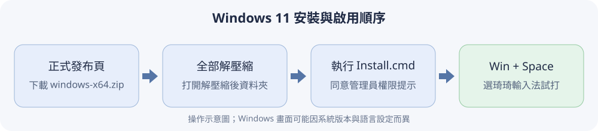

# Windows 11 安裝與使用指南

這份指南給第一次使用琦琦輸入法的 Windows 使用者。照著畫面下載、解壓縮並連按兩下安裝檔即可，**不需要安裝開發工具，也不需要輸入指令**。安裝完成後，琦琦輸入法會出現在 Windows 的輸入法清單中，不會像一般 App 一樣開啟打字主視窗。

本指南使用 **v1.2.9** 的 Windows 安裝包。日後更新時，檔名中的版本數字會跟著改變。

## 安裝前，先確認電腦

打開 **開始 → 設定 → 系統 → 關於**，在「裝置規格」查看「系統類型」。目前套件適用於 **Windows 11、64 位元 x64 電腦**。安裝時需要同意 Windows 的管理員權限提示。

Windows 安裝檔目前**沒有數位簽章**，因此瀏覽器或 Windows 可能顯示安全警告。請只從下方的專案正式發布頁取得檔案，先核對檔名與版本，再自行決定是否繼續；如果 Windows 不允許執行，不要為了安裝而關閉整台電腦的安全防護。

## 1. 下載 Windows 套件

1. 開啟 [琦琦輸入法 v1.2.9 正式發布頁](https://github.com/polobread/KeyKey/releases/tag/v1.2.9)，往下找到 **Assets**；如果清單收起來，按一下展開。
2. 下載 [**`chichi77-KeyKey-1.2.9-windows-x64.zip`**](https://github.com/polobread/KeyKey/releases/download/v1.2.9/chichi77-KeyKey-1.2.9-windows-x64.zip)。它是本指南使用的完整安裝資料夾。
3. 請不要選旁邊的 `.sha256`、Linux、macOS 或 `Source code` 檔案。發布頁另有 `.unsigned.exe` 測試安裝程式；以下步驟使用 ZIP 內的 `Install.cmd`，它會將輸入法加入目前帳號的 Windows 輸入法清單。



*圖 1：安裝順序示意圖，並非 Windows 系統截圖。*

## 2. 完整解壓縮並安裝

1. 在「下載」資料夾找到剛下載的 ZIP，按滑鼠右鍵，選 **全部解壓縮…**，再按 **解壓縮**。請先完成這一步，不要在 ZIP 預覽視窗內直接執行檔案。
2. 打開解壓縮後的資料夾，找到 **`Install.cmd`**，連按兩下。若 Windows 詢問是否允許程式變更裝置，確認來源後按 **是**。
3. 等黑色安裝視窗顯示完成結果；若畫面要求按任意鍵，按一下再關閉視窗。安裝程式會把所需檔案放進 `C:\Program Files\chichi77 KeyKey`。
4. 第一次安裝後，先按 **Win + Space** 看清單裡是否有 **繁體中文（台灣）— 琦琦輸入法**。如果還沒有，儲存手邊工作，從「開始」選單**登出 Windows，再重新登入**同一個帳號，然後再試一次。

若下載的資料夾位於網路磁碟、NAS 或共享路徑，請先把**整個解壓縮後的資料夾**搬到這台電腦的本機磁碟，再執行 `Install.cmd`。

Windows 若顯示「Windows 已保護您的電腦」等未簽署程式警告，請先核對檔案是從上方的發布頁下載、檔名正確；若你信任此版本，且畫面提供 **其他資訊 → 仍要執行**，可自行選擇繼續。若沒有繼續選項，記下畫面訊息並向專案回報。

## Microsoft 對本次 Defender 偵測的判定

Windows Defender 曾將本次送驗的 `KeyKeySettings.exe` 偵測為
`Trojan:Win32/Wacatac.C!ml`。Microsoft Security Intelligence 分析後將最終判定列為
**Not malware（不是惡意程式）**，並說明該檔案不符合惡意程式或潛在不受歡迎應用程式
的標準，相關偵測已移除。

這項判定只適用於送驗的檔案內容；日後重新編譯的版本會有不同的檔案雜湊，仍須重新掃描。
舊的動態簽章或本機快取也可能讓 Windows 暫時繼續顯示原警告。遇到這個偵測時，先按以下
順序更新，不要關閉即時防護，也不要把整個安裝資料夾加入排除清單：

1. 開啟 **Windows 安全性 → 病毒與威脅防護 → 防護更新**，按 **檢查更新**。
2. 更新完成後，重新掃描從本指南正式發布頁下載的 ZIP 或解壓縮資料夾。
3. 如果 `KeyKeySettings.exe` 先前已被隔離，更新後重新下載 ZIP、完整解壓縮，再執行
   `Install.cmd`；不要從其他網站尋找替代檔案。
4. 若仍出現相同偵測，以系統管理員身分開啟 **命令提示字元**，依 Microsoft 分析員提供
   的步驟執行：

   ```bat
   cd /d "%ProgramFiles%\Windows Defender"
   MpCmdRun.exe -removedefinitions -dynamicsignatures
   MpCmdRun.exe -SignatureUpdate
   ```

   第一個命令會清除快取的動態簽章，請緊接著執行第二個命令取得最新定義；不要只執行
   第一個命令就停止。完成後再掃描一次正式下載的檔案。

若更新後仍被擋住，請不要停用 Defender 強行安裝。記下威脅名稱、Defender 定義版本、
下載檔名及畫面訊息，再到 [Microsoft 檔案送驗頁](https://www.microsoft.com/en-us/wdsi/filesubmission)
提交檔案，或向專案回報。

## 3. 切換到琦琦輸入法

1. 打開 Windows 內建的 **記事本**，新增空白文件，點一下文字區。
2. 按住 **Win** 再按 **Space**，在清單中選 **繁體中文（台灣）— 琦琦輸入法**；也可以點工作列右下角的輸入法圖示選取。
3. 確認工作列顯示琦琦輸入法，並且模式顯示 **「ㄅ」**。如果顯示 **「英」**，請按一次 **Ctrl + Space** 切回中文模式。


*圖 2：專案既有的 Windows 實際畫面；從工作列的輸入法清單選「琦琦輸入法」。*

## 4. 在記事本試打注音

Windows 版使用實體鍵盤上的標準注音位置。若你使用「標準」配置，可依序按 **`f`、`u`、`6`**，也就是 **ㄑㄧˊ**；畫面應出現候選字，例如「其」「期」「齊」。按候選字旁的 **1–9** 選字，或用滑鼠點選。選好後可繼續輸入下一個字；目前以**逐字選字**為主。


*圖 3：專案既有的記事本實際輸入畫面；游標旁是候選字窗，圖中的讀音與候選字可能和你試打時不同。*

### 常用操作

| 按鍵或畫面 | 用途 |
| --- | --- |
| **1–9** | 選取候選字窗中對應號碼的字。 |
| **Space／Page Down**、**Page Up** | 候選字有多頁時，往後或往前翻頁。 |
| **方向鍵** | 在候選字窗移動反白項目。 |
| **Enter** | 選取目前反白的候選字。 |
| **Esc** | 關閉目前的候選字窗或取消尚未完成的輸入。 |
| **Ctrl + Space** 或單按 **Shift** | 在琦琦輸入法內切換中文與英文；工作列的「ㄅ／英」會跟著改變。 |
| **Shift + Space** | 切換半形與全形；工作列的「半／全」會跟著改變。 |
| **Ctrl + 0** 或 **Ctrl + 1** | 開啟符號候選清單。 |

**Win + Space** 是在不同的 Windows 輸入法之間切換；**Ctrl + Space** 是留在琦琦輸入法裡切換中文、英文。選好一個字後若出現「關聯詞」建議，可按畫面對應的 **Shift + 1–9** 選用；若不需要，直接打下一個字即可。


*圖 4：工作列的「ㄅ／英」「半／全」按鈕可切換模式，選單中的「輸入法設定…」會開啟偏好設定。*

## 5. 調整注音、候選字和詞庫

切到琦琦輸入法後，點工作列的琦琦圖示，再選 **輸入法設定…**。設定視窗有三個頁籤：

- **一般**：調整候選字窗直排／橫排、大小、反白顏色、輸入錯誤提示聲，以及是否使用 `Ctrl + \` 切換中英文。
- **注音**：選擇 **標準、倚天、倚天 26 鍵、許氏鍵盤、漢語拼音**配置；第一次使用可先保持「標準」。也可決定是否顯示全字庫罕用字。
- **關聯詞庫**：勾選想用的接續詞分類；不確定時先保留預設值。分類詞庫可能有錯字或不合適的詞，輸入重要內容時請自行確認。

調整後按 **套用**，再回記事本試打。下圖是實際的關聯詞庫設定畫面。


*圖 5：勾選想使用的關聯詞庫後按「套用」；變更會在下一次輸入時生效。*

## 遇到問題時

| 情況 | 先檢查 |
| --- | --- |
| 安裝時被 Windows 擋住 | 核對下載頁、版本與檔名。若顯示 `Wacatac.C!ml`，先依上方 Microsoft 判定與更新步驟處理；此版尚未簽章，若系統仍沒有繼續選項，不要關閉安全防護強行安裝。 |
| 連按兩下 `Install.cmd` 後視窗一閃而過 | 確認 ZIP 已完整解壓縮、整個資料夾在本機磁碟；安裝失敗記錄通常在 `%TEMP%\chichi77-keykey-install.log`。 |
| `Win + Space` 看不到琦琦輸入法 | 首次安裝後登出再登入；檢查安裝視窗是否顯示成功，再看「設定 → 時間與語言 → 語言與地區」的繁體中文輸入法清單。 |
| 已選琦琦，打字仍是英文 | 看工作列模式是否為「英」；按 **Ctrl + Space** 切回「ㄅ」，再到記事本試打。 |
| 打完注音卻沒出現候選字 | 確認在記事本的一般文字區、目前是「ㄅ」模式；一聲沒有聲調符號，可輸入讀音後按 **Space**。 |
| 某個 App 無法輸入 | 先在記事本試打，並記下出問題的 App 名稱與版本；不同 App 的輸入欄位可能有差異。 |

仍無法使用時，請記下 Windows 版本、系統類型、下載的檔名、`Win + Space` 清單是否看到琦琦輸入法，以及在記事本試打的畫面。

## 移除琦琦輸入法

打開 **開始 → 設定 → 應用程式 → 已安裝的應用程式**，搜尋 **chichi77 KeyKey** 或 **琦琦輸入法**，點右側的 **… → 解除安裝**。如果正在使用琦琦輸入法，先切到其他輸入法並關閉正在打字的 App；移除後若仍在清單中，登出並重新登入。

Windows 切換鍵盤的系統操作可參考 [Microsoft 的語言與鍵盤設定說明](https://support.microsoft.com/en-us/windows/hardware/input-devices/manage-the-language-and-keyboard-input-layout-settings-in-windows)。建置與進階部署資訊另見 [Windows TSF 技術文件](Source/Loaders/Windows-TSF/README.md)。
