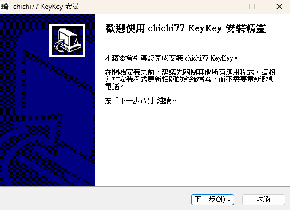

# Windows 1.3.1 安裝與使用指南

琦琦輸入法是 Windows 輸入法。**首次安裝後，請自行到 Windows 設定新增「琦琦輸入法」鍵盤，再用 Win + Space 選用。** 安裝程式只登記可用的輸入法；新增鍵盤、選用及預設輸入法由你決定。升級保留已加入的共用入口；原本選用舊香港／澳門入口者，需依下方步驟改選共用入口。

台灣、香港、澳門共用一個「琦琦輸入法」入口。舊版曾分別登記三個區域，造成三個同名選項；升級成功後會移除舊香港、舊澳門註冊，只保留共用入口。原本選用舊區域入口者，請在 Windows 設定重新加入「琦琦輸入法」並選用；個人設定、自訂詞及學習資料保留。這些入口不是三份舊版本，不必手動刪除登錄或版本資料夾。

一般使用者不需要安裝開發工具或 .NET。下方圖片是 **1.3.0 的介面參考**，不是 1.3.1 安裝驗收截圖；1.3.1 已移除安裝位置選擇頁及安裝後自動開啟琦琦設定的動作。

本指南說明 **1.3.1 的新版安裝流程**。下載時請到[發布頁](https://github.com/polobread/KeyKey/releases)核對實際發布版本、檔名及來源；原始碼文件不代表 1.3.1 已正式發布。

## 1. 確認系統與安裝檔

開啟 **開始 → 設定 → 系統 → 關於**，查看「系統類型」。1.3.1 以 Windows 10 起為目標；目前已在 Windows 11 x64 建置與測試，Windows 10 x64／x86 尚待實機驗證。

- **64 位元 x64 Windows**：使用 x64 安裝精靈，或 `chichi77-KeyKey-1.3.1-windows-x64.zip`。未簽署精靈檔名為 `chichi77-KeyKey-1.3.1-windows-x64-setup.unsigned.exe`，簽章版以 `setup.exe` 結尾。x64 套件同時支援 64 位元及 32 位元應用程式。
- **32 位元 x86 Windows**：使用 `chichi77-KeyKey-1.3.1-windows-x86.zip` 內的 `Install.cmd`；本頁的安裝精靈截圖只適用於 x64 EXE。
- **ARM64 Windows**：目前沒有本指南涵蓋的安裝包，請勿以 x64 或 x86 包代替。

未簽署安裝檔可能引發 Windows 安全提示。先確認檔案來源與版本；不要為了安裝而關閉整台電腦的安全防護。自行建置與打包方式見 [BUILDING.md](BUILDING.md#windows-10-與-11)。

## 2. 執行 x64 安裝精靈

1. 連按兩下 1.3.1 的 x64 安裝檔。Windows 詢問是否允許程式變更裝置時，確認檔案後按 **是**。安裝精靈會顯示歡迎畫面，按 **下一步**。

   

2. 依序閱讀授權範圍、Windows frontend 的 MIT 授權及原始 KeyKey 的 BSD 授權，接受條款後繼續。
3. 按 **安裝**，等待完成後按 **完成**。安裝位置由程式管理，位於 `C:\Program Files\chichi77 KeyKey`，版號目錄例如 `1.3.1-012345abcdef`；無須自行建立、移動或刪除版本資料夾。
4. **首次安裝**：依下一節在 Windows 設定新增鍵盤。**從舊版升級**：先儲存工作、登出 Windows 再登入，讓工作列及文字程式載入新版；共用入口保留，舊香港／澳門入口使用者需改選共用入口。

安裝程式不變更 Windows 語言清單、顯示語言或預設輸入法，也不自動登出、重新開機或關閉文字程式。

### 使用 x64／x86 ZIP 安裝

將符合系統架構的 ZIP **完整解壓縮**，把整個資料夾放在本機磁碟（例如 `C:\KeyKeyInstaller`），再連按兩下 `Install.cmd` 並允許 UAC。不要直接從 ZIP 預覽視窗、網路磁碟、NAS 或共享路徑執行。閱讀視窗結果後按任意鍵關閉；遇到錯誤請記下錯誤碼。首次安裝同樣須手動新增鍵盤，升級後同樣請登出再登入。

兩種方式可直接升級已知舊 TSF 安裝，不必先執行舊解除安裝程式。升級暫時保留舊版檔案，供尚未關閉的程式使用。

## 3. 在 Windows 設定新增鍵盤

### Windows 11

1. 開啟 **開始 → 設定 → 時間與語言 → 語言與地區**。
2. 在「慣用語言」找到你使用的 **中文（繁體，台灣）**，按右側 **… → 語言選項**。使用香港或澳門繁體中文者，請開啟對應語言的選項。
3. 在「鍵盤」按 **新增鍵盤**，選擇 **琦琦輸入法**。加入後，它會出現在「已安裝的鍵盤」清單。

### Windows 10

1. 開啟 **開始 → 設定 → 時間與語言 → 語言**。
2. 在「慣用語言」點選你使用的繁體中文語言，再按 **選項**。
3. 在「鍵盤」按 **新增鍵盤**，選擇 **琦琦輸入法**。

**沒有繁體中文語言時**：在上述語言頁按「新增語言」，自行選擇台灣、香港或澳門的繁體中文，完成後再到其語言選項新增鍵盤。只為輸入中文時，不必把該語言設成 Windows 顯示語言；是否下載額外語音、手寫等功能由你選擇。安裝程式不替你下載語言套件。

新版統一使用同一個共用入口（登記在台灣語言下）；香港、澳門語言使用者可在「新增鍵盤」清單的其他語言區域尋找「琦琦輸入法」。找不到時，可自行新增「中文（繁體，台灣）」再加入琦琦，不需要改 Windows 顯示語言。升級後不再提供「舊香港／舊澳門」入口；先前使用這兩個入口的帳號，需自行新增及選用共用入口；若原本設為預設，也請在進階鍵盤設定重新選擇。已加入共用入口者不必重加。若清單仍顯示舊項目，先關閉 Windows 設定再重開；仍未刷新時，儲存工作、登出再登入。請用包含此修正的新安裝檔直接升級，不必先解除安裝；若部署記錄顯示舊入口清理失敗，重跑同一安裝包可重試。

找不到琦琦時，先確認開的是上述繁體中文語言的選項，再登出、登入後重試。「新增鍵盤」與 **Win + Space** 清單用途不同：前者加入可用鍵盤，後者切換你已加入的鍵盤。Windows 操作依 [Microsoft 語言與鍵盤設定說明](https://support.microsoft.com/en-us/windows/hardware/input-devices/manage-the-language-and-keyboard-input-layout-settings-in-windows)。

### 選用及選擇預設輸入法

1. 開啟 Windows **記事本**，點一下文字區。
2. 按 **Win + Space**，選擇 **繁體中文（台灣）— 琦琦輸入法**；也可從工作列的輸入法清單選取。香港、澳門使用者也選擇同一個琦琦入口；依 Windows 實際顯示的語言分類選取。
3. 工作列顯示「ㄅ」時可輸入中文；若顯示「英」，按 **Ctrl + Space** 切回中文。

若希望預設使用琦琦，可自行在 Windows 設定搜尋 **進階鍵盤設定**，於「覆寫預設輸入法」選擇已加入的琦琦輸入法。保持「使用語言清單（建議）」則由 Windows 依語言清單決定。這是選用設定，安裝程式不會替你更改。

## 4. 在記事本試打好打注音

新安裝預設使用「好打注音」。依所選的注音鍵盤配置連續輸入多個音節，候選窗會顯示可選的中文字或詞。按候選編號或用滑鼠選字；完成後按 **Enter** 送出組字。下圖是記事本中的組字與候選畫面。組字底線的外觀由使用中的 App 決定，在其他程式可能不同。

點工作列的琦琦圖示，可直接選「好打注音」或「傳統注音」；勾號表示目前使用的模式。傳統注音依原有方式逐字選字。同一個選單也能切換中英文、全半形，並開啟「輸入法設定…」。

| 按鍵或操作 | 用途 |
| --- | --- |
| **Win + Space** | 在 Windows 已安裝的輸入法之間切換。 |
| **Ctrl + Space** | 在琦琦輸入法內切換中英文；切換時保留並送出正在組的文字。 |
| **Shift + Space** | 切換半形與全形。 |
| **1–9** 或滑鼠 | 選取候選窗中對應的字詞。 |
| **Space／Page Down**、**Page Up** | 翻閱候選頁。 |
| **方向鍵** | 移動候選反白項目。 |
| **Enter** | 依目前狀態選取候選或送出組字。 |
| **Esc** | 關閉候選窗或取消尚未完成的輸入。 |

## 5. 調整設定與自訂詞

從工作列的琦琦選單點 **輸入法設定…**。設定視窗跟隨 Windows 的明暗模式，包含四個頁籤：

- **一般**：勾選要在工作列顯示的輸入法，並調整候選窗的顯示方向、大小及其他鍵盤選項。至少要保留一種輸入法。
- **注音**：選擇標準、倚天、倚天 26 鍵、許氏或漢語拼音鍵盤配置，以及字集等選項。
- **關聯詞庫**：勾選要使用的分類詞庫；變更會在下一次輸入時生效。
- **自訂詞**：新增、修改、刪除自訂詞，也可匯入／匯出使用者資料庫及重設學習紀錄；重設學習會保留自訂詞。

首次使用可先到「注音」選擇熟悉的鍵盤配置，再到「一般」調整候選窗方向與大小。調整後按 **套用**，再回記事本試打。這些是琦琦本身的輸入設定；若要新增、移除鍵盤或改預設輸入法，請使用第 3 節的 Windows 設定。

## 遇到問題時

| 情況 | 先檢查 |
| --- | --- |
| 安裝檔被 Windows 擋住 | 核對檔案來源、版號與安全提示；不要關閉 Defender 強行安裝。 |
| **Win + Space** 看不到琦琦輸入法 | 先依第 3 節到繁體中文的「語言選項 → 新增鍵盤」加入琦琦；仍未出現時登出再登入。 |
| 工作列仍開啟舊設定頁或顯示舊選單 | 升級後登出再登入，讓 Explorer 重新載入新版輸入法。 |
| 已選琦琦但打字仍是英文 | 確認工作列不是「英」，按 **Ctrl + Space** 切回「ㄅ」。 |
| 某個 App 沒有組字底線 | 先在記事本試打；不同 App 對 TSF 底線的顯示可能不同。 |
| 無法輸入中文字或候選 | 在記事本確認是「ㄅ」模式，輸入完整讀音；記下 Windows 版本、App 名稱與畫面後回報。 |
| 顯示請重新開機／代碼 3010 | 解除安裝已完成，使用中的產品檔案已排定於重開機時刪除。儲存工作後自行重新開機；不需要再次解除安裝。 |
| 舊測試包留下 `pending file cleanup`、清理時拒絕存取 `Uninstall.exe`，或重裝中止 | 保留 `Deployment.log`；使用包含一次移除與 TSF 驗證修正的新版安裝包直接安裝，不必反覆執行舊移除器，也不要手動刪登錄或 Program Files。 |
| 安裝／解除安裝顯示其他錯誤 | 記下錯誤碼；開始部署後可查看 `C:\Program Files\chichi77 KeyKey\Deployment.log`，保留下載包並回報。自訂路徑或登錄、檔案不一致的舊安裝可能需要個別處理。 |

## 移除琦琦輸入法

只想暫停使用，可到第 3 節的「語言選項」移除琦琦鍵盤，程式仍保留在電腦上，之後可再次新增。

要移除程式，先切換到其他輸入法並儲存工作。Windows 11 開啟 **設定 → 應用程式 → 已安裝的應用程式**，搜尋 **chichi77 KeyKey**，按 **… → 解除安裝**；Windows 10 則在 **應用程式與功能** 選取該項目並按 **解除安裝**。若顯示「請重新開機完成移除」，代表輸入法已解除註冊，Windows 已接受使用中產品檔案的刪除排程。**儲存工作後重新開機即可，不需要再次解除安裝。** 正常移除會同時移除「已安裝的應用程式」項目；若 Windows 設定尚未刷新，關閉再重開。只有實際操作失敗才保留「解除安裝未完成，請重試」入口並顯示錯誤。產品根目錄可能保留診斷記錄與移除狀態，額外放入或修改過的檔案也會保留，這不表示輸入法仍有註冊。

移除保留個人設定、自訂詞及學習資料，之後重新安裝可沿用。請使用 Windows 的**目前移除入口**；升級後不要執行以前另存的舊 ZIP／舊解除安裝 EXE。若舊 TSF 安裝的移除入口故障，可用新版 ZIP 的 `Uninstall.cmd` 載入安全維護工具後移除，再安裝新版。歷代實際發布包的升級、移除與重新安裝仍需逐一實機驗收；Yahoo 舊 IMM／MSI 產品需使用其自己的解除安裝入口。

Windows 切換鍵盤的系統操作可參考 [Microsoft 的語言與鍵盤設定說明](https://support.microsoft.com/en-us/windows/hardware/input-devices/manage-the-language-and-keyboard-input-layout-settings-in-windows)。建置與進階部署資訊見 [Windows TSF 技術文件](Source/Loaders/Windows-TSF/README.md)。
